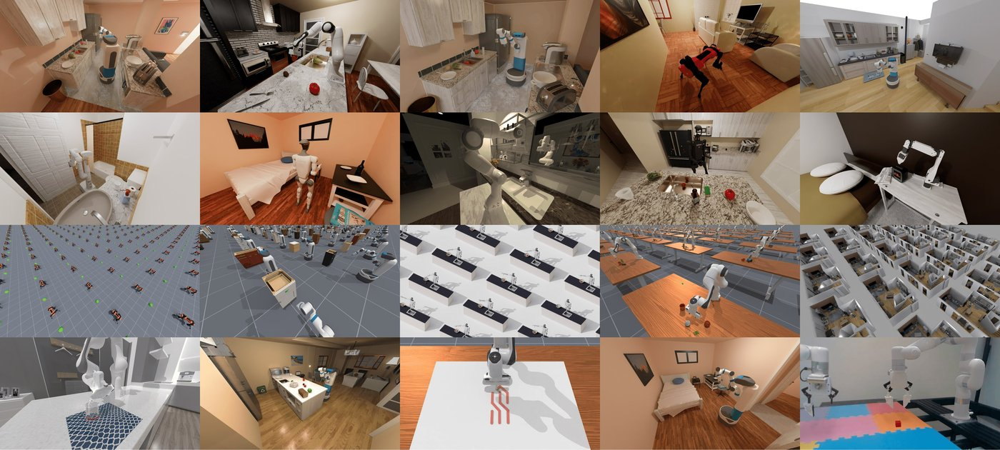

# 🛠️ 工具与开源项目

> 💡 本列表持续更新，如果你发现好工具未被收录，或现有信息需要更新，请直接提交 [PR](https://github.com/Octoday-Hub/Embodied-AI/pulls) 或在 [Issues](https://github.com/Octoday-Hub/Embodied-AI/issues) 中反馈。

## 目录

**工具与项目分类：** [🎮 仿真平台](#simulation-platforms) · [🤖 模型](#models) · [🧰 通用工具与库](#general-tools) · [🏗️ 学习框架](#learning-frameworks) · [🤖 机器人项目](#robot-projects) · [🧠 推理/强化学习](#reasoning-rl) · [🗺️ SLAM 与感知](#slam-perception) · [🔧 中间件与 ROS 工具](#middleware-ros) · [🛒 其他](#other)

## 🎮 仿真平台

### ManiSkill3

  

<table style="width:100%;display:table;table-layout:fixed" width="100%">
<tbody>
<tr><td style="width:110px;min-width:110px;max-width:110px" width="110">一句话摘要</td><td style="word-wrap:break-word;width:1200px" width="1200">基于 SAPIEN 的 GPU 并行操作仿真、数据生成与策略评测一体框架，面向可泛化操作技能研究。</td></tr>
<tr><td style="width:110px;min-width:110px;max-width:110px" width="110">发布与维护</td><td style="word-wrap:break-word;width:1200px" width="1200">2024 年发布（RSS 2025 发表），仓库活跃维护至 2026 年</td></tr>
<tr><td style="width:110px;min-width:110px;max-width:110px" width="110">机构</td><td style="word-wrap:break-word;width:1200px" width="1200">斯坦福大学 Hao Su 实验室主导（haosulab）与开源社区</td></tr>
<tr><td style="width:110px;min-width:110px;max-width:110px" width="110">特点</td><td style="word-wrap:break-word;width:1200px" width="1200"><ul><li><strong>最快的 contact-rich GPU 并行仿真</strong>：模拟与渲染同 GPU 运行，30,000+ FPS（4090 上采集 RGBD+分割），比 Isaac/MJX 等快 10–1000×，显存占用低 2–3×</li><li><strong>异构仿真与大规模任务库</strong>：每个并行环境可装载不同场景，12 类任务域、20+ 机器人，场景来自 ReplicaCAD/AI2-THOR 等真实感资源</li><li><strong>数据与评测双向管线</strong>：Real2Sim 支持真实策略 100× 提速的仿真规模化评测，并提供数百万演示帧（运动规划/RL/遥操作来源）</li><li><strong>开箱即用策略基线全家桶</strong>：RL（PPO/SAC/TD-MPC2）、模仿学习（BC/Diffusion Policy）、VLA（Octo/RDT-1B/RT-x）均有调好配置</li></ul></td></tr>
<tr><td style="width:110px;min-width:110px;max-width:110px" width="110">使用场景</td><td style="word-wrap:break-word;width:1200px" width="1200"><ul><li>GPU 大规模合成操作演示数据</li><li>视觉/状态 RL 与模仿学习训练</li><li>真实机器人策略的仿真规模化评测（SIMPLER 式）</li><li>多本体策略与新操作任务的快速基准对比</li></ul></td></tr>
<tr><td style="width:110px;min-width:110px;max-width:110px" width="110">案例</td><td style="word-wrap:break-word;width:1200px" width="1200"><ul><li>作为操作策略统一评测平台，被 VLA/扩散策略等大量研究用于大规模合成演示与基准对比</li></ul></td></tr>
<tr><td style="width:110px;min-width:110px;max-width:110px" width="110">数据与模型</td><td style="word-wrap:break-word;width:1200px" width="1200">ManiSkill3 框架（基于 SAPIEN）；ManiSkill2/3 基准任务与演示数据集</td></tr>
<tr><td style="width:110px;min-width:110px;max-width:110px" width="110">官方链接</td><td style="word-wrap:break-word;width:1200px" width="1200"><a href="https://github.com/haosulab/ManiSkill">GitHub haosulab/ManiSkill</a> · <a href="https://maniskill.ai/">官网 maniskill.ai</a> · <a href="https://maniskill.readthedocs.io/">文档</a> · <a href="https://arxiv.org/abs/2410.00425">论文 arXiv 2410.00425</a></td></tr>
</tbody>
</table>

### Genesis

  

<table style="width:100%;display:table;table-layout:fixed" width="100%">
<tbody>
<tr><td style="width:110px;min-width:110px;max-width:110px" width="110">一句话摘要</td><td style="word-wrap:break-word;width:1200px" width="1200">面向物理 AI 的生成式仿真平台，统一多物理引擎与照片级渲染，号称比实时快数十万倍的仿真速度。</td></tr>
<tr><td style="width:110px;min-width:110px;max-width:110px" width="110">发布与维护</td><td style="word-wrap:break-word;width:1200px" width="1200">2024 年 12 月发布学术版，持续活跃维护（GitHub ⭐ 29.8k）；Apache 2.0 开源。</td></tr>
<tr><td style="width:110px;min-width:110px;max-width:110px" width="110">机构</td><td style="word-wrap:break-word;width:1200px" width="1200">斯坦福、CMU、MIT、清华、港大等 20 余所高校联合项目（Genesis-Embodied-AI）。</td></tr>
<tr><td style="width:110px;min-width:110px;max-width:110px" width="110">特点</td><td style="word-wrap:break-word;width:1200px" width="1200"><ul><li><strong>统一多物理引擎</strong>：刚体、FEM、MPM、SPH、PBD、IPC 等求解器共享同一场景状态</li><li>自研 <strong>Nyx 照片级渲染器</strong> + Luisa 光线追踪 + Pyrender 三条渲染路径</li><li><strong>Quadrants 跨平台编译器</strong>：Python kernel 编译至 CUDA/ROCm/Metal/Vulkan</li><li>内置深度相机、IMU、LiDAR、触觉、接触力等传感器仿真</li></ul></td></tr>
<tr><td style="width:110px;min-width:110px;max-width:110px" width="110">使用场景</td><td style="word-wrap:break-word;width:1200px" width="1200"><ul><li>机器人操作/运动的强化学习与模仿学习大规模并行训练</li><li>可变形物体、流体、布料等多物理耦合的具身任务仿真</li><li>传感器级仿真数据生成（Sim2Real 训练数据管线）</li><li>从笔记本 GPU 到数据中心集群的可扩展训练</li></ul></td></tr>
<tr><td style="width:110px;min-width:110px;max-width:110px" width="110">案例</td><td style="word-wrap:break-word;width:1200px" width="1200"><ul><li>RoboGen 等生成式仿真框架以其作为底层引擎</li><li>社区广泛用于四足/机械臂 RL 训练与多物理耦合演示</li></ul></td></tr>
<tr><td style="width:110px;min-width:110px;max-width:110px" width="110">数据与模型</td><td style="word-wrap:break-word;width:1200px" width="1200">完全开源（Apache 2.0）；支持 URDF/MJCF/USD 等资产格式，内置示例场景库。</td></tr>
<tr><td style="width:110px;min-width:110px;max-width:110px" width="110">官方链接</td><td style="word-wrap:break-word;width:1200px" width="1200"><a href="https://github.com/Genesis-Embodied-AI/Genesis">github.com/Genesis-Embodied-AI/Genesis</a></td></tr>
</tbody>
</table>

### XTDrone

  

<table style="width:100%;display:table;table-layout:fixed" width="100%">
<tbody>
<tr><td style="width:110px;min-width:110px;max-width:110px" width="110">一句话摘要</td><td style="word-wrap:break-word;width:1200px" width="1200">基于 ROS / PX4 / Gazebo 的开源无人机仿真平台，支持多机型与集群仿真，是无人机算法开发与教学的首选仿真环境。</td></tr>
<tr><td style="width:110px;min-width:110px;max-width:110px" width="110">发布与维护</td><td style="word-wrap:break-word;width:1200px" width="1200">开源项目，持续维护更新（GitHub ⭐ 6.5k）。</td></tr>
<tr><td style="width:110px;min-width:110px;max-width:110px" width="110">机构</td><td style="word-wrap:break-word;width:1200px" width="1200">robin-shaun 等开源贡献者（国防科技大学背景）。</td></tr>
<tr><td style="width:110px;min-width:110px;max-width:110px" width="110">特点</td><td style="word-wrap:break-word;width:1200px" width="1200"><ul><li><strong>多机型支持</strong>：多旋翼、固定翼、复合翼无人机，以及无人车、无人船、机械臂</li><li><strong>全栈仿真</strong>：动力学、传感器（相机 / 激光 / IMU）、控制、状态估计与 3D 场景</li><li><strong>深度集成 PX4 与 ROS</strong>，支持 Offboard 控制、SLAM、路径规划等算法验证</li><li>配套教程完善、社区活跃，教学与科研广泛使用</li></ul></td></tr>
<tr><td style="width:110px;min-width:110px;max-width:110px" width="110">使用场景</td><td style="word-wrap:break-word;width:1200px" width="1200"><ul><li>无人机控制、避障、路径规划算法的开发与仿真验证</li><li>视觉 SLAM、目标跟踪、编队与集群仿真</li><li>PX4 固件开发与软硬件在环验证（SITL / HITL）</li><li>高校无人机课程、毕业设计与竞赛备赛</li></ul></td></tr>
<tr><td style="width:110px;min-width:110px;max-width:110px" width="110">案例</td><td style="word-wrap:break-word;width:1200px" width="1200"><ul><li>大量无人机开发者先在此仿真验证算法、再部署真机</li><li>被高校课程与工作坊用作 PX4 入门仿真环境</li></ul></td></tr>
<tr><td style="width:110px;min-width:110px;max-width:110px" width="110">数据与模型</td><td style="word-wrap:break-word;width:1200px" width="1200">完全开源；基于 PX4、Gazebo 与 ROS 生态，自带示例场景与传感器模型。</td></tr>
<tr><td style="width:110px;min-width:110px;max-width:110px" width="110">官方链接</td><td style="word-wrap:break-word;width:1200px" width="1200"><a href="https://github.com/robin-shaun/XTDrone">github.com/robin-shaun/XTDrone</a></td></tr>
</tbody>
</table>

- **BEHAVIOR-1K** — [`StanfordVL/BEHAVIOR-1K`](https://github.com/StanfordVL/BEHAVIOR-1K) ⭐ 1.5k
  📄 斯坦福大学出品，1,000 种日常生活活动的具身 AI 基准测试与仿真平台

- **Prometheus** — [`amov-lab/Prometheus`](https://github.com/amov-lab/Prometheus) ⭐ 4.5k
  📄 面向自主无人机的开源软件系统，支持目标检测、SLAM 导航、编队控制等

- **Aerial Gym** — [`github.com/ntnu-arl/aerial_gym_simulator`](https://github.com/ntnu-arl/aerial_gym_simulator)
  📄 基于 Isaac Gym 的空中机器人仿真环境，支持无人机强化学习训练。

- **AllenAct** — [`allenact.org`](https://allenact.org/)
  📄 面向具身智能研究的训练框架，支持 iTHOR、RoboTHOR、Habitat 等多环境和常用 RL / IL 算法。

- **BEHAVIOR** — [`behavior.stanford.edu`](https://behavior.stanford.edu/)
  📄 大规模交互仿真基准。基于SAPIEN引擎构建，包含100个日常家居物品和30个复杂任务（如"把湿毛巾挂起来"），提供一套完整的物理交互能力测试环境。

- **CARLA** — [`carla.org`](https://carla.org)
  📄 面向自动驾驶与机器人研究的开源仿真器，提供城市道路、交通参与者、传感器和场景脚本能力。

- **CoppeliaSim (V-REP)** — [`www.coppeliarobotics.com`](https://www.coppeliarobotics.com)
  📄 支持远程 API、内嵌脚本等多种接口的机器人仿真平台，适用于教学、研究和工业原型验证。

- **DISCOVERSE** — [`air-discoverse.github.io`](https://air-discoverse.github.io/)
  📄 面向 Real2Sim2Real 的高保真仿真框架，结合 3DGS 场景表示、MuJoCo 物理和控制接口。

- **Drake** — [`github.com/RobotLocomotion/drake`](https://github.com/RobotLocomotion/drake)
  📄 面向机器人建模、规划与控制的工具包，适用于系统分析、仿真和算法研究。

- **EmbodiedCity** — [`github.com/tsinghua-fib-lab/EmbodiedCity`](https://github.com/tsinghua-fib-lab/EmbodiedCity)
  📄 真实开放环境具身智能平台。清华大学发布，基于虚幻引擎5打造真实城市环境，提供在线和离线两种部署方式，支持智能体在开放城市中进行导航与任务规划。

- **Gazebo Sim** — [`gazebosim.org`](https://gazebosim.org)
  📄 高保真度开源机器人仿真器，支持多种物理引擎（ODE、Bullet、DART），提供逼真渲染和传感器模型，是 ROS 生态中的主流仿真平台之一。

- **Genesis** — [`genesis-embodied-ai.github.io`](https://genesis-embodied-ai.github.io/)
  📄 通用机器人仿真引擎。专为生成式物理智能设计，集成了刚体、流体、软体等多种物理求解器，旨在解决复杂场景下的仿真难题。

- **GRUtopia** — [`github.com/OpenRobotLab/GRUtopia`](https://github.com/OpenRobotLab/GRUtopia)
  📄 通用具身智能仿真平台。由上海人工智能实验室发布，提供海量高质量可交互场景与数据，支持简单代码定义任务，是解决具身智能数据稀缺问题的核心工具。

- **Gymnasium-Robotics** — [`robotics.farama.org`](https://robotics.farama.org/)
  📄 基于 Gymnasium API 的机器人仿真环境集合，适合强化学习算法开发、复现和标准化比较。

- **Habitat-Lab** — [`github.com/facebookresearch/habitat-lab`](https://github.com/facebookresearch/habitat-lab)
  📄 面向具身智能任务的高层开发库，通常与 Habitat Sim 配合使用，支持任务定义、智能体配置、训练与标准化评测。

- **Habitat Sim** — [`github.com/facebookresearch/habitat-sim`](https://github.com/facebookresearch/habitat-sim)
  📄 Meta 开源的高性能 3D 仿真器，常与 Habitat-Lab 配合使用，适用于大规模场景导航与交互任务。

- **Habitat 3.0** — [`aihabitat.org`](https://aihabitat.org/)
  📄 社交具身AI仿真平台。Meta AI推出的最新版本，专注于人与机器人、机器人与机器人之间的交互，支持高精度的社会行为模拟和导航任务。

- **ManiSkill3** — [`github.com/haosulab/ManiSkill`](https://github.com/haosulab/ManiSkill)
  📄 下一代操作技能仿真框架。上海AI实验室推出的最新版本，专为训练通用操作策略设计，支持更复杂的铰接物体（如抽屉、门把手）和更高效的并行物理模拟。

- **MORSE Simulator** — [`morse-simulator.github.io`](https://morse-simulator.github.io/)
  📄 基于 Blender 的学术机器人仿真器，支持移动机器人、人机交互和多中间件接入。

- **MuJoCo** — [`github.com/google-deepmind/mujoco`](https://github.com/google-deepmind/mujoco)
  📄 高性能物理引擎，专为机器人、生物力学和图形学设计，广泛应用于强化学习和运动控制研究。

- **NVIDIA Isaac Gym** — [`developer.nvidia.com/isaac-gym`](https://developer.nvidia.com/isaac-gym)
  📄 面向机器人学习的高性能强化学习仿真环境，支持 GPU 加速的大规模并行训练。

- **NVIDIA Isaac Lab** — [`developer.nvidia.com/isaac/lab`](https://developer.nvidia.com/isaac/lab)
  📄 开源、GPU 加速的模块化机器人学习框架，适合大规模策略训练和仿真到现实迁移。

- **NVIDIA Isaac Sim** — [`developer.nvidia.com/isaac-sim`](https://developer.nvidia.com/isaac-sim)
  📄 基于 Omniverse 构建的机器人仿真平台，支持物理 AI 训练、合成数据生成和 Sim2Real 工作流。

- **NVIDIA RAD-MARS** — [`developer.nvidia.com/omniverse`](https://developer.nvidia.com/omniverse)
  📄 机器人辅助设计与仿真平台。基于Omniverse构建，允许在物理级逼真的环境中设计机器人硬件并测试运动学算法，连接了机械设计与AI训练。

- **OmniGibson** — [`behavior.stanford.edu/omnigibson/overview.html`](https://behavior.stanford.edu/omnigibson/overview.html)
  📄 基于 Isaac Sim 的具身智能仿真框架，支持交互场景、任务定义、数据采集与并行环境训练。

- **PyBullet** — [`github.com/bulletphysics/bullet3`](https://github.com/bulletphysics/bullet3)
  📄 基于 Bullet 物理引擎的 Python 接口，轻量易用，适合快速原型开发和强化学习实验。

- **RLBench** — [`github.com/stepjam/RLBench`](https://github.com/stepjam/RLBench)
  📄 大规模视觉引导机器人操作 benchmark 与学习环境，覆盖强化学习、模仿学习、多任务和少样本设置。

- **RoboCasa** — [`robocasa.ai`](https://robocasa.ai/)
  📄 面向日常家居操作任务的大规模仿真框架，支持多场景、多对象、示教数据和 benchmark。

- **robosuite** — [`github.com/ARISE-Initiative/robosuite`](https://github.com/ARISE-Initiative/robosuite)
  📄 基于 MuJoCo 的模块化机器人学习仿真框架与基准套件，适合操作任务研究与复现实验。

- **RobotStudio** — [`www.abb.com/global/en/areas/robotics/products/software/robotstudio-suite`](https://www.abb.com/global/en/areas/robotics/products/software/robotstudio-suite)
  📄 ABB 官方机器人编程、仿真和离线编程软件，适合工业机器人工作站开发。

- **SAPIEN** — [`github.com/haosulab/SAPIEN`](https://github.com/haosulab/SAPIEN)
  📄 面向部件级交互和操作任务的仿真环境，支持铰接物体建模与操作学习研究。

- **SimplerEnv** — [`github.com/simpler-env/SimplerEnv`](https://github.com/simpler-env/SimplerEnv)
  📄 面向真实机器人操作策略的仿真评测环境，支持在统一设置下复现和比较 real-to-sim manipulation policy。

- **Unity ML-Agents** — [`github.com/Unity-Technologies/ml-agents`](https://github.com/Unity-Technologies/ml-agents)
  📄 Unity 游戏引擎的机器学习代理工具包，支持智能体在 3D 环境中的训练与评估。

- **UnrealCV** — [`unrealcv.org`](https://unrealcv.org/)
  📄 连接 Unreal Engine 与外部视觉 / 机器人程序的开源插件，适合构建仿真环境和合成数据工作流。

- **Webots** — [`cyberbotics.com`](https://cyberbotics.com)
  📄 开源跨平台机器人仿真桌面应用，提供完整的建模、编程与仿真环境。

- **跨维智能 DexVerse** — [`dexforce.com`](https://www.dexforce.com/)
  📄 生成式仿真引擎（WAIC 2026 发布），面向具身智能大规模训练的国产自主基础设施，支持实时多物理场仿真与生成式仿真，可将真实场景快速转化为可训练虚拟环境。
[↑ 回目录](#toc)

## 🤖 模型

- **VLA-Adapter** — [`OpenHelix-Team/VLA-Adapter`](https://github.com/OpenHelix-Team/VLA-Adapter) ⭐ 2.2k
  📄 面向小规模 VLA 模型的有效训练范式 —— VLA 适配器

- **LLaVA-OneVision** — [`EvolvingLMMs-Lab/LLaVA-OneVision`](https://github.com/EvolvingLMMs-Lab/LLaVA-OneVision) ⭐ 754
  📄 完全开源的大型多模态模型，低成本实现 SOTA 性能

- **Otter** — [`EvolvingLMMs-Lab/Otter`](https://github.com/EvolvingLMMs-Lab/Otter) ⭐ 3.3k
  📄 基于 OpenFlamingo 的多模态模型，在 MIMIC-IT 数据集上训练，提升指令跟随能力

- **XR-1** — [`Open-X-Humanoid/XR-1`](https://github.com/Open-X-Humanoid/XR-1)
  📄 中国首个国标级 VLA 大模型（北京人形机器人创新中心），支持跨机器人平台操作，包含 RoboMIND 2.0 数据集和 ArtVIP 资产

- **DexVLA** — [`juruobenruo/DexVLA`](https://github.com/juruobenruo/DexVLA)
  📄 基于 Qwen2-VL 的视觉-语言-动作模型，支持单臂、双臂和灵巧手等多种机器人形态的通用控制

- **ManiFoundation** — [`NUS-LinS-Lab/ManiFM`](https://github.com/NUS-LinS-Lab/ManiFM)
  📄 通用机器人操作基础模型（新加坡国立大学/清华大学），通过接触合成实现对刚性、铰接和可变形物体的操作

- **RoboBrain 2.5** — [`FlagOpen/RoboBrain2.5`](https://github.com/FlagOpen/RoboBrain2.5)
  📄 新一代具身 AI 基础模型（智源研究院/北京大学），支持精确 3D 空间推理、深度感知坐标预测和时序建模

- **WholebodyVLA** — [`OpenDriveLab/WholebodyVLA`](https://github.com/OpenDriveLab/WholebodyVLA) ⭐
  📄 ICLR 2026，面向人形机器人全身移动操作控制的统一潜空间 VLA 模型（上海AI实验室）

- **X-VLA** — [`2toinf/X-VLA`](https://github.com/2toinf/X-VLA)
  📄 ICLR 2026，软提示 Transformer 跨形态 VLA 模型，AgiBot World 挑战赛（IROS 2025）冠军

- **RoboticsDiffusionTransformer (RDT-1B)** — [`thu-ml/RoboticsDiffusionTransformer`](https://github.com/thu-ml/RoboticsDiffusionTransformer)
  📄 双臂机器人操控基础模型（清华大学），采用扩散 Transformer 架构，在多种双臂操控任务上取得 SOTA 效果

- **AgiBot-World** — [`OpenDriveLab/AgiBot-World`](https://github.com/OpenDriveLab/AgiBot-World)
  📄 IROS 2025 最佳论文候选，面向可扩展和智能具身系统的大规模操控平台（上海AI实验室）

- **Dexterity-BEV** — 详见 [Dexterity-BEV](https://arxiv.org/abs/2606.02274)
  📄 对齐 3D 世界与动作实现可泛化机器人策略学习

- **面壁智能 MiniCPM-RobotManip** — [`github.com/OpenBMB/MiniCPM-Robot`](https://github.com/OpenBMB/MiniCPM-Robot)
  📄 1.5B 通用 VLA 模型（WAIC 2026 发布），保留 1 分钟上下文记忆，单决策步推理 120ms，综合性能位列 VLA 第一梯队。

- **面壁智能 MiniCPM-RobotTrack** — [`github.com/OpenBMB/MiniCPM-Robot`](https://github.com/OpenBMB/MiniCPM-Robot)
  📄 0.9B 端到端视觉指令跟踪模型（WAIC 2026 发布），支持单目标/动态多目标/模糊目标跟踪，断网本地部署 5+ Hz。
[↑ 回目录](#toc)

## 🧰 通用工具与库

### Diffusion Policy

  

<table style="width:100%;display:table;table-layout:fixed" width="100%">
<tbody>
<tr><td style="width:110px;min-width:110px;max-width:110px" width="110">一句话摘要</td><td style="word-wrap:break-word;width:1200px" width="1200">用扩散模型直接生成动作序列的视觉运动策略，机器人操作模仿学习的代表性方法。</td></tr>
<tr><td style="width:110px;min-width:110px;max-width:110px" width="110">发布与维护</td><td style="word-wrap:break-word;width:1200px" width="1200">2023 年发布（RSS 2023，获最佳论文奖）；开源持续维护（GitHub ⭐ 4.1k）。</td></tr>
<tr><td style="width:110px;min-width:110px;max-width:110px" width="110">机构</td><td style="word-wrap:break-word;width:1200px" width="1200">Stanford（Cheng Chi、Chelsea Finn 等）。</td></tr>
<tr><td style="width:110px;min-width:110px;max-width:110px" width="110">特点</td><td style="word-wrap:break-word;width:1200px" width="1200"><ul><li>基于<strong>条件扩散模型（DDPM）</strong>端到端生成动作块，非自回归</li><li>天然表达<strong>多模态动作分布</strong>，训练稳定，可扩展至高维动作空间</li><li>视觉编码灵活（ResNet / 时空 Transformer），支持多相机输入</li><li>官方实现开源，附多任务数据与训练代码，易于复现</li></ul></td></tr>
<tr><td style="width:110px;min-width:110px;max-width:110px" width="110">使用场景</td><td style="word-wrap:break-word;width:1200px" width="1200"><ul><li>单臂 / 双臂操作策略训练（模仿学习）</li><li>灵巧操作、桌面任务与复杂长时程操作</li><li>作为 VLA 底层的动作专家（π0、Hi Robot 等采用）</li><li>视觉-语言-动作研究的常用基线</li></ul></td></tr>
<tr><td style="width:110px;min-width:110px;max-width:110px" width="110">案例</td><td style="word-wrap:break-word;width:1200px" width="1200"><ul><li>ALOHA 双臂平台上的挂衣服、系鞋带等复杂灵巧任务</li><li>被 π0 等流匹配 VLA 方法的前身思路广泛参考与对比</li></ul></td></tr>
<tr><td style="width:110px;min-width:110px;max-width:110px" width="110">数据与模型</td><td style="word-wrap:break-word;width:1200px" width="1200">开源（MIT）；配套自采演示数据与仿真数据，支持自定义任务训练。</td></tr>
<tr><td style="width:110px;min-width:110px;max-width:110px" width="110">官方链接</td><td style="word-wrap:break-word;width:1200px" width="1200"><a href="https://github.com/real-stanford/diffusion_policy">github.com/real-stanford/diffusion_policy</a></td></tr>
</tbody>
</table>

> 涵盖仿真工具、开发框架、中间件、基准和其他通用库

- **AI2-THOR** — [`ai2thor.allenai.org`](https://ai2thor.allenai.org/)
  📄 语义交互模拟器。由艾伦研究所开发，拥有200+精细房间和2600+可交互物体，支持复杂的物体状态改变（如切片、烹饪）。

- **cuRobo** — [`github.com/NVlabs/curobo`](https://github.com/NVlabs/curobo)
  📄 NVIDIA 开源的 CUDA 加速机器人运动生成库，支持逆运动学、碰撞检测、轨迹优化与高自由度规划。

- **DORA** — [`github.com/dora-rs/dora`](https://github.com/dora-rs/dora)
  📄 面向 AI 机器人应用的数据流中间件，支持低时延、可组合、分布式的数据处理管线。

- **Intern-Robotics** — [`internrobotics.shlab.org.cn`](https://internrobotics.shlab.org.cn/)
  📄 书生具身全栈框架。上海人工智能实验室开源的具身智能全栈框架，涵盖导航、操作、运动大模型等，推动具身大脑的全栈化与量产。

- **LeRobot** — [`huggingface.co/docs/lerobot/main/en/index`](https://huggingface.co/docs/lerobot/main/en/index)
  📄 Hugging Face 推出的真实机器人机器学习工具集，提供模型、数据集和训练工具。

- **Meta-World** — [`metaworld.farama.org`](https://metaworld.farama.org/)
  📄 经典机器人操作 benchmark，包含 50 个操作任务，常用于多任务学习与 meta-RL 评测。

- **MimicGen** — [`github.com/NVlabs/mimicgen`](https://github.com/NVlabs/mimicgen)
  📄 从少量人类示教自动生成大规模机器人数据的数据生成系统，适合扩充 manipulation 训练集。

- **Octo** — [`github.com/octo-models/octo`](https://github.com/octo-models/octo)
  📄 开源通用机器人策略，基于多机器人轨迹预训练，支持语言指令、目标图像和小样本微调。

- **OK-Robot** — [`ok-robot.github.io`](https://ok-robot.github.io/)
  📄 模块化系统集成框架。纽约大学（NYU）开源，专为真实家庭环境设计，通过结合VLM实现零样本（Zero-shot）的取放任务。

- **OpenVLA** — [`github.com/openvla/openvla`](https://github.com/openvla/openvla)
  📄 开源视觉-语言-动作模型，面向通用机器人操作任务，支持微调、训练和评估。

- **OpenXLab** — [`openxlab.org.cn`](https://openxlab.org.cn/)
  📄 具身智能开源开放平台。上海AI实验室推出的综合性平台，提供从数据处理、算法训练到部署的全套工具链，旨在降低具身智能的研发门槛。

- **RobotecAI RAI** — [`github.com/RobotecAI/rai`](https://github.com/RobotecAI/rai)
  📄 RobotecAI 开源的 agentic robotics framework，基于 ROS 2 工具链，支持自然语言交互、多模态能力集成和机器人任务执行。

- **RoboGen** — [`robogen-ai.github.io`](https://robogen-ai.github.io/)
  📄 代码生成式机器人框架。由MIT等机构推出，利用大语言模型自动生成包含感知、规划、控制逻辑的完整Python代码，实现"代码即策略"的自动化生成。

- **robomimic** — [`github.com/ARISE-Initiative/robomimic`](https://github.com/ARISE-Initiative/robomimic)
  📄 面向机器人示教学习的通用框架，提供数据集、离线学习算法和可复现实验基线。

- **RoboTwin 2.0** — [`github.com/RoboTwin-Platform/RoboTwin`](https://github.com/RoboTwin-Platform/RoboTwin)
  📄 面向双臂操作的数据生成与 benchmark 平台，强调强 domain randomization、规模化生成和标准化评测。

- **ROS / ROS2** — [`www.ros.org`](https://www.ros.org)
  📄 机器人操作系统，提供丰富工具和库，支持模块化开发与分布式计算，是机器人软件开发的行业标准。

- **RQT Frame Editor** — [`github.com/ipa320/rqt_frame_editor_plugin`](https://github.com/ipa320/rqt_frame_editor_plugin)
  📄 用于创建和调整 TF 坐标系的 rqt 插件，便于处理多传感器和多机器人坐标关系。

- **Theseus** — [`github.com/facebookresearch/theseus`](https://github.com/facebookresearch/theseus)
  📄 可微非线性优化库，适合机器人和视觉中的状态估计、几何优化、轨迹优化与端到端可微系统构建。

- **Universal Manipulation Interface (UMI)** — [`github.com/real-stanford/universal_manipulation_interface`](https://github.com/real-stanford/universal_manipulation_interface)
  📄 斯坦福开源的通用操作接口，支持多种机器人学习和操作任务。

- **VEX Robotics Software** — [`www.vexrobotics.com/?srsltid=AfmBOoqB_9zu0-eFHO4wzVB_33rsABV6DRRJ_drQfuk67n-MLcUmVy9M`](https://www.vexrobotics.com/?srsltid=AfmBOoqB_9zu0-eFHO4wzVB_33rsABV6DRRJ_drQfuk67n-MLcUmVy9M)
  📄 面向 VEX 机器人平台的软件工具，支持拖放式编程，常用于教育场景。

- **VIMA** — [`vimalabs.github.io`](https://vimalabs.github.io/)
  📄 多模态具身任务基准。由UIUC等机构推出，提供复杂的"搭建积木"类任务，专门用于评测机器人模型在处理视觉、语言及空间推理混合指令时的表现。

- **具识智能 insightOS Semantic** — [`insightos.cn`](https://www.insightos.cn/)
  📄 具身语义智能体系统（WAIC 2026 发布），以语义为中枢贯通"理解—规划—执行—进化"全链路，支持用自然语言指挥多台异构机器人协同作业。

- **穹彻智能 RoboPocket** — [`noematrix.ai`](https://www.noematrix.ai/)
  📄 无本体数据采集系统（WAIC 2026 发布），大幅降低真实世界数据采集门槛，单日可管理近万条数据，完全摆脱对遥操作数据的依赖。

- **腾讯 TairosAgent 具身智能体框架** — [`tairos.tencent.com`](https://tairos.tencent.com/)
  📄 具身原生智能体框架（WAIC 2026 发布），三层系统（感知反应/认知决策/探索沉淀）全部围绕具身任务原生设计，维护环境/本体/任务三类记忆。

- **腾讯 Apexio 原生具身智能体** — [`tairos.tencent.com`](https://tairos.tencent.com/)
  📄 持续在线具身智能体（WAIC 2026 发布），三层不同频率并行：认知系统按需唤醒、感知行动系统 15Hz 持续运行、执行系统高频反射响应。

- **面壁智能 PhyAI 推理框架** — [`github.com/OpenBMB/MiniCPM-Robot`](https://github.com/OpenBMB/MiniCPM-Robot)
  📄 面向 Physical AI 的开源推理框架（WAIC 2026 发布），专为端侧极速推理与云端 RL 大规模 Rollout 设计，支持 π0/π0.5/GR00T 等模型 1.8-2.8 倍加速。
[↑ 回目录](#toc)

## 🏗️ 学习框架

### LeRobot

  

<table style="width:100%;display:table;table-layout:fixed" width="100%">
<tbody>
<tr><td style="width:110px;min-width:110px;max-width:110px" width="110">一句话摘要</td><td style="word-wrap:break-word;width:1200px" width="1200">Hugging Face 出品的 PyTorch 真实世界机器人学习全家桶：模型、数据集、工具一站式。</td></tr>
<tr><td style="width:110px;min-width:110px;max-width:110px" width="110">发布与维护</td><td style="word-wrap:break-word;width:1200px" width="1200">2024 年发布，活跃维护；ICLR 2026 论文；Apache 2.0 开源。</td></tr>
<tr><td style="width:110px;min-width:110px;max-width:110px" width="110">机构</td><td style="word-wrap:break-word;width:1200px" width="1200">Hugging Face（Remi Cadene、Thomas Wolf 团队）。</td></tr>
<tr><td style="width:110px;min-width:110px;max-width:110px" width="110">特点</td><td style="word-wrap:break-word;width:1200px" width="1200"><ul><li><strong>硬件无关 Python 接口</strong>：从低成本 SO-100 机械臂到 Unitree G1 人形统一控制</li><li><strong>LeRobotDataset</strong> 标准格式（Parquet + MP4），HF Hub 托管数千数据集</li><li><strong>SOTA 策略全家桶</strong>：ACT、Diffusion、VQ-BeT、HIL-SERL、π0/π0.5、GR00T、SmolVLA 等纯 PyTorch 实现</li><li>支持 LIBERO、MetaWorld 标准评测与第三方硬件插件生态</li></ul></td></tr>
<tr><td style="width:110px;min-width:110px;max-width:110px" width="110">使用场景</td><td style="word-wrap:break-word;width:1200px" width="1200"><ul><li>从数据采集（lerobot-record）、训练（lerobot-train）到部署评测的端到端流程</li><li>低成本机械臂（SO-ARM101）入门具身智能教学与 hackathon</li><li>VLA 模型训练与真机部署的标准基础设施</li><li>社区数据集的托管、可视化与共享</li></ul></td></tr>
<tr><td style="width:110px;min-width:110px;max-width:110px" width="110">案例</td><td style="word-wrap:break-word;width:1200px" width="1200"><ul><li>全球 hackathon 与高校课程（同济 SO-ARM101 中文教程等）广泛使用</li><li>T 恤折叠端到端实验（HF Spaces 演示）</li></ul></td></tr>
<tr><td style="width:110px;min-width:110px;max-width:110px" width="110">数据与模型</td><td style="word-wrap:break-word;width:1200px" width="1200">完全开源（Apache 2.0）；PyPI 直接安装（pip install lerobot）。</td></tr>
<tr><td style="width:110px;min-width:110px;max-width:110px" width="110">官方链接</td><td style="word-wrap:break-word;width:1200px" width="1200"><a href="https://github.com/huggingface/lerobot">github.com/huggingface/lerobot</a></td></tr>
</tbody>
</table>

- **RLinf** — [`RLinf/RLinf`](https://github.com/RLinf/RLinf) ⭐ 3.7k
  📄 面向具身和智能体 AI 的强化学习基础设施

- **OpenLoong (Brain)** — [`loongOpen`](https://github.com/loongOpen)
  📄 青龙人形机器人全栈技能调度框架（上海人形机器人创新中心/开放原子基金会），包含动力学控制(MPC+WBC)、训练平台(Gymloong/MiniGym)

- **AimRT** — [`AimRT/AimRT`](https://github.com/AimRT/AimRT)
  📄 面向现代机器人领域的运行时开发框架，基于 Modern C++，轻量易部署，兼容 ROS2/HTTP/Grpc

- **Open-TeleVision** — [`OpenTeleVision/TeleVision`](https://github.com/OpenTeleVision/TeleVision)
  📄 基于 VR 头显的沉浸式机器人遥操作系统，操作者通过第一视角实时控制机器人双臂完成灵巧操作

- **AgileX Cobot Magic** — [`agilexrobotics`](https://github.com/agilexrobotics)
  📄 基于 Mobile ALOHA 架构的开源双臂移动操作平台（松灵机器人），含 PiPER 机械臂、AGV 底盘和深度相机

- **every-embodied** — [`datawhalechina/every-embodied`](https://github.com/datawhalechina/every-embodied) ⭐ 2.2k
  📄 仅需 Python 基础，从 0 构建 VLA/OpenVLA/SmolVLA/Pi0 的具身智能学习路径

[↑ 回目录](#toc)

## 🤖 机器人项目

### 人形机器人

- **AgiBot X1** — [`推理`](https://github.com/AgibotTech/agibot_x1_infer) · [`训练`](https://github.com/AgibotTech/agibot_x1_train) · [`硬件`](https://github.com/AgibotTech/agibot_x1_hardware)
  📄 智元机器人 X1 完整开源人形机器人项目，包含推理模块、强化学习训练代码和全套硬件设计资料

- **OpenLoong 青龙** — [`loongOpen`](https://github.com/loongOpen)
  📄 全栈开源人形机器人项目（上海人形机器人创新中心/开放原子基金会），包含动力学控制(MPC+WBC)、硬件设计、训练平台和大规模技能调度框架

- **Fourier N1** — [`FFTAI`](https://github.com/FFTAI)
  📄 全球首个全开源人形机器人（傅利叶智能），公开全套硬件设计、BOM、装配指南和 Fourier-GRX SDK，1.3m/38kg/3.5m/s

- **EngineAI Humanoid** — [`engineai-robotics/engineai_humanoid`](https://github.com/engineai-robotics/engineai_humanoid)
  📄 EngineAI（松延动力）双足机器人 SA01/PM01 的开源运动控制算法，采用端到端神经网络实现拟人步态

- **Booster Gym** — [`BoosterRobotics`](https://github.com/BoosterRobotics)
  📄 Booster T1/K1 人形机器人端到端强化学习运动控制框架（加速进化），含 RoboCup 自主踢球 Demo

- **Humanoid-Gym** — [`roboterax/humanoid-gym`](https://github.com/roboterax/humanoid-gym)
  📄 基于 Isaac Gym 的人形机器人强化学习训练框架，支持零样本迁移至真实机器人

- **Unitree Qmini** — [`unitreerobotics/Qmini`](https://github.com/unitreerobotics/Qmini)
  📄 宇树科技开源双足平台，提供全套 BOM/装配指南、RoboTamer4Qmini 控制框架与 URDF 模型

### 四足机器人

- **OpenCat** — [`PetoiCamp/OpenCat`](https://github.com/PetoiCamp/OpenCat) ⭐ 15k
  📄 开源四足机器人平台

- **小米 CyberDog** — [`MiRoboticsLab/cyberdog_ros2`](https://github.com/MiRoboticsLab/cyberdog_ros2)
  📄 小米 CyberDog 四足机器人的开源软件和硬件资料

- **宇树科技四足机器人 ROS** — [`unitreerobotics/unitree_ros`](https://github.com/unitreerobotics/unitree_ros)
  📄 宇树科技四足机器人 Go1/Go2 的 ROS 驱动包

### 机械臂与桌面机器人

- **vlm_arm** — [`TommyZihao/vlm_arm`](https://github.com/TommyZihao/vlm_arm)
  📄 机械臂 + 大模型 + 多模态（同济子豪兄）

- **超迷你机械臂 (Dummy-Robot)** — [`peng-zhihui/Dummy-Robot`](https://github.com/peng-zhihui/Dummy-Robot)
  📄 自制迷你机械臂机器人（稚晖君）

- **ElectronBot 迷你桌面机器人** — [`peng-zhihui/ElectronBot`](https://github.com/peng-zhihui/ElectronBot)
  📄 非常小巧的桌面机器人（稚晖君）

- **解魔方机器人** — [`diy-robots.com`](http://www.diy-robots.com/?page_id=46)
  📄 基于乐高的解魔方机器人（动力老男孩）

### 移动机器人

- **MiniRover 火星车** — [`peng-zhihui/MiniRover-Hardware`](https://github.com/peng-zhihui/MiniRover-Hardware)
  📄 自制火星车的开源资料（稚晖君）

- **ONE-Robot 独轮机器人** — [`peng-zhihui/ONE-Robot`](https://github.com/peng-zhihui/ONE-Robot)
  📄 基于 IMU 和 STM32 的独轮自平衡机器人（稚晖君）

### SLAM 与感知

- **视觉SLAM十四讲** — [`gaoxiang12/slambook2`](https://github.com/gaoxiang12/slambook2) ⭐ 12k
  📄 SLAM 领域经典中文教程及配套代码（高翔）

- **VINS-Mono** — [`HKUST-Aerial-Robotics/VINS-Mono`](https://github.com/HKUST-Aerial-Robotics/VINS-Mono) ⭐ 5k
  📄 鲁棒通用的单目视觉惯性状态估计器（香港科技大学）

- **VINS-Fusion** — [`HKUST-Aerial-Robotics/VINS-Fusion`](https://github.com/HKUST-Aerial-Robotics/VINS-Fusion)
  📄 基于优化的多传感器状态估计器，支持单/双目相机+IMU 融合

- **LIO-SAM** — [`TixiaoShan/LIO-SAM`](https://github.com/TixiaoShan/LIO-SAM) ⭐ 3.5k
  📄 紧耦合激光惯性里程计（平滑和建图），被广泛引用的 LiDAR SLAM 方案

- **FAST_LIO** — [`hku-mars/FAST_LIO`](https://github.com/hku-mars/FAST_LIO) ⭐ 2.5k
  📄 计算高效且鲁棒的 LiDAR 惯性里程计（港大 MARS 实验室）

- **FAST-LIVO2** — [`hku-mars/FAST-LIVO2`](https://github.com/hku-mars/FAST-LIVO2)
  📄 快速、直接的 LiDAR-惯性-视觉里程计，多传感器紧耦合方案

- **R3LIVE** — [`hku-mars/r3live`](https://github.com/hku-mars/r3live) ⭐ 2.0k
  📄 鲁棒、实时的 RGB 彩色 LiDAR-惯性-视觉紧耦合状态估计与建图

- **宇树科技 4D LiDAR SLAM** — [`unitreerobotics/point_lio_unilidar`](https://github.com/unitreerobotics/point_lio_unilidar)
  📄 基于 Point-LIO 算法适配宇树 L1 4D LiDAR 的 SLAM 方案

### 抓取与操作

- **AnyGrasp** — [`graspnet/anygrasp_sdk`](https://github.com/graspnet/anygrasp_sdk)
  📄 高效通用的 6 自由度抓取位姿估计算法（上海AI实验室），支持任意物体的机器人抓取检测

- **小觅双目相机系列** — [`slightech/MYNT-EYE-S-SDK`](https://github.com/slightech/MYNT-EYE-S-SDK)
  📄 小觅双目相机系列（MYNTAI），提供完整的 SLAM 和视觉算法解决方案

### 其他

- **ALOHA 2** — [`aloha-2.github.io`](https://aloha-2.github.io/)
  📄 面向双臂遥操作与具身数据采集的低成本开源硬件平台，附带教程与 MuJoCo 仿真模型。

- **北京人形机器人创新中心·慧思开物** — [`login.x-humanoid-cloud.com/?responseType=code&clientId=fd6c22fb&redirectUri=https%3A%2F%2Fopen.x-humanoid-cloud.com%2Fhome&stamp=1778429122172&env=cloud`](https://login.x-humanoid-cloud.com/?responseType=code&clientId=fd6c22fb&redirectUri=https%3A%2F%2Fopen.x-humanoid-cloud.com%2Fhome&stamp=1778429122172&env=cloud)
  📄 面向通用具身智能场景的工具链平台，覆盖技能调用、智能体配置到场景部署。

- **DexCap** — [`dex-cap.github.io`](https://dex-cap.github.io/)
  📄 灵巧手数据采集系统。斯坦福开源，通过手部动作捕捉系统和深度相机，低成本、大规模地采集人类灵巧手操作数据，支持精细化的Sim-to-Real迁移。

- **Dobb-E** — [`dobb-e.com`](https://dobb-e.com/)
  📄 硬件到数据的全栈方案。NYU开源，包含低成本手持采集硬件"Stick"、数据集和模仿学习框架，核心是让机器人在15分钟示教后学会新家务。

- **GR-1 (ByteDance Model)** — [`github.com/bytedance/GR-1`](https://github.com/bytedance/GR-1)
  📄 字节跳动开源的 GPT 风格视觉机器人操作模型，面向语言条件下的多任务机器人操作学习与动作预测，需与智元机器人的 GR-1 人形机器人整机区分。

- **京东 JoyInside** — [`joyinside.com`](https://joyinside.com/)
  📄 面向机器人与 AI 玩具等智能硬件的对话智能体平台。

- **kscale·K-Bot** — [`github.com/kscalelabs/kbot`](https://github.com/kscalelabs/kbot)
  📄 面向开发者和研究人员的开源全栈人形机器人平台。

- **智元灵创平台 (LinkCraft)** — [`www.agibot.com.cn/filepage/295.html`](https://www.agibot.com.cn/filepage/295.html)
  📄 智元机器人推出的零代码机器人内容创作平台，支持动作模仿、语音驱动和任务脚本生成。

- **腾讯 Tairos (钛螺丝)** — [`tairos.tencent.com`](https://tairos.tencent.com/)
  📄 面向机器人场景的具身智能开放平台，提供模型、开发工具和数据服务。

- **Viam** — [`www.viam.com`](https://www.viam.com)
  📄 面向机器人构建、部署和管理的软件平台，提供统一 API、模块注册、远程运维和车队级管理能力。

- **网易灵动·灵掘** — [`lingdong.fuxi.163.com/productSummary/wj`](https://lingdong.fuxi.163.com/productSummary/wj)
  📄 面向矿山挖掘机装车场景的具身智能模型与训练框架。

- **宇树科技 XR 遥操作** — [`unitreerobotics/xr_teleoperate`](https://github.com/unitreerobotics/xr_teleoperate)
  📄 基于 XR 设备（Apple Vision Pro/Quest 等）的 H1/G1 人形机器人遥操作系统

- **RoboWiki** — [`yfrobotics/robowiki`](https://github.com/yfrobotics/robowiki)
  📄 机器人领域的维基百科（云飞机器人实验室）

- **宇树科技机器人控制教程** — [`unitreerobotics/unitree_guide`](https://github.com/unitreerobotics/unitree_guide)
  📄 宇树科技四足机器人控制的开源教程项目，适合入门学习与参考

[↑ 回目录](#toc)

## 🧠 推理 / 强化学习

- **OpenR1-Multimodal** — [`EvolvingLMMs-Lab/open-r1-multimodal`](https://github.com/EvolvingLMMs-Lab/open-r1-multimodal) ⭐ 1.5k
  📄 R1 推理范式在多模态模型上的探索，开源 8K 多模态 RL 训练样本

- **unitree_rl_gym** — [`unitreerobotics/unitree_rl_gym`](https://github.com/unitreerobotics/unitree_rl_gym)
  📄 宇树科技四足/人形机器人强化学习训练框架，基于 Isaac Gym

- **unitree_rl_lab** — [`IsaacLab`](https://github.com/unitreerobotics/unitree_rl_lab) · [`MuJoCo`](https://github.com/unitreerobotics/unitree_rl_mjlab)
  📄 宇树科技机器人强化学习实现，分别基于 Isaac Lab 和 MuJoCo

- **unitree_IL_lerobot** — [`unitreerobotics/unitree_IL_lerobot`](https://github.com/unitreerobotics/unitree_IL_lerobot)
  📄 基于 LeRobot 框架的模仿学习工具，用于 G1 双臂灵巧手数据的训练与测试

[↑ 回目录](#toc)

## 🗺️ SLAM 与感知

- **AprilTag** — [`github.com/AprilRobotics/apriltag`](https://github.com/AprilRobotics/apriltag)
  📄 机器人领域常用的视觉标记系统，支持标签检测、位姿估计和相机 / 机器人标定。

- **Cartographer** — [`google-cartographer-ros.readthedocs.io`](https://google-cartographer-ros.readthedocs.io/)
  📄 Google 开源的经典实时 2D / 3D SLAM 系统，支持多传感器建图、定位和闭环优化。

- **Kalibr** — [`github.com/ethz-asl/kalibr`](https://github.com/ethz-asl/kalibr)
  📄 多传感器标定工具箱，支持相机内参、多相机和相机-IMU 联合标定。

- **Nav2 (Navigation2)** — [`github.com/ros-navigation/navigation2`](https://github.com/ros-navigation/navigation2)
  📄 ROS 2 导航框架，提供定位、规划、控制、恢复行为等完整移动机器人导航能力。

- **Open3D** — [`www.open3d.org`](https://www.open3d.org)
  📄 现代 3D 数据处理库，支持点云、重建、配准、可视化和 3D 机器学习。

- **OpenCV** — [`opencv.org`](https://opencv.org/)
  📄 经典计算机视觉库，提供图像处理、特征提取、检测跟踪与几何视觉等基础能力。

- **ORB-SLAM3** — [`github.com/UZ-SLAMLab/ORB_SLAM3`](https://github.com/UZ-SLAMLab/ORB_SLAM3)
  📄 开源视觉 / 视觉惯性 / 多地图 SLAM 系统，支持单目、双目和 RGB-D 相机。

- **PCL (Point Cloud Library)** — [`pointclouds.org`](https://pointclouds.org/)
  📄 经典点云处理库，覆盖滤波、分割、配准、重建和可视化等 3D 感知基础能力。

- **RTAB-Map** — [`introlab.github.io/rtabmap`](https://introlab.github.io/rtabmap/)
  📄 基于图优化与外观闭环检测的视觉 / RGB-D / 激光 SLAM 框架，适合大规模场景建图与定位。

[↑ 回目录](#toc)

## 🔧 中间件与 ROS 工具

- **Cyclone DDS** — [`projects.eclipse.org/projects/iot.cyclonedds`](https://projects.eclipse.org/projects/iot.cyclonedds)
  📄 Eclipse 基金会维护的 DDS 实现，以鲁棒性和网络适应性见长，常用于 ROS 2 部署。

- **DDS (Data Distribution Service)** — [`www.omg.org/omg-dds-portal/index.htm`](https://www.omg.org/omg-dds-portal/index.htm)
  📄 实时分布式系统的发布-订阅通信标准，也是 ROS 2 中间件体系的基础。

- **Fast DDS (原 Fast RTPS)** — [`fast-dds.docs.eprosima.com/en/latest/index.html`](https://fast-dds.docs.eprosima.com/en/latest/index.html)
  📄 eProsima 的 DDS 实现，为 ROS 2 提供高性能、可配置的通信中间件。

- **MQTT** — [`mqtt.org`](https://mqtt.org/)
  📄 轻量级发布-订阅消息协议，常用于机器人边缘设备、网关和云端数据传输。

- **Open-RMF** — [`www.open-rmf.org`](https://www.open-rmf.org)
  📄 面向多机器人车队与楼宇基础设施协同的开源框架，支持任务调度、资源协调和互操作。

- **Zenoh** — [`zenoh.io`](https://zenoh.io/)
  📄 面向机器人与边缘系统的轻量级数据通信协议与中间件，适合分布式场景下的高效 pub/sub 与查询。

- **Foxglove** — [`foxglove.dev`](https://foxglove.dev)
  📄 面向机器人与 Physical AI 的数据可视化和可观测性平台，支持 ROS、MCAP、3D 场景与多模态日志调试。

- **PlotJuggler** — [`github.com/facontidavide/PlotJuggler`](https://github.com/facontidavide/PlotJuggler)
  📄 面向机器人时序数据的可视化与分析工具，适合话题调试、日志回放和指标对比。

- **ros2_latency_analysis** — [`github.com/TUM-AVS/ros2_latency_analysis`](https://github.com/TUM-AVS/ros2_latency_analysis)
  📄 面向 ROS 2 的延迟分析工具，可拆解端到端、通信与计算时延瓶颈。

- **ROSboard** — [`github.com/dheera/rosboard`](https://github.com/dheera/rosboard)
  📄 将 ROS / ROS 2 话题转换为网页仪表盘的轻量工具，适合远程监控和移动端查看。

- **rqt_plot** — [`docs.ros.org/en/rolling/p/rqt_plot`](https://docs.ros.org/en/rolling/p/rqt_plot/)
  📄 ROS / ROS 2 常用绘图插件，可实时查看话题数值变化，适合调参与快速排障。

- **RViz / RViz2** — [`docs.ros.org/en/rolling/p/rviz2`](https://docs.ros.org/en/rolling/p/rviz2/)
  📄 ROS / ROS 2 核心 3D 可视化工具，可实时查看机器人模型、TF、点云、路径和地图。

- **system_fingerprint** — [`github.com/MetroRobots/ros_system_fingerprint`](https://github.com/MetroRobots/ros_system_fingerprint)
  📄 采集 ROS / ROS 2 运行环境、节点、话题和 TF 状态的系统快照工具，便于排障与交付验收。

- **Webviz** — [`webviz.io`](https://webviz.io/)
  📄 面向 ROS bag 与实时机器人数据的浏览器可视化平台，适合布局式分析、回放和远程调试。

- **Arduino IDE** — [`www.arduino.cc`](https://www.arduino.cc)
  📄 开源电子原型开发工具，适合传感器、执行器和控制板快速联调，支持 C / C++ 编程。

- **Clearpath·Husky** — [`clearpathrobotics.com`](https://clearpathrobotics.com)
  📄 常见 ROS 科研移动机器人平台，提供标准化接口，适合户外导航与算法验证。

- **Clearpath·TurtleBot 4** — [`www.turtlebot.com`](https://www.turtlebot.com/)
  📄 面向教学和研究的 ROS2 入门平台，开箱即用，适合导航与多传感器实验。

- **MoveIt** — [`moveit.ai`](https://moveit.ai)
  📄 面向 ROS 的运动规划、操作和运动学框架，常用于机械臂规划、抓取和任务编排。

- **OMPL** — [`ompl.kavrakilab.org`](https://ompl.kavrakilab.org)
  📄 开源运动规划库，包含多种经典采样规划算法，常用于路径规划和机械臂规划。

[↑ 回目录](#toc)

## 🛒 其他

> 未被以上分类覆盖的工具、平台与项目

[↑ 回目录](#toc)

*数据更新日期：2026年6月22日*
