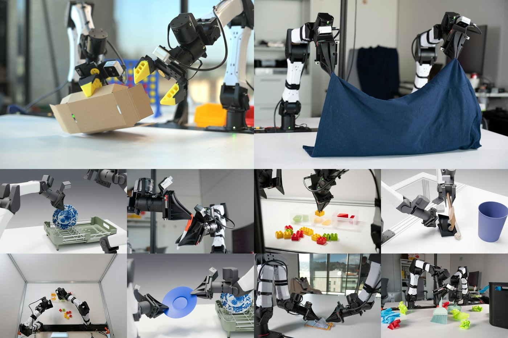
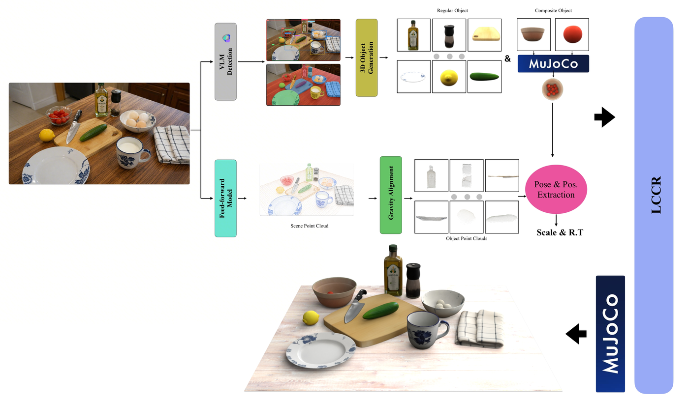
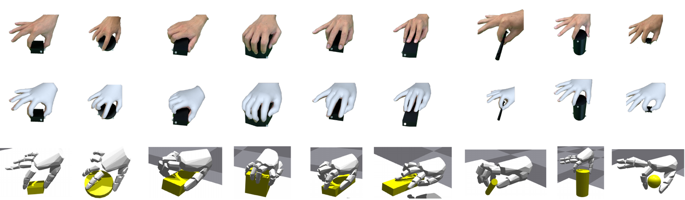
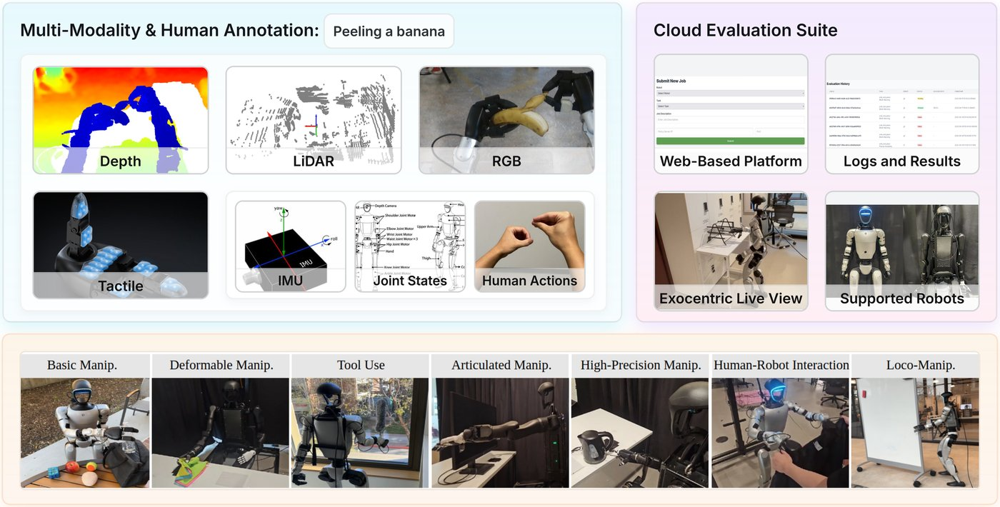
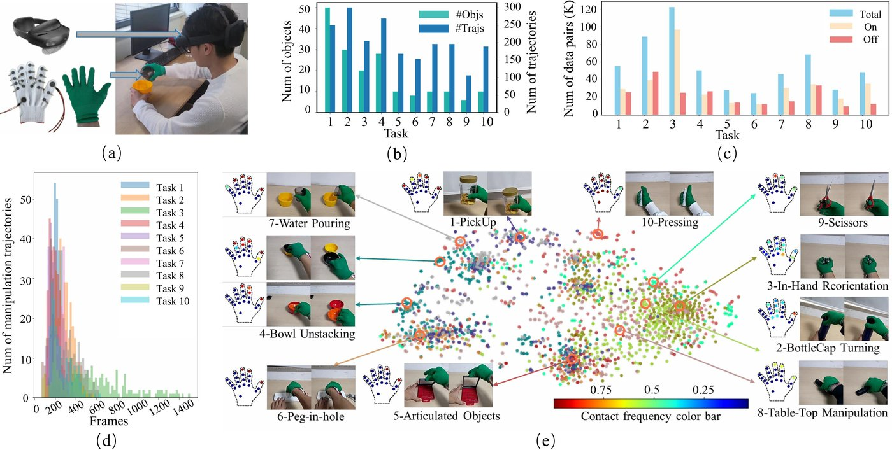

# Embodied AI Datasets

> 51 representative datasets covering real-world collection, cross-embodiment aggregation, RGB-D / force / tactile sensing, tabletop manipulation, simulation benchmarks, and automated data generation. Statistics follow official pages, repositories, and papers.

---

### Index

| Dataset | Positioning | Type | Scale | Key modalities | Official homepage |
|---|---|---|---|---|---|
| [DROID](#droid-sample) | Large-scale in-the-wild teleoperated manipulation from 13 North American labs | Real-world collection | ~76k trajectories / 564 scenes | RGB + proprioception + language | [Homepage](https://droid-dataset.github.io/) |
| [Open X-Embodiment / RT-X](#open-x-sample) | Aggregation of real robot datasets from 21 institutions | Real-world + aggregated | 1M+ trajectories / 22 embodiments | RGB + language | [Homepage](https://robotics-transformer-x.github.io/) |
| [RH20T](#rh20t-sample) | Contact-rich manipulation with force / tactile / audio modalities | Real-world collection | 110k+ sequences / 147 tasks | RGB-D + force + tactile + audio | [Homepage](https://rh20t.github.io/) |
| [BridgeData V2](#bridgedata-sample) | Tabletop manipulation via VR teleoperation | Real-world collection | 60k trajectories / 24 environments | RGB-D + language | [Homepage](https://rail-berkeley.github.io/bridgedata/) |
| [LIBERO](#libero-sample) | Simulation benchmark for lifelong robot learning / knowledge transfer | Simulation + demonstrations | 130 tasks / 4 suites | Sim RGB + language | [Homepage](https://libero-project.github.io/) |
| [MimicGen](#mimicgen-sample) | Automated large-scale simulation data from few human demos | Simulation + generation | 50k+ trajectories / 18 tasks | Sim RGB + robot state | [Homepage](https://mimicgen.github.io/) |
| [AgiBot World](#ds-agibot-world) | Million-scale real-robot manipulation | Real-world | 1M+ trajectories / 217 tasks | RGB-D + force + tactile + language | [Homepage](https://agibot-world.com/) |
| [RoboMIND](#ds-robomind) | Multi-embodiment teleoperation + benchmark | Real-world | 310K+ trajectories / 739 tasks | RGB(-D) + tactile + language | [Homepage](https://x-humanoid-robomind.github.io/) |
| [Xiaomi-Robotics-1 Dataset](#ds-xiaomi-robotics-1-dataset) | 100K-hour UMI VLA pretraining corpus | Real-world | 100K hours / 1,700+ scenes | Egocentric RGB + language | [Homepage](https://robotics.xiaomi.com/xiaomi-robotics-1.html) |
| [Hy-UMI-10K](#ds-hy-umi-10k) | Sub-mm fingertip UMI human demos | Real-world | 10K+ hours / 70 task types | Egocentric RGB + force/torque | [Homepage](https://tairos.tencent.com/openSourceModels/hy-embodied-0.5-vla) |
| [ALOHA / Mobile ALOHA](#ds-aloha-mobile-aloha) | Low-cost bimanual / mobile teleop | Real-world | 6 real tasks + 7 mobile categories | Multi-view RGB + joint pose | [Homepage](https://tonyzhaozh.github.io/aloha/) |
| [UMI](#ds-umi) | Hand-held gripper in-the-wild demos | Real-world | 1,447 in-the-wild demos | Wrist fisheye RGB + IMU/SLAM | [Homepage](https://umi-gripper.github.io/) |
| [Dobb·E](#ds-dobb-e) | iPhone-based home demo collection | Real-world | 13 hours / 5,620 trajectories | RGB-D + gripper pose | [Homepage](https://www.dobb-e.com/) |
| [Adroit](#ds-adroit) | 24-DoF dexterous hand suite | Simulation | 4 tasks / 25 demos each | State/torque | [Homepage](http://sites.google.com/view/deeprl-dexterous-manipulation) |
| [RoboCasa](#ds-robocasa) | Generative-AI kitchen simulation | Simulation | 2,200+ hours / 365 tasks | RGB-D + robot state | [Homepage](https://robocasa.ai/) |
| [BEHAVIOR-1K](#ds-behavior-1k) | 1,000 everyday activities benchmark | Simulation | 1,000 activities / 50 scenes | RGB-D + physical states | [Homepage](https://behavior.stanford.edu/) |
| [CALVIN](#ds-calvin) | Long-horizon language-conditioned ops | Simulation | 34 subtasks / ~24K demos | RGB-D + language | [Homepage](https://github.com/mees/calvin) |
| [RLBench](#ds-rlbench) | Vision-guided multi-task benchmark | Simulation | 100+ tasks | RGB-D + segmentation | [Homepage](https://sites.google.com/view/rlbench) |
| [Meta-World](#ds-meta-world) | Meta-RL 50-task benchmark | Simulation | 50 tasks | State/joint | [Homepage](https://meta-world.github.io/) |
| [Franka Kitchen](#ds-franka-kitchen) | Multi-stage kitchen imitation benchmark | Real-world | 566 demos | Joint + object states | [Homepage](https://relay-policy-learning.github.io/) |
| [RoboTwin](#ds-robotwin) | Bimanual simulation benchmark + generation | Simulation + real | 50 bimanual tasks / 100K+ trajs | RGB-D + language | [Homepage](https://robotwin-platform.github.io/) |
| [Ego4D](#ds-ego4d) | Large-scale egocentric daily video | Video | 3,670 hours / 923 wearers | Egocentric RGB | [Homepage](https://ego4d-data.org/) |
| [EPIC-KITCHENS](#ds-epic-kitchens) | Egocentric kitchen manipulation video | Video | 100 hours / 45 kitchens | Egocentric RGB + audio | [Homepage](https://epic-kitchens.github.io/) |
| [Physion](#ds-physion) | Physical-intuition prediction benchmark | Simulation | ~25K videos | RGB-D + optical flow + seg | [Homepage](https://physion-benchmark.github.io/) |
| [RoboGen](#ds-robogen) | Foundation-model task generation | Generated | 100+ tasks | Sim-generated | [Homepage](https://generativesimulation.github.io/) |
| [Isaac GR00T](#ds-isaac-gr00t) | Humanoid data generation pipeline | Generated + sim | 780K synthetic trajs / 11h | Multimodal | [Homepage](https://developer.nvidia.com/isaac/gr00t) |
| [RT-1 Robotic Dataset](#ds-rt-1-robotic-dataset) | Large-scale real teleop dataset, 700+ tasks | Real-world | 130K+ trajectories / 700+ tasks | RGB + language | [Homepage](https://robotics-transformer1.github.io/) |
| [FurnitureBench](#ds-furniturebench) | Real-world furniture assembly benchmark | Real-world + sim | 5,100 trajs / 219.6 h / 8 tasks | RGB + joint states | [Homepage](https://clvrai.github.io/furniture-bench/) |
| [RoboAgent (RoboSet)](#ds-roboagent) | Sample-efficient multi-skill dataset | Real-world | 100K+ trajs / 12 skills / 38 tasks | RGB + language | [Homepage](https://robopen.github.io/) |
| [TriFinger](#ds-trifinger) | Remote real-robot dexterous benchmark | Real-world + sim | 9-DoF platform / 10K+ episodes | RGB + fingertip force | [Homepage](https://is.mpg.de/ei/projects/robot-benchmark) |
| [Ravens](#ds-ravens) | Tabletop manipulation simulation benchmark | Simulation | 10 tasks + 5 variants | RGB-D | [Homepage](https://transporternets.github.io/) |
| [SoftVTBench](#ds-softvtbench) | Visuo-tactile dataset and benchmark for deformable-object manipulation | Real + simulation | 4,000 demos / 50+ assets / 20Hz multimodal | RGB + tactile + FEM states | [Homepage](https://arxiv.org/abs/2608.18701) |
| [Open-AoE](#ds-open-aoe) | Open egocentric manipulation dataset and toolchain | Real-world | ~2,000 hours / 500+ contributors | Egocentric RGB + MANO hand pose | [Homepage](https://arxiv.org/abs/2607.14183) |
| [QuadFM](#ds-quadfm) | Text-driven quadruped motion dataset | Motion capture | 11,784 clips / 35,352 descriptions | Motion + language | [Homepage](https://github.com/GaoLii/QuadFM) |
| [ManiGuard](#ds-maniguard) | Safety benchmark and data suite for manipulation | Real + simulation | 200 tasks / 1,000 scenarios / 8,000 safety-labeled demos | RGB + spec constraints | [Homepage](https://arxiv.org/abs/2608.17386) |
| [EmbodimentSemantic](#ds-embodimentsemantic) | Spatial scene-graph dataset for embodied manipulation | Real + simulation | 60K+ frames / 120K+ scene graphs | RGB-D + scene graph | [Homepage](https://arxiv.org/abs/2607.00020) |
| [DexYCB](#ds-dexycb) | NVIDIA hand-object capture benchmark | Real-world | 582K frames / 1,000 sequences / 20 objects | RGB-D + 6D pose + 3D hands | [Homepage](https://dex-ycb.github.io/) |
| [OakInk](#ds-oakink) | Hand manipulation intent and affordance dataset | Real-world + virtual transfer | 50K interactions / 1,800-object affordance library | RGB-D + hand pose + intent labels | [Homepage](https://oakink.net/) |
| [GraspNet-1Billion](#ds-graspnet) | Large-scale dense grasp pose dataset | Real-world | 97,280 RGB-D images / 190 scenes / 1.1B+ grasp poses | RGB-D + 6D pose + grasp labels | [Homepage](https://graspnet.net/) |
| [HOI4D](#ds-hoi4d) | Category-level dynamic hand-object 4D interaction | Real-world | 2.4M frames / 4,000+ sequences / 800 object instances | RGB-D 4D point clouds + 3D hands | [Homepage](https://hoi4d.github.io/) |
| [ARCTIC](#ds-arctic) | Articulated hand-object interaction dataset | Real-world | 2.1M frames / 339 sequences / 11 articulated objects | Dual-view RGB + 3D hand/object meshes + contact | [Homepage](https://arctic.is.tue.mpg.de/) |
| [GigaHands](#ds-gigahands) | Large-scale multi-view hand manipulation dataset | Real-world | 34 hours / 14k clips / 183M frames | Multi-view RGB + 3D hand/object poses + text | [Homepage](https://ivl.cs.brown.edu/research/gigahands.html) |
| [EgoDex](#ds-egodex) | Apple egocentric tabletop manipulation dataset | Real-world | 829 hours / 338k demos / 194 task types | 1080p RGB + 3D hand skeleton + language | [Homepage](https://github.com/apple/ml-egodex) |
| [DexCap](#ds-dexcap) | Portable hand-capture dexterous manipulation data | Real-world | 6 dexterous task evaluations | 3D point clouds + hand mocap | [Homepage](https://dex-cap.github.io/) |
| [HumanPlus](#ds-humanplus-data) | Humanoid shadowing full-body data | Real-world | 40 hours human motion / up to 40 demos per task | Egocentric RGB + full-body joints | [Homepage](https://humanoid-ai.github.io/) |
| [LeRobot Community Datasets](#ds-lerobot-data) | Hugging Face community robot dataset collection | Real-world | ~189 datasets (growing) | Multi-camera RGB + state/action + language | [Homepage](https://huggingface.co/lerobot) |
| [ABC-130K](#ds-abc-130k) | Largest open bimanual teleoperation dataset | Real-world | 134,806 episodes / 3,553 hours | 3-view RGB + state/action | [Homepage](https://abc.bot/) |
| [TableVerse-100K](#ds-tableverse-100k) | Real2Sim physically-consistent tabletop scenes | Simulation-generated | 100K scenes / 1M object instances | Synthetic multi-view RGB + meshes | [Homepage](https://bytedance.github.io/TableVerse/) |
| [DexCanvas](#ds-dexcanvas) | Human dexterous hands + per-frame contact force | Real + sim expansion | 70h seed / 7,000h planned | Multi-view RGB-D + MANO + force | [Homepage](https://dexcanvas.github.io/) |
| [Humanoid Everyday](#ds-humanoideveryday) | Open-world humanoid whole-body operation | Real-world | 10.3K trajectories / 260 tasks | RGB + depth + LiDAR + tactile | [Homepage](https://humanoideveryday.github.io/) |
| [VTDexManip](#ds-vtdexmanip) | Human tactile data + dexterous benchmark | Real + simulation | 565k frames / 2,032 sequences | RGB + fingertip tactile | [Homepage](https://lqts.github.io/VTDexManip/) |

---

### DROID

[Homepage](https://droid-dataset.github.io/) · [Download](https://droid-dataset.github.io/droid/the-droid-dataset) · [Paper](https://arxiv.org/abs/2403.12945)

  

<table style="width:100%;table-layout:fixed" width="100%">
<tbody>
<tr><td rowspan="4" style="width:130px;min-width:130px;max-width:130px" width="130">Overview</td><td style="width:130px;min-width:130px;max-width:130px" width="130">Dataset Visualizer</td><td style="word-wrap:break-word;width:620px;min-width:620px;max-width:620px" width="620">The [official interactive viewer](https://droid-dataset.github.io/visualizer/) — randomly samples 1000 trajectories with real-time filtering and browsing across Scene, Object, and Task dimensions.</td></tr>
<tr><td style="width:130px;min-width:130px;max-width:130px" width="130">Source</td><td style="word-wrap:break-word;width:620px;min-width:620px;max-width:620px" width="620">13 North American labs led by Stanford / UC Berkeley / Google, unified on the Franka Panda robot hardware.</td></tr>
<tr><td style="width:130px;min-width:130px;max-width:130px" width="130">Recommendations</td><td style="word-wrap:break-word;width:620px;min-width:620px;max-width:620px" width="620">In-the-wild robot manipulation across scenes, institutions, and tasks. Spans 8 indoor scene categories (industrial office, kitchen, office, living room, bedroom, bathroom, hallway, laundry room). A common benchmark for behavior cloning and RLHF. DROID is designed to let the research community collect large-scale real interaction data beyond the lab.</td></tr>
<tr><td style="width:130px;min-width:130px;max-width:130px" width="130">Use</td><td style="word-wrap:break-word;width:620px;min-width:620px;max-width:620px" width="620"><ul><li><strong>Download</strong>: The full RLDS release is ~1.7 TB, accessed via <code>gsutil</code> commands on Google Cloud Storage (<code>gs://gresearch/robotics/</code>); the documentation page lists per-file commands. Raw stereo HD video (~8.7 TB) and the <code>droid_100</code> debugging subset (~2 GB, ~100 episodes) are also available;</li><li><strong>Example code</strong>: The official  loads and visualizes a small number of episodes;</li><li><strong>Schema docs</strong>: <a href="https://droid-dataset.github.io/droid/the-droid-dataset">The DROID Dataset</a>.</li></ul></td></tr>
<tr><td rowspan="3" style="width:130px;min-width:130px;max-width:130px" width="130">Design</td><td style="width:130px;min-width:130px;max-width:130px" width="130">Collection</td><td style="word-wrap:break-word;width:620px;min-width:620px;max-width:620px" width="620">Human-in-the-loop robot teleoperation across diverse scenes, with face blurring before release.</td></tr>
<tr><td style="width:130px;min-width:130px;max-width:130px" width="130">Scale distribution</td><td style="word-wrap:break-word;width:620px;min-width:620px;max-width:620px" width="620">~76,000 trajectories / 350 hours of interaction / 564 scenes / 52 buildings / 86 tasks / 18 robots / 13 institutions / 50 data collectors.</td></tr>
<tr><td style="width:130px;min-width:130px;max-width:130px" width="130">Modalities</td><td style="word-wrap:break-word;width:620px;min-width:620px;max-width:620px" width="620"><ul><li><strong>Vision</strong>: Three ZED stereo RGB cameras, including 1 wrist and 2 exterior cameras; the raw release contains monocular videos, concatenated stereo videos, and SVO files. The RLDS release exposes left-view RGB image fields with an example schema size of 180×320×3; the raw release is high-definition</li><li><strong>Proprioception</strong>: joint position (7D), Cartesian position (6D), gripper position; the raw <code>trajectory.h5</code> files contain action and proprioceptive trajectories</li><li><strong>Actions and control</strong>: gripper position / velocity, Cartesian position / velocity, joint position / velocity; the RLDS <code>action</code> example is 7D, composed of joint velocity and gripper position</li><li><strong>Force</strong>: None</li><li><strong>Tactile</strong>: None</li><li><strong>Other</strong>: Natural-language task instructions and alternative instruction fields</li></ul></td></tr>
</tbody>
</table>

---

### Open X-Embodiment / RT-X

[Homepage](https://robotics-transformer-x.github.io/) · [Download](https://github.com/google-deepmind/open_x_embodiment) · [Paper](https://arxiv.org/abs/2310.08864)

  

<table style="width:100%;table-layout:fixed" width="100%">
<tbody>
<tr><td rowspan="4" style="width:130px;min-width:130px;max-width:130px" width="130">Overview</td><td style="width:130px;min-width:130px;max-width:130px" width="130">Dataset Visualizer</td><td style="word-wrap:break-word;width:620px;min-width:620px;max-width:620px" width="620">The [official homepage](https://robotics-transformer-x.github.io/) carries representative videos across 60 contributing datasets and 22 embodiments, plus RT-1 / RT-2 task demos.</td></tr>
<tr><td style="width:130px;min-width:130px;max-width:130px" width="130">Source</td><td style="word-wrap:break-word;width:620px;min-width:620px;max-width:620px" width="620">An aggregation of real robot datasets by Google DeepMind and 21 collaborating institutions.</td></tr>
<tr><td style="width:130px;min-width:130px;max-width:130px" width="130">Recommendations</td><td style="word-wrap:break-word;width:620px;min-width:620px;max-width:620px" width="620">A unified training set across 22 robot embodiments (single-arm, bimanual, quadruped, etc.); the pretraining foundation for RT-1 / RT-2 class VLA models; provides the data basis for "one model, many embodiments".</td></tr>
<tr><td style="width:130px;min-width:130px;max-width:130px" width="130">Use</td><td style="word-wrap:break-word;width:620px;min-width:620px;max-width:620px" width="620"><ul><li><strong>Download and load</strong>: Provided through TensorFlow Datasets (TFDS). The Dataset Access section of the <a href="https://github.com/google-deepmind/open_x_embodiment">google-deepmind/open_x_embodiment</a> repository lists the <code>tfds.load</code> names and commands for each contributing dataset; datasets are downloaded individually;</li><li><strong>Metadata</strong>: The official dataset spreadsheet records the source, license, citation, and field description of every contributing dataset (linked from the repository README).</li></ul></td></tr>
<tr><td rowspan="3" style="width:130px;min-width:130px;max-width:130px" width="130">Design</td><td style="width:130px;min-width:130px;max-width:130px" width="130">Collection</td><td style="word-wrap:break-word;width:620px;min-width:620px;max-width:620px" width="620">Aggregation of public real-robot datasets from 21 institutions, unified into the RLDS episode format.</td></tr>
<tr><td style="width:130px;min-width:130px;max-width:130px" width="130">Scale distribution</td><td style="word-wrap:break-word;width:620px;min-width:620px;max-width:620px" width="620">&gt;1,000,000 real robot trajectories / 22 embodiments / 527 skills / 160,266 tasks / 60 datasets / 1,798 attributes / 5,228 objects / 23,486 spatial relations.</td></tr>
<tr><td style="width:130px;min-width:130px;max-width:130px" width="130">Modalities</td><td style="word-wrap:break-word;width:620px;min-width:620px;max-width:620px" width="620"><ul><li><strong>Vision</strong>: Workspace RGB images from single-arm / bimanual / quadruped robots, one of the unified inputs; the contributing datasets also include demonstration videos</li><li><strong>Proprioception</strong>: None</li><li><strong>Actions and control</strong>: RLDS episode sequences; action spaces and control frequencies are inherited from each contributing dataset</li><li><strong>Force</strong>: None</li><li><strong>Tactile</strong>: None</li><li><strong>Other</strong>: Natural-language task strings / task labels (one of the unified inputs); metadata includes robot state and scene descriptions</li></ul></td></tr>
</tbody>
</table>

---

### RH20T

[Homepage](https://rh20t.github.io/) · [Download](https://rh20t.github.io/#download) · [Paper](https://arxiv.org/abs/2307.00595)

  

<table style="width:100%;table-layout:fixed" width="100%">
<tbody>
<tr><td rowspan="4" style="width:130px;min-width:130px;max-width:130px" width="130">Overview</td><td style="width:130px;min-width:130px;max-width:130px" width="130">Dataset Visualizer</td><td style="word-wrap:break-word;width:620px;min-width:620px;max-width:620px" width="620">The [official homepage](https://rh20t.github.io/) showcases 110k+ contact-rich manipulation sequences, multiple robot configurations, and paired human demonstration videos.</td></tr>
<tr><td style="width:130px;min-width:130px;max-width:130px" width="130">Source</td><td style="word-wrap:break-word;width:620px;min-width:620px;max-width:620px" width="620">Shanghai Jiao Tong University (Cewu Lu's group / MVIG Lab).</td></tr>
<tr><td style="width:130px;min-width:130px;max-width:130px" width="130">Recommendations</td><td style="word-wrap:break-word;width:620px;min-width:620px;max-width:620px" width="620">A real-world manipulation dataset emphasizing contact-rich interaction and multi-modal perception; every robot sequence is paired with a corresponding human demonstration video and a language description, targeting one-shot imitation research; covers complex skills such as cutting, plugging, pouring, folding, and rotating that require visual and force / tactile perception together.</td></tr>
<tr><td style="width:130px;min-width:130px;max-width:130px" width="130">Use</td><td style="word-wrap:break-word;width:620px;min-width:620px;max-width:620px" width="620"><ul><li><strong>Download</strong>: The raw data is ~40 TB; a 640×360 resized version is also provided (~5 TB RGB, ~10 TB RGBD). Data is split into seven hardware configurations (Cfg1–Cfg7), available via the Google Drive / Baidu Cloud links on the homepage;</li><li><strong>Parsing</strong>: The official <a href="https://github.com/rh20t/rh20t_api">rh20t_api</a> package parses the data (per-config robot info in <code>configs/configs.json</code>).</li></ul></td></tr>
<tr><td rowspan="3" style="width:130px;min-width:130px;max-width:130px" width="130">Design</td><td style="width:130px;min-width:130px;max-width:130px" width="130">Collection</td><td style="word-wrap:break-word;width:620px;min-width:620px;max-width:620px" width="620">The robot is equipped with a force / torque sensor and teleoperated via a haptic device with force rendering for precise, efficient collection suited to contact-rich interaction; a corresponding human demonstration video is recorded for each sequence.</td></tr>
<tr><td style="width:130px;min-width:130px;max-width:130px" width="130">Scale distribution</td><td style="word-wrap:break-word;width:620px;min-width:620px;max-width:620px" width="620">110,000+ contact-rich manipulation sequences / 147 tasks (48 from RLBench, 29 from MetaWorld, 70 self-proposed) / 7 hardware configurations / 4 robot arms (Flexiv, UR5, Franka, Kuka) / 50M+ image frames / 110k+ paired human demonstration videos.</td></tr>
<tr><td style="width:130px;min-width:130px;max-width:130px" width="130">Modalities</td><td style="word-wrap:break-word;width:620px;min-width:620px;max-width:620px" width="620"><ul><li><strong>Vision</strong>: 8–10 global RGB-D cameras plus 1–2 in-hand cameras per configuration; includes RGB, depth, and binocular IR images</li><li><strong>Proprioception</strong>: joint angle / joint torque, gripper state, end-effector (EE) pose</li><li><strong>Actions and control</strong>: 6–7 DoF joint + gripper; EE / gripper Cartesian pose is also provided</li><li><strong>Force</strong>: 6-DoF force-torque</li><li><strong>Tactile</strong>: fingertip tactile (Cfg7 only)</li><li><strong>Other</strong>: audio; each sequence has a language description and a paired human demonstration video</li></ul></td></tr>
</tbody>
</table>

---

### BridgeData V2

[Homepage](https://rail-berkeley.github.io/bridgedata/) · [Download](https://rail.eecs.berkeley.edu/datasets/bridge_release/data/) · [Paper](https://arxiv.org/abs/2308.12952)

  

<table style="width:100%;table-layout:fixed" width="100%">
<tbody>
<tr><td rowspan="4" style="width:130px;min-width:130px;max-width:130px" width="130">Overview</td><td style="width:130px;min-width:130px;max-width:130px" width="130">Dataset Visualizer</td><td style="word-wrap:break-word;width:620px;min-width:620px;max-width:620px" width="620">The [official homepage](https://rail-berkeley.github.io/bridgedata/) offers a "Sample" button to draw a random trajectory, showing its initial / final states with the corresponding natural-language annotation.</td></tr>
<tr><td style="width:130px;min-width:130px;max-width:130px" width="130">Source</td><td style="word-wrap:break-word;width:620px;min-width:620px;max-width:620px" width="620">UC Berkeley RAIL Lab (Sergey Levine's group).</td></tr>
<tr><td style="width:130px;min-width:130px;max-width:130px" width="130">Recommendations</td><td style="word-wrap:break-word;width:620px;min-width:620px;max-width:620px" width="620">Collected on the low-cost, easy-to-source WidowX 250 platform (hardware ~$4,000), so other institutions can reproduce it; each trajectory carries a crowdsourced post-hoc natural-language instruction, supporting goal-conditioned, language-conditioned, imitation-learning, and offline-RL methods; a common real-world fine-tuning benchmark for VLAs such as OpenVLA and Octo, and a major contributor to the Open X-Embodiment mix.</td></tr>
<tr><td style="width:130px;min-width:130px;max-width:130px" width="130">Use</td><td style="word-wrap:break-word;width:620px;min-width:620px;max-width:620px" width="620"><ul><li><strong>Download</strong>: The raw data is provided as NumPy shards (~400 GB), with teleoperated demonstrations and scripted-policy data in separate zips; an RLDS copy can also be streamed from the Open X-Embodiment GCS bucket (<code>gs://gresearch/robotics</code>);</li><li><strong>Training code</strong>: The official <a href="https://github.com/rail-berkeley/bridge_data_v2">rail-berkeley/bridge_data_v2</a> provides training / evaluation code and pretrained weights.</li></ul></td></tr>
<tr><td rowspan="3" style="width:130px;min-width:130px;max-width:130px" width="130">Design</td><td style="width:130px;min-width:130px;max-width:130px" width="130">Collection</td><td style="word-wrap:break-word;width:620px;min-width:620px;max-width:620px" width="620">Collected by teleoperating a WidowX 250 6-DoF arm with a VR controller at 5 Hz control frequency, averaging ~38 timesteps per trajectory; camera poses, objects, and workspace positions are randomized roughly every 50 trajectories for generalization; a portion is autonomously collected by a scripted pick-and-place policy; task labels are crowdsourced post-hoc natural-language annotations.</td></tr>
<tr><td style="width:130px;min-width:130px;max-width:130px" width="130">Scale distribution</td><td style="word-wrap:break-word;width:620px;min-width:620px;max-width:620px" width="620">60,096 trajectories (50,365 teleoperated demonstrations + 9,731 scripted-policy rollouts) / 13 skills / 24 environments / 100+ objects; image resolution 640×480.</td></tr>
<tr><td style="width:130px;min-width:130px;max-width:130px" width="130">Modalities</td><td style="word-wrap:break-word;width:620px;min-width:620px;max-width:620px" width="620"><ul><li><strong>Vision</strong>: 1 fixed over-the-shoulder RGB-D camera + 2 randomized-pose RGB cameras + 1 wrist RGB camera; resolution 640×480</li><li><strong>Proprioception</strong>: robot state / gripper state</li><li><strong>Actions and control</strong>: WidowX 250 6-DoF actions at 5 Hz; each trajectory provides an initial observation, a goal state (image or text), and an action sequence</li><li><strong>Force</strong>: None</li><li><strong>Tactile</strong>: None</li><li><strong>Other</strong>: each trajectory carries a crowdsourced post-hoc natural-language instruction</li></ul></td></tr>
</tbody>
</table>

---

### LIBERO

[Homepage](https://libero-project.github.io/) · [Download](https://libero-project.github.io/datasets) · [Paper](https://arxiv.org/abs/2306.03310)

  

<table style="width:100%;table-layout:fixed" width="100%">
<tbody>
<tr><td rowspan="4" style="width:130px;min-width:130px;max-width:130px" width="130">Overview</td><td style="width:130px;min-width:130px;max-width:130px" width="130">Dataset Visualizer</td><td style="word-wrap:break-word;width:620px;min-width:620px;max-width:620px" width="620">The [official homepage](https://libero-project.github.io/) presents representative tasks from the four task suites and the lifelong-learning benchmark description.</td></tr>
<tr><td style="width:130px;min-width:130px;max-width:130px" width="130">Source</td><td style="word-wrap:break-word;width:620px;min-width:620px;max-width:620px" width="620">The University of Texas at Austin and collaborators (authors include Yuke Zhu and Peter Stone).</td></tr>
<tr><td style="width:130px;min-width:130px;max-width:130px" width="130">Recommendations</td><td style="word-wrap:break-word;width:620px;min-width:620px;max-width:620px" width="620">A simulation benchmark for lifelong robot learning / knowledge transfer; provides a procedural generation pipeline that can in principle create infinitely many tasks; the four suites separately probe distribution shifts in objects, spatial layout, and task goals, plus their mixture — suited to systematic study of transferring declarative and procedural knowledge.</td></tr>
<tr><td style="width:130px;min-width:130px;max-width:130px" width="130">Use</td><td style="word-wrap:break-word;width:620px;min-width:620px;max-width:620px" width="620"><ul><li><strong>Download</strong>: The official script <code>benchmark_scripts/download_libero_datasets.py</code> downloads human-teleoperated demonstrations for all four suites; use <code>--datasets</code> to select a specific suite, or <code>--use-huggingface</code> to download from the HuggingFace mirror;</li><li><strong>Environment</strong>: Built on MuJoCo simulation and requires Linux; simulation assets are auto-loaded from the HuggingFace Hub (<code>lerobot/libero-assets</code>) and cached locally.</li></ul></td></tr>
<tr><td rowspan="3" style="width:130px;min-width:130px;max-width:130px" width="130">Design</td><td style="width:130px;min-width:130px;max-width:130px" width="130">Collection</td><td style="word-wrap:break-word;width:620px;min-width:620px;max-width:620px" width="620">Tasks are created by a procedural generation pipeline, and high-quality human-teleoperated demonstrations are provided for all 130 tasks.</td></tr>
<tr><td style="width:130px;min-width:130px;max-width:130px" width="130">Scale distribution</td><td style="word-wrap:break-word;width:620px;min-width:620px;max-width:620px" width="620">130 language-conditioned manipulation tasks in four suites: LIBERO-Spatial (10), LIBERO-Object (10), LIBERO-Goal (10), and LIBERO-100 (100, further split into LIBERO-90 for pretraining + LIBERO-10 for long-horizon testing).</td></tr>
<tr><td style="width:130px;min-width:130px;max-width:130px" width="130">Modalities</td><td style="word-wrap:break-word;width:620px;min-width:620px;max-width:620px" width="620"><ul><li><strong>Vision</strong>: Simulation-rendered RGB images (example camera resolution 128×128)</li><li><strong>Proprioception</strong>: robot state / gripper state</li><li><strong>Actions and control</strong>: 7-D actions (joint + gripper); MuJoCo-based OffScreenRenderEnv stepping</li><li><strong>Force</strong>: None</li><li><strong>Tactile</strong>: None</li><li><strong>Other</strong>: each task is language-conditioned; BDDL task-definition files</li></ul></td></tr>
</tbody>
</table>

---

### MimicGen

[Homepage](https://mimicgen.github.io/) · [Download](https://github.com/NVlabs/mimicgen) · [Paper](https://arxiv.org/abs/2310.17596)

  

<table style="width:100%;table-layout:fixed" width="100%">
<tbody>
<tr><td rowspan="4" style="width:130px;min-width:130px;max-width:130px" width="130">Overview</td><td style="width:130px;min-width:130px;max-width:130px" width="130">Dataset Visualizer</td><td style="word-wrap:break-word;width:620px;min-width:620px;max-width:620px" width="620">The [official homepage](https://mimicgen.github.io/) visualizes generated trajectories per task, task reset distributions, and side-by-side comparisons from source human demos to generated data.</td></tr>
<tr><td style="width:130px;min-width:130px;max-width:130px" width="130">Source</td><td style="word-wrap:break-word;width:620px;min-width:620px;max-width:620px" width="620">NVIDIA and The University of Texas at Austin (authors include Ajay Mandlekar, Yuke Zhu, and Dieter Fox).</td></tr>
<tr><td style="width:130px;min-width:130px;max-width:130px" width="130">Recommendations</td><td style="word-wrap:break-word;width:620px;min-width:620px;max-width:620px" width="620">Essentially a data-generation system rather than a plain dataset: it decomposes human demos into object-centric subtask segments, re-anchors them to new scenes / object poses, and replays them in simulation to auto-scale large datasets from few demos; targets long-horizon and high-precision (millimeter-level) contact tasks and is simulator-agnostic (robosuite/MuJoCo, Isaac Gym); follow-on work such as LIBERO and RoboCasa adopts its approach to extend benchmarks.</td></tr>
<tr><td style="width:130px;min-width:130px;max-width:130px" width="130">Use</td><td style="word-wrap:break-word;width:620px;min-width:620px;max-width:620px" width="620"><ul><li><strong>Download</strong>: The pre-generated datasets are HDF5 files in standard robomimic format (~60 GB), fetched via the official <code>download_datasets.py</code>;</li><li><strong>Generate your own</strong>: <code>generate_dataset.py</code> starts from a few source demos, runs subtask decomposition, object-pose resampling, simulation replay, and success filtering to produce new HDF5 files; code at <a href="https://github.com/NVlabs/mimicgen">NVlabs/mimicgen</a> (depends on robomimic + robosuite).</li></ul></td></tr>
<tr><td rowspan="3" style="width:130px;min-width:130px;max-width:130px" width="130">Design</td><td style="width:130px;min-width:130px;max-width:130px" width="130">Collection</td><td style="word-wrap:break-word;width:620px;min-width:620px;max-width:620px" width="620">Automated data generation: starting from ~200 human teleoperated demos, it spatially transforms object-centric subtask segments, replays and stitches them in simulation, and filters for success — roughly 250x amplification.</td></tr>
<tr><td style="width:130px;min-width:130px;max-width:130px" width="130">Scale distribution</td><td style="word-wrap:break-word;width:620px;min-width:620px;max-width:620px" width="620">50,000+ generated trajectories / 18 tasks / multiple robots (Franka Panda, Sawyer, UR5e, bimanual Panda) / multiple simulators; ~200 source human demonstrations.</td></tr>
<tr><td style="width:130px;min-width:130px;max-width:130px" width="130">Modalities</td><td style="word-wrap:break-word;width:620px;min-width:620px;max-width:620px" width="620"><ul><li><strong>Vision</strong>: Simulation-rendered RGB (agent view + wrist view)</li><li><strong>Proprioception</strong>: low-dimensional robot state, object poses</li><li><strong>Actions and control</strong>: standard robomimic action format; includes subtask segmentation information</li><li><strong>Force</strong>: None</li><li><strong>Tactile</strong>: None</li><li><strong>Other</strong>: task reset distributions; generated trajectories are amplified from source demonstrations</li></ul></td></tr>
</tbody>
</table>

---

### AgiBot World

[Homepage](https://agibot-world.com/) · [Download](https://huggingface.co/datasets/agibot-world) · [Paper](https://arxiv.org/abs/2503.06669)

  

<table style="width:100%;table-layout:fixed" width="100%">
<tbody>
<tr><td rowspan="4" style="width:130px;min-width:130px;max-width:130px" width="130">Overview</td><td style="width:130px;min-width:130px;max-width:130px" width="130">Dataset Visualizer</td><td style="word-wrap:break-word;width:620px;min-width:620px;max-width:620px" width="620">The [official project page](https://agibot-world.com/) provides statistics, scene browsing, and download access.</td></tr>
<tr><td style="width:130px;min-width:130px;max-width:130px" width="130">Source</td><td style="word-wrap:break-word;width:620px;min-width:620px;max-width:620px" width="620">AgiBot + Shanghai AI Lab + National Innovation Center for Humanoid Robots.</td></tr>
<tr><td style="width:130px;min-width:130px;max-width:130px" width="130">Recommendations</td><td style="word-wrap:break-word;width:620px;min-width:620px;max-width:620px" width="620">A million-scale real-robot manipulation dataset spanning home / dining / industry / retail / office; the first large-scale dataset with failure-recovery data, supporting VLA pretraining and failure-mode research.</td></tr>
<tr><td style="width:130px;min-width:130px;max-width:130px" width="130">Use</td><td style="word-wrap:break-word;width:620px;min-width:620px;max-width:620px" width="620"><ul><li><strong>Download</strong>: The Beta full set is ~43.8 TB; Alpha curated subset 92K trajectories; released on HuggingFace under CC BY-NC-SA 4.0;</li><li><strong>Companion</strong>: released together with the AgiBot GO-1 model and AgiBot Digital World simulation data.</li></ul></td></tr>
<tr><td rowspan="3" style="width:130px;min-width:130px;max-width:130px" width="130">Design</td><td style="width:130px;min-width:130px;max-width:130px" width="130">Collection</td><td style="word-wrap:break-word;width:620px;min-width:620px;max-width:620px" width="620">Bimanual humanoid teleoperation with human-in-the-loop quality verification.</td></tr>
<tr><td style="width:130px;min-width:130px;max-width:130px" width="130">Scale distribution</td><td style="word-wrap:break-word;width:620px;min-width:620px;max-width:620px" width="620">1,003,672 trajectories / 217 tasks / 3,000+ objects / 100+ robots.</td></tr>
<tr><td style="width:130px;min-width:130px;max-width:130px" width="130">Modalities</td><td style="word-wrap:break-word;width:620px;min-width:620px;max-width:620px" width="620"><ul><li><strong>Vision</strong>: multi-view RGB-D</li><li><strong>Proprioception</strong>: joint states, 6-DoF force</li><li><strong>Actions and control</strong>: bimanual action sequences</li><li><strong>Force</strong>: 6-DoF force</li><li><strong>Tactile</strong>: visuo-tactile sensors, dexterous hands</li><li><strong>Other</strong>: language instructions</li></ul></td></tr>
</tbody>
</table>

---

### RoboMIND

[Homepage](https://x-humanoid-robomind.github.io/) · [Paper](https://arxiv.org/abs/2412.13877)

  

<table style="width:100%;table-layout:fixed" width="100%">
<tbody>
<tr><td rowspan="4" style="width:130px;min-width:130px;max-width:130px" width="130">Overview</td><td style="width:130px;min-width:130px;max-width:130px" width="130">Dataset Visualizer</td><td style="word-wrap:break-word;width:620px;min-width:620px;max-width:620px" width="620">The [official project page](https://x-humanoid-robomind.github.io/) provides download, embodiment docs, and the evaluation benchmark.</td></tr>
<tr><td style="width:130px;min-width:130px;max-width:130px" width="130">Source</td><td style="word-wrap:break-word;width:620px;min-width:620px;max-width:620px" width="620">Beijing Humanoid Robot Innovation Center + Peking University.</td></tr>
<tr><td style="width:130px;min-width:130px;max-width:130px" width="130">Recommendations</td><td style="word-wrap:break-word;width:620px;min-width:620px;max-width:620px" width="620">A multi-embodiment real-robot teleoperation dataset and evaluation benchmark spanning five life scenarios; includes failure demonstrations and Isaac Sim digital twins for VLA training and evaluation.</td></tr>
<tr><td style="width:130px;min-width:130px;max-width:130px" width="130">Use</td><td style="word-wrap:break-word;width:620px;min-width:620px;max-width:620px" width="620"><ul><li><strong>Download</strong>: Released on HuggingFace with 10M+ global downloads;</li><li><strong>Versions</strong>: V1.0 (107K trajectories / 479 tasks) and V2.0.</li></ul></td></tr>
<tr><td rowspan="3" style="width:130px;min-width:130px;max-width:130px" width="130">Design</td><td style="width:130px;min-width:130px;max-width:130px" width="130">Collection</td><td style="word-wrap:break-word;width:620px;min-width:620px;max-width:620px" width="620">Teleoperation with a unified collection platform, including failure demos and Isaac Sim digital twins.</td></tr>
<tr><td style="width:130px;min-width:130px;max-width:130px" width="130">Scale distribution</td><td style="word-wrap:break-word;width:620px;min-width:620px;max-width:620px" width="620">V2.0: 310K+ trajectories / 739 tasks / 6 embodiments / 129 skills / 12K+ tactile sequences.</td></tr>
<tr><td style="width:130px;min-width:130px;max-width:130px" width="130">Modalities</td><td style="word-wrap:break-word;width:620px;min-width:620px;max-width:620px" width="620"><ul><li><strong>Vision</strong>: multi-view RGB(-D)</li><li><strong>Proprioception</strong>: robot state, end-effector information</li><li><strong>Actions and control</strong>: action sequences</li><li><strong>Force</strong>: None</li><li><strong>Tactile</strong>: tactile sequences (partial)</li><li><strong>Other</strong>: language task descriptions</li></ul></td></tr>
</tbody>
</table>

---

### Xiaomi-Robotics-1 Dataset

[Homepage](https://robotics.xiaomi.com/xiaomi-robotics-1.html) · [Paper](https://arxiv.org/abs/2607.15330)

  

<table style="width:100%;table-layout:fixed" width="100%">
<tbody>
<tr><td rowspan="4" style="width:130px;min-width:130px;max-width:130px" width="130">Overview</td><td style="width:130px;min-width:130px;max-width:130px" width="130">Dataset Visualizer</td><td style="word-wrap:break-word;width:620px;min-width:620px;max-width:620px" width="620">The [official project page](https://robotics.xiaomi.com/xiaomi-robotics-1.html) documents the model and data.</td></tr>
<tr><td style="width:130px;min-width:130px;max-width:130px" width="130">Source</td><td style="word-wrap:break-word;width:620px;min-width:620px;max-width:620px" width="620">Xiaomi Robotics.</td></tr>
<tr><td style="width:130px;min-width:130px;max-width:130px" width="130">Recommendations</td><td style="word-wrap:break-word;width:620px;min-width:620px;max-width:620px" width="620">A 100K-hour UMI hand-held trajectory pretraining corpus with a VLM auto-labeling pipeline generating state-transition language; a representative real-data source for VLA foundation pretraining.</td></tr>
<tr><td style="width:130px;min-width:130px;max-width:130px" width="130">Use</td><td style="word-wrap:break-word;width:620px;min-width:620px;max-width:620px" width="620"><ul><li><strong>Download</strong>: Model weights and full code open-sourced (Aug 2026); the 100K-hour training set itself is not publicly released.</li></ul></td></tr>
<tr><td rowspan="3" style="width:130px;min-width:130px;max-width:130px" width="130">Design</td><td style="width:130px;min-width:130px;max-width:130px" width="130">Collection</td><td style="word-wrap:break-word;width:620px;min-width:620px;max-width:620px" width="620">UMI hand-held gripper collection in the wild (embodiment-free) plus real-robot data for post-training.</td></tr>
<tr><td style="width:130px;min-width:130px;max-width:130px" width="130">Scale distribution</td><td style="word-wrap:break-word;width:620px;min-width:620px;max-width:620px" width="620">Pretraining: 100K hours of UMI trajectories / 1,700+ scenarios / 2.4M clips / 260+ tasks; post-training: 10K+ hours of cross-embodiment data.</td></tr>
<tr><td style="width:130px;min-width:130px;max-width:130px" width="130">Modalities</td><td style="word-wrap:break-word;width:620px;min-width:620px;max-width:620px" width="620"><ul><li><strong>Vision</strong>: egocentric RGB</li><li><strong>Proprioception</strong>: gripper state</li><li><strong>Actions and control</strong>: gripper action sequences</li><li><strong>Force</strong>: None</li><li><strong>Tactile</strong>: None</li><li><strong>Other</strong>: VLM-generated language annotations (state transitions)</li></ul></td></tr>
</tbody>
</table>

---

### Hy-UMI-10K

[Homepage](https://tairos.tencent.com/openSourceModels/hy-embodied-0.5-vla) · [Paper](https://arxiv.org/abs/2606.14409)

  

<table style="width:100%;table-layout:fixed" width="100%">
<tbody>
<tr><td rowspan="4" style="width:130px;min-width:130px;max-width:130px" width="130">Overview</td><td style="width:130px;min-width:130px;max-width:130px" width="130">Dataset Visualizer</td><td style="word-wrap:break-word;width:620px;min-width:620px;max-width:620px" width="620">The [Tencent Tairos platform](https://tairos.tencent.com/openSourceModels/hy-embodied-0.5-vla) documents the model and data.</td></tr>
<tr><td style="width:130px;min-width:130px;max-width:130px" width="130">Source</td><td style="word-wrap:break-word;width:620px;min-width:620px;max-width:620px" width="620">Tencent Robotics X + Hunyuan team.</td></tr>
<tr><td style="width:130px;min-width:130px;max-width:130px" width="130">Recommendations</td><td style="word-wrap:break-word;width:620px;min-width:620px;max-width:620px" width="620">10K hours of human demonstration data collected with sub-millimeter precision fingertip UMI, covering kitchen / laundry / tidying / cleaning task families; supports VLA pretraining and cross-embodiment transfer.</td></tr>
<tr><td style="width:130px;min-width:130px;max-width:130px" width="130">Use</td><td style="word-wrap:break-word;width:620px;min-width:620px;max-width:620px" width="620"><ul><li><strong>Download</strong>: Partially open-sourced; a 2,000-hour self-collected subset is planned for release.</li></ul></td></tr>
<tr><td rowspan="3" style="width:130px;min-width:130px;max-width:130px" width="130">Design</td><td style="width:130px;min-width:130px;max-width:130px" width="130">Collection</td><td style="word-wrap:break-word;width:620px;min-width:620px;max-width:620px" width="620">High-precision fingertip UMI hand-held collection with optical motion capture (replacing SLAM).</td></tr>
<tr><td style="width:130px;min-width:130px;max-width:130px" width="130">Scale distribution</td><td style="word-wrap:break-word;width:620px;min-width:620px;max-width:620px" width="620">10K+ hours / 1M+ episodes / 70 task types.</td></tr>
<tr><td style="width:130px;min-width:130px;max-width:130px" width="130">Modalities</td><td style="word-wrap:break-word;width:620px;min-width:620px;max-width:620px" width="620"><ul><li><strong>Vision</strong>: egocentric RGB</li><li><strong>Proprioception</strong>: optical motion capture sub-millimeter 6-DoF trajectories</li><li><strong>Actions and control</strong>: end-effector action sequences</li><li><strong>Force</strong>: end-effector force/torque</li><li><strong>Tactile</strong>: None</li><li><strong>Other</strong>: None</li></ul></td></tr>
</tbody>
</table>

---

### ALOHA / Mobile ALOHA

[Homepage](https://tonyzhaozh.github.io/aloha/) · [Mobile ALOHA](https://mobile-aloha.github.io/) · [Paper](https://arxiv.org/abs/2401.02117)

  

<table style="width:100%;table-layout:fixed" width="100%">
<tbody>
<tr><td rowspan="4" style="width:130px;min-width:130px;max-width:130px" width="130">Overview</td><td style="width:130px;min-width:130px;max-width:130px" width="130">Dataset Visualizer</td><td style="word-wrap:break-word;width:620px;min-width:620px;max-width:620px" width="620">The [project page](https://tonyzhaozh.github.io/aloha/) and [Mobile ALOHA](https://mobile-aloha.github.io/) provide demos, data, and hardware designs.</td></tr>
<tr><td style="width:130px;min-width:130px;max-width:130px" width="130">Source</td><td style="word-wrap:break-word;width:620px;min-width:620px;max-width:620px" width="620">Stanford (Tony Zhao / Zipeng Fu / Chelsea Finn) + UC Berkeley + Meta.</td></tr>
<tr><td style="width:130px;min-width:130px;max-width:130px" width="130">Recommendations</td><td style="word-wrap:break-word;width:620px;min-width:620px;max-width:620px" width="620">A low-cost bimanual / mobile bimanual teleoperation dataset paired with the ACT action-chunking algorithm; a classic benchmark for bimanual imitation learning.</td></tr>
<tr><td style="width:130px;min-width:130px;max-width:130px" width="130">Use</td><td style="word-wrap:break-word;width:620px;min-width:620px;max-width:620px" width="620"><ul><li><strong>Download</strong>: Open-sourced under MIT; code and hardware designs included.</li></ul></td></tr>
<tr><td rowspan="3" style="width:130px;min-width:130px;max-width:130px" width="130">Design</td><td style="width:130px;min-width:130px;max-width:130px" width="130">Collection</td><td style="word-wrap:break-word;width:620px;min-width:620px;max-width:620px" width="620">Master-slave teleoperation (leader-follower joint-space mapping with full-DoF simultaneous control).</td></tr>
<tr><td style="width:130px;min-width:130px;max-width:130px" width="130">Scale distribution</td><td style="word-wrap:break-word;width:620px;min-width:620px;max-width:620px" width="620">Static ALOHA: 6 real-robot tasks + 2 simulation tasks, 50 demos each; Mobile ALOHA: 7 mobile-manipulation categories, 50 demos each.</td></tr>
<tr><td style="width:130px;min-width:130px;max-width:130px" width="130">Modalities</td><td style="word-wrap:break-word;width:620px;min-width:620px;max-width:620px" width="620"><ul><li><strong>Vision</strong>: multi-view RGB (top + dual wrist, 4 cameras)</li><li><strong>Proprioception</strong>: joint pose / torque</li><li><strong>Actions and control</strong>: joint-space actions</li><li><strong>Force</strong>: None</li><li><strong>Tactile</strong>: None</li><li><strong>Other</strong>: None</li></ul></td></tr>
</tbody>
</table>

---

### UMI

[Homepage](https://umi-gripper.github.io/) · [Paper](https://arxiv.org/abs/2402.10329)

  

<table style="width:100%;table-layout:fixed" width="100%">
<tbody>
<tr><td rowspan="4" style="width:130px;min-width:130px;max-width:130px" width="130">Overview</td><td style="width:130px;min-width:130px;max-width:130px" width="130">Dataset Visualizer</td><td style="word-wrap:break-word;width:620px;min-width:620px;max-width:620px" width="620">The [project page](https://umi-gripper.github.io/) provides data, hardware designs, and collection instructions.</td></tr>
<tr><td style="width:130px;min-width:130px;max-width:130px" width="130">Source</td><td style="word-wrap:break-word;width:620px;min-width:620px;max-width:620px" width="620">Stanford + Columbia + Toyota Research Institute.</td></tr>
<tr><td style="width:130px;min-width:130px;max-width:130px" width="130">Recommendations</td><td style="word-wrap:break-word;width:620px;min-width:620px;max-width:620px" width="620">Hand-held gripper collection of human demos in the wild, deploying across embodiments without target-robot teleoperation; 100% calibration-free; the origin tool for large-scale collection pipelines such as Xiaomi-Robotics-1 and Hy-UMI-10K.</td></tr>
<tr><td style="width:130px;min-width:130px;max-width:130px" width="130">Use</td><td style="word-wrap:break-word;width:620px;min-width:620px;max-width:620px" width="620"><ul><li><strong>Download</strong>: Open-sourced under MIT; data and hardware designs included.</li></ul></td></tr>
<tr><td rowspan="3" style="width:130px;min-width:130px;max-width:130px" width="130">Design</td><td style="width:130px;min-width:130px;max-width:130px" width="130">Collection</td><td style="word-wrap:break-word;width:620px;min-width:620px;max-width:620px" width="620">UMI hand-held gripper collection with SLAM post-processing, 100% calibration-free.</td></tr>
<tr><td style="width:130px;min-width:130px;max-width:130px" width="130">Scale distribution</td><td style="word-wrap:break-word;width:620px;min-width:620px;max-width:620px" width="620">Official cup-organization data: 1,447 in-the-wild demos (30 environments) + 305 lab demos; collection rate ~30 s per demo.</td></tr>
<tr><td style="width:130px;min-width:130px;max-width:130px" width="130">Modalities</td><td style="word-wrap:break-word;width:620px;min-width:620px;max-width:620px" width="620"><ul><li><strong>Vision</strong>: wrist GoPro fisheye RGB (155° + side mirror implicit stereo)</li><li><strong>Proprioception</strong>: IMU/SLAM 6-DoF trajectories</li><li><strong>Actions and control</strong>: gripper opening and end-effector trajectories</li><li><strong>Force</strong>: None</li><li><strong>Tactile</strong>: None</li><li><strong>Other</strong>: None</li></ul></td></tr>
</tbody>
</table>

---

### Dobb·E

[Homepage](https://www.dobb-e.com/) · [Paper](https://arxiv.org/abs/2311.16098)

  

<table style="width:100%;table-layout:fixed" width="100%">
<tbody>
<tr><td rowspan="4" style="width:130px;min-width:130px;max-width:130px" width="130">Overview</td><td style="width:130px;min-width:130px;max-width:130px" width="130">Dataset Visualizer</td><td style="word-wrap:break-word;width:620px;min-width:620px;max-width:620px" width="620">The [project page](https://www.dobb-e.com/) provides data, code, and hardware designs.</td></tr>
<tr><td style="width:130px;min-width:130px;max-width:130px" width="130">Source</td><td style="word-wrap:break-word;width:620px;min-width:620px;max-width:620px" width="620">NYU (Lerrel Pinto's group) + Meta AI.</td></tr>
<tr><td style="width:130px;min-width:130px;max-width:130px" width="130">Recommendations</td><td style="word-wrap:break-word;width:620px;min-width:620px;max-width:620px" width="620">A home general-purpose robot learning system recording household demos with an iPhone-modified collection stick; a representative low-cost source of real home data.</td></tr>
<tr><td style="width:130px;min-width:130px;max-width:130px" width="130">Use</td><td style="word-wrap:break-word;width:620px;min-width:620px;max-width:620px" width="620"><ul><li><strong>Download</strong>: Open-sourced (data / code / hardware designs); RGB version 814 MB, depth-included version 77 GB.</li></ul></td></tr>
<tr><td rowspan="3" style="width:130px;min-width:130px;max-width:130px" width="130">Design</td><td style="width:130px;min-width:130px;max-width:130px" width="130">Collection</td><td style="word-wrap:break-word;width:620px;min-width:620px;max-width:620px" width="620">Hand-held collection stick The Stick ($25 pickup rod + 3D-printed parts + iPhone) for home demos.</td></tr>
<tr><td style="width:130px;min-width:130px;max-width:130px" width="130">Scale distribution</td><td style="word-wrap:break-word;width:620px;min-width:620px;max-width:620px" width="620">HoNY dataset: 13 hours / 5,620 trajectories / 1.5M RGB-D frames / 22 NY homes, 216 environments.</td></tr>
<tr><td style="width:130px;min-width:130px;max-width:130px" width="130">Modalities</td><td style="word-wrap:break-word;width:620px;min-width:620px;max-width:620px" width="620"><ul><li><strong>Vision</strong>: RGB + depth (iPhone)</li><li><strong>Proprioception</strong>: gripper 6-DoF pose and opening</li><li><strong>Actions and control</strong>: end-effector trajectories</li><li><strong>Force</strong>: None</li><li><strong>Tactile</strong>: None</li><li><strong>Other</strong>: None</li></ul></td></tr>
</tbody>
</table>

---

### Adroit

[Homepage](http://sites.google.com/view/deeprl-dexterous-manipulation) · [Paper](https://arxiv.org/abs/1709.10087)

  

<table style="width:100%;table-layout:fixed" width="100%">
<tbody>
<tr><td rowspan="4" style="width:130px;min-width:130px;max-width:130px" width="130">Overview</td><td style="width:130px;min-width:130px;max-width:130px" width="130">Dataset Visualizer</td><td style="word-wrap:break-word;width:620px;min-width:620px;max-width:620px" width="620">The [project page](http://sites.google.com/view/deeprl-dexterous-manipulation) provides task descriptions and demos.</td></tr>
<tr><td style="width:130px;min-width:130px;max-width:130px" width="130">Source</td><td style="word-wrap:break-word;width:620px;min-width:620px;max-width:620px" width="620">University of Washington + UC Berkeley (Rajeswaran et al.).</td></tr>
<tr><td style="width:130px;min-width:130px;max-width:130px" width="130">Recommendations</td><td style="word-wrap:break-word;width:620px;min-width:620px;max-width:620px" width="620">A 24-DoF Shadow hand simulation task suite; a classic D4RL offline-RL benchmark and a common evaluation set for dexterous-hand research.</td></tr>
<tr><td style="width:130px;min-width:130px;max-width:130px" width="130">Use</td><td style="word-wrap:break-word;width:620px;min-width:620px;max-width:620px" width="620"><ul><li><strong>Download</strong>: Open-sourced (dataset CC BY 4.0, code Apache 2.0); distributed via D4RL.</li></ul></td></tr>
<tr><td rowspan="3" style="width:130px;min-width:130px;max-width:130px" width="130">Design</td><td style="width:130px;min-width:130px;max-width:130px" width="130">Collection</td><td style="word-wrap:break-word;width:620px;min-width:620px;max-width:620px" width="620">VR-teleoperated human demos + DAPG reinforcement-learning expert data.</td></tr>
<tr><td style="width:130px;min-width:130px;max-width:130px" width="130">Scale distribution</td><td style="word-wrap:break-word;width:620px;min-width:620px;max-width:620px" width="620">4 tasks (door / hammer / pen / object relocation), 25 VR human demos each; D4RL provides human / expert / cloned variants.</td></tr>
<tr><td style="width:130px;min-width:130px;max-width:130px" width="130">Modalities</td><td style="word-wrap:break-word;width:620px;min-width:620px;max-width:620px" width="620"><ul><li><strong>Vision</strong>: image-observation variant included</li><li><strong>Proprioception</strong>: joint / object low-dimensional states</li><li><strong>Actions and control</strong>: joint-torque actions</li><li><strong>Force</strong>: None</li><li><strong>Tactile</strong>: None</li><li><strong>Other</strong>: MuJoCo simulation</li></ul></td></tr>
</tbody>
</table>

---

### RoboCasa

[Homepage](https://robocasa.ai/) · [Paper](https://arxiv.org/abs/2406.02538)

  

<table style="width:100%;table-layout:fixed" width="100%">
<tbody>
<tr><td rowspan="4" style="width:130px;min-width:130px;max-width:130px" width="130">Overview</td><td style="width:130px;min-width:130px;max-width:130px" width="130">Dataset Visualizer</td><td style="word-wrap:break-word;width:620px;min-width:620px;max-width:620px" width="620">The [project page](https://robocasa.ai/) offers interactive scene browsing and demo videos.</td></tr>
<tr><td style="width:130px;min-width:130px;max-width:130px" width="130">Source</td><td style="word-wrap:break-word;width:620px;min-width:620px;max-width:620px" width="620">UT Austin + NVIDIA Research.</td></tr>
<tr><td style="width:130px;min-width:130px;max-width:130px" width="130">Recommendations</td><td style="word-wrap:break-word;width:620px;min-width:620px;max-width:620px" width="620">A large kitchen simulation framework and dataset with generative-AI-built scene assets; a common VLA simulation pretraining benchmark; RoboCasa365 extends it to 365 tasks.</td></tr>
<tr><td style="width:130px;min-width:130px;max-width:130px" width="130">Use</td><td style="word-wrap:break-word;width:620px;min-width:620px;max-width:620px" width="620"><ul><li><strong>Download</strong>: Open-sourced (code MIT, assets and data CC BY 4.0).</li></ul></td></tr>
<tr><td rowspan="3" style="width:130px;min-width:130px;max-width:130px" width="130">Design</td><td style="width:130px;min-width:130px;max-width:130px" width="130">Collection</td><td style="word-wrap:break-word;width:620px;min-width:620px;max-width:620px" width="620">Teleoperation (SpaceMouse / keyboard) + MimicGen automatic trajectory synthesis.</td></tr>
<tr><td style="width:130px;min-width:130px;max-width:130px" width="130">Scale distribution</td><td style="word-wrap:break-word;width:620px;min-width:620px;max-width:620px" width="620">2,200+ hours of demos: 300 pretraining tasks (482h human teleoperation + 1,615h MimicGen synthesis); RoboCasa365 extends to 365 tasks, 2,500+ kitchen scenes, 3,200+ objects.</td></tr>
<tr><td style="width:130px;min-width:130px;max-width:130px" width="130">Modalities</td><td style="word-wrap:break-word;width:620px;min-width:620px;max-width:620px" width="620"><ul><li><strong>Vision</strong>: RGB, depth</li><li><strong>Proprioception</strong>: robot state</li><li><strong>Actions and control</strong>: action sequences</li><li><strong>Force</strong>: None</li><li><strong>Tactile</strong>: None</li><li><strong>Other</strong>: MuJoCo / Omnivive rendered simulation</li></ul></td></tr>
</tbody>
</table>

---

### BEHAVIOR-1K

[Homepage](https://behavior.stanford.edu/) · [Paper](https://arxiv.org/abs/2403.09227)

  

<table style="width:100%;table-layout:fixed" width="100%">
<tbody>
<tr><td rowspan="4" style="width:130px;min-width:130px;max-width:130px" width="130">Overview</td><td style="width:130px;min-width:130px;max-width:130px" width="130">Dataset Visualizer</td><td style="word-wrap:break-word;width:620px;min-width:620px;max-width:620px" width="620">The [project page](https://behavior.stanford.edu/) provides task lists, scene browsing, and downloads.</td></tr>
<tr><td style="width:130px;min-width:130px;max-width:130px" width="130">Source</td><td style="word-wrap:break-word;width:620px;min-width:620px;max-width:620px" width="620">Stanford (Li Fei-Fei, Jiajun Wu, C. Karen Liu et al.).</td></tr>
<tr><td style="width:130px;min-width:130px;max-width:130px" width="130">Recommendations</td><td style="word-wrap:break-word;width:620px;min-width:620px;max-width:620px" width="620">A thousand everyday-activity embodied simulation benchmark driven by a 1,000-person survey, built on OmniGibson; covers rigid / deformable / liquid interaction for long-horizon evaluation.</td></tr>
<tr><td style="width:130px;min-width:130px;max-width:130px" width="130">Use</td><td style="word-wrap:break-word;width:620px;min-width:620px;max-width:620px" width="620"><ul><li><strong>Download</strong>: Open-sourced (released on GitHub); the NeurIPS 2025 Challenge additionally provides 10K demonstrations.</li></ul></td></tr>
<tr><td rowspan="3" style="width:130px;min-width:130px;max-width:130px" width="130">Design</td><td style="width:130px;min-width:130px;max-width:130px" width="130">Collection</td><td style="word-wrap:break-word;width:620px;min-width:620px;max-width:620px" width="620">Simulation generation (BDDL language defines initial / goal states).</td></tr>
<tr><td style="width:130px;min-width:130px;max-width:130px" width="130">Scale distribution</td><td style="word-wrap:break-word;width:620px;min-width:620px;max-width:620px" width="620">1,000 everyday activities / 50 interactive scenes / 9,000+ object models.</td></tr>
<tr><td style="width:130px;min-width:130px;max-width:130px" width="130">Modalities</td><td style="word-wrap:break-word;width:620px;min-width:620px;max-width:620px" width="620"><ul><li><strong>Vision</strong>: RGB, depth, segmentation</li><li><strong>Proprioception</strong>: physical states (rigid / deformable / liquid)</li><li><strong>Actions and control</strong>: full-arm actions</li><li><strong>Force</strong>: None</li><li><strong>Tactile</strong>: None</li><li><strong>Other</strong>: OmniGibson simulation</li></ul></td></tr>
</tbody>
</table>

---

### CALVIN

[Homepage](https://github.com/mees/calvin) · [Paper](https://arxiv.org/abs/2112.03227)

  

<table style="width:100%;table-layout:fixed" width="100%">
<tbody>
<tr><td rowspan="4" style="width:130px;min-width:130px;max-width:130px" width="130">Overview</td><td style="width:130px;min-width:130px;max-width:130px" width="130">Dataset Visualizer</td><td style="word-wrap:break-word;width:620px;min-width:620px;max-width:620px" width="620">The [GitHub repository](https://github.com/mees/calvin) and [project page](https://calvin.cs.uni-freiburg.de/) provide task definitions, data, and evaluation code.</td></tr>
<tr><td style="width:130px;min-width:130px;max-width:130px" width="130">Source</td><td style="word-wrap:break-word;width:620px;min-width:620px;max-width:620px" width="620">University of Freiburg (Mees, Burgard et al.).</td></tr>
<tr><td style="width:130px;min-width:130px;max-width:130px" width="130">Recommendations</td><td style="word-wrap:break-word;width:620px;min-width:620px;max-width:620px" width="620">A long-horizon language-conditioned manipulation simulation benchmark with 34 subtasks across environments A–D; a mainstream long-horizon evaluation suite for VLAs.</td></tr>
<tr><td style="width:130px;min-width:130px;max-width:130px" width="130">Use</td><td style="word-wrap:break-word;width:620px;min-width:620px;max-width:620px" width="620"><ul><li><strong>Download</strong>: Open-sourced under MIT.</li></ul></td></tr>
<tr><td rowspan="3" style="width:130px;min-width:130px;max-width:130px" width="130">Design</td><td style="width:130px;min-width:130px;max-width:130px" width="130">Collection</td><td style="word-wrap:break-word;width:620px;min-width:620px;max-width:620px" width="620">Teleoperated "play" recording in simulation, post-hoc reverse segmentation with crowdsourced language annotations.</td></tr>
<tr><td style="width:130px;min-width:130px;max-width:130px" width="130">Scale distribution</td><td style="word-wrap:break-word;width:620px;min-width:620px;max-width:620px" width="620">4 environments (A–D) / 34 subtasks / ~24K demo trajectories / ~24 hours of interaction data.</td></tr>
<tr><td style="width:130px;min-width:130px;max-width:130px" width="130">Modalities</td><td style="word-wrap:break-word;width:620px;min-width:620px;max-width:620px" width="620"><ul><li><strong>Vision</strong>: RGB-D (static + gripper cameras)</li><li><strong>Proprioception</strong>: robot state</li><li><strong>Actions and control</strong>: full-arm actions</li><li><strong>Force</strong>: None</li><li><strong>Tactile</strong>: tactile (partial)</li><li><strong>Other</strong>: language instructions</li></ul></td></tr>
</tbody>
</table>

---

### RLBench

[Homepage](https://sites.google.com/view/rlbench) · [Paper](https://arxiv.org/abs/2109.09513)

  

<table style="width:100%;table-layout:fixed" width="100%">
<tbody>
<tr><td rowspan="4" style="width:130px;min-width:130px;max-width:130px" width="130">Overview</td><td style="width:130px;min-width:130px;max-width:130px" width="130">Dataset Visualizer</td><td style="word-wrap:break-word;width:620px;min-width:620px;max-width:620px" width="620">The [project page](https://sites.google.com/view/rlbench) provides task lists, demos, and evaluation code.</td></tr>
<tr><td style="width:130px;min-width:130px;max-width:130px" width="130">Source</td><td style="word-wrap:break-word;width:620px;min-width:620px;max-width:620px" width="620">Imperial College London (Stephen James, Andrew Davison et al.).</td></tr>
<tr><td style="width:130px;min-width:130px;max-width:130px" width="130">Recommendations</td><td style="word-wrap:break-word;width:620px;min-width:620px;max-width:620px" width="620">A vision-guided multi-task manipulation simulation benchmark and learning environment; 100+ tasks with unlimited generated demos; the underlying environment for follow-on benchmarks such as CALVIN and LIBERO.</td></tr>
<tr><td style="width:130px;min-width:130px;max-width:130px" width="130">Use</td><td style="word-wrap:break-word;width:620px;min-width:620px;max-width:620px" width="620"><ul><li><strong>Download</strong>: Open-sourced under MIT.</li></ul></td></tr>
<tr><td rowspan="3" style="width:130px;min-width:130px;max-width:130px" width="130">Design</td><td style="width:130px;min-width:130px;max-width:130px" width="130">Collection</td><td style="word-wrap:break-word;width:620px;min-width:620px;max-width:620px" width="620">Simulation with waypoint-based motion-planning automatic demo generation.</td></tr>
<tr><td style="width:130px;min-width:130px;max-width:130px" width="130">Scale distribution</td><td style="word-wrap:break-word;width:620px;min-width:620px;max-width:620px" width="620">100 hand-written tasks (now 100+), each capable of generating unlimited demos via motion planning.</td></tr>
<tr><td style="width:130px;min-width:130px;max-width:130px" width="130">Modalities</td><td style="word-wrap:break-word;width:620px;min-width:620px;max-width:620px" width="620"><ul><li><strong>Vision</strong>: RGB, depth, segmentation masks (shoulder stereo + hand-eye cameras)</li><li><strong>Proprioception</strong>: joint / pose states</li><li><strong>Actions and control</strong>: joint-space actions</li><li><strong>Force</strong>: None</li><li><strong>Tactile</strong>: None</li><li><strong>Other</strong>: CoppeliaSim simulation</li></ul></td></tr>
</tbody>
</table>

---

### Meta-World

[Homepage](https://meta-world.github.io/) · [Paper](https://arxiv.org/abs/1910.10897)

  

<table style="width:100%;table-layout:fixed" width="100%">
<tbody>
<tr><td rowspan="4" style="width:130px;min-width:130px;max-width:130px" width="130">Overview</td><td style="width:130px;min-width:130px;max-width:130px" width="130">Dataset Visualizer</td><td style="word-wrap:break-word;width:620px;min-width:620px;max-width:620px" width="620">The [project page](https://meta-world.github.io/) provides task demos, data, and code.</td></tr>
<tr><td style="width:130px;min-width:130px;max-width:130px" width="130">Source</td><td style="word-wrap:break-word;width:620px;min-width:620px;max-width:620px" width="620">Stanford, UC Berkeley, Columbia University, USC, Google.</td></tr>
<tr><td style="width:130px;min-width:130px;max-width:130px" width="130">Recommendations</td><td style="word-wrap:break-word;width:620px;min-width:620px;max-width:620px" width="620">A 50-task simulation manipulation benchmark for meta-RL and multi-task learning; a classic evaluation set with ML / MT configurations.</td></tr>
<tr><td style="width:130px;min-width:130px;max-width:130px" width="130">Use</td><td style="word-wrap:break-word;width:620px;min-width:620px;max-width:620px" width="620"><ul><li><strong>Download</strong>: Open-sourced under MIT.</li></ul></td></tr>
<tr><td rowspan="3" style="width:130px;min-width:130px;max-width:130px" width="130">Design</td><td style="width:130px;min-width:130px;max-width:130px" width="130">Collection</td><td style="word-wrap:break-word;width:620px;min-width:620px;max-width:620px" width="620">Procedurally generated simulation environments.</td></tr>
<tr><td style="width:130px;min-width:130px;max-width:130px" width="130">Scale distribution</td><td style="word-wrap:break-word;width:620px;min-width:620px;max-width:620px" width="620">50 manipulation tasks with ML1/ML10/ML45 and MT10/MT50 evaluation settings.</td></tr>
<tr><td style="width:130px;min-width:130px;max-width:130px" width="130">Modalities</td><td style="word-wrap:break-word;width:620px;min-width:620px;max-width:620px" width="620"><ul><li><strong>Vision</strong>: optional image observations</li><li><strong>Proprioception</strong>: joint states</li><li><strong>Actions and control</strong>: joint-space actions</li><li><strong>Force</strong>: None</li><li><strong>Tactile</strong>: None</li><li><strong>Other</strong>: MuJoCo simulation</li></ul></td></tr>
</tbody>
</table>

---

### Franka Kitchen

[Homepage](https://relay-policy-learning.github.io/) · [Paper](https://arxiv.org/abs/1910.11956)

  

<table style="width:100%;table-layout:fixed" width="100%">
<tbody>
<tr><td rowspan="4" style="width:130px;min-width:130px;max-width:130px" width="130">Overview</td><td style="width:130px;min-width:130px;max-width:130px" width="130">Dataset Visualizer</td><td style="word-wrap:break-word;width:620px;min-width:620px;max-width:620px" width="620">The [project page](https://relay-policy-learning.github.io/) provides task demos and code.</td></tr>
<tr><td style="width:130px;min-width:130px;max-width:130px" width="130">Source</td><td style="word-wrap:break-word;width:620px;min-width:620px;max-width:620px" width="620">UC Berkeley (Gupta, Levine et al.).</td></tr>
<tr><td style="width:130px;min-width:130px;max-width:130px" width="130">Recommendations</td><td style="word-wrap:break-word;width:620px;min-width:620px;max-width:620px" width="620">A multi-stage long-horizon kitchen manipulation benchmark for imitation learning and offline RL; 9-DoF Franka with 7 interactive objects; the companion dataset for Relay Policy Learning and IBC.</td></tr>
<tr><td style="width:130px;min-width:130px;max-width:130px" width="130">Use</td><td style="word-wrap:break-word;width:620px;min-width:620px;max-width:620px" width="620"><ul><li><strong>Download</strong>: Open-sourced; data distributed via D4RL.</li></ul></td></tr>
<tr><td rowspan="3" style="width:130px;min-width:130px;max-width:130px" width="130">Design</td><td style="width:130px;min-width:130px;max-width:130px" width="130">Collection</td><td style="word-wrap:break-word;width:620px;min-width:620px;max-width:620px" width="620">VR teleoperation.</td></tr>
<tr><td style="width:130px;min-width:130px;max-width:130px" width="130">Scale distribution</td><td style="word-wrap:break-word;width:620px;min-width:620px;max-width:620px" width="620">566 demos, each completing 4 subtasks; 9-DoF Franka, 7 interactive objects.</td></tr>
<tr><td style="width:130px;min-width:130px;max-width:130px" width="130">Modalities</td><td style="word-wrap:break-word;width:620px;min-width:620px;max-width:620px" width="620"><ul><li><strong>Vision</strong>: image version included</li><li><strong>Proprioception</strong>: joint states, object states</li><li><strong>Actions and control</strong>: joint-space actions</li><li><strong>Force</strong>: None</li><li><strong>Tactile</strong>: None</li><li><strong>Other</strong>: MuJoCo simulation</li></ul></td></tr>
</tbody>
</table>

---

### RoboTwin

[Homepage](https://robotwin-platform.github.io/) · [Paper](https://arxiv.org/abs/2506.18088)

  

<table style="width:100%;table-layout:fixed" width="100%">
<tbody>
<tr><td rowspan="4" style="width:130px;min-width:130px;max-width:130px" width="130">Overview</td><td style="width:130px;min-width:130px;max-width:130px" width="130">Dataset Visualizer</td><td style="word-wrap:break-word;width:620px;min-width:620px;max-width:620px" width="620">The [project page](https://robotwin-platform.github.io/) provides task demos, data, and evaluation code.</td></tr>
<tr><td style="width:130px;min-width:130px;max-width:130px" width="130">Source</td><td style="word-wrap:break-word;width:620px;min-width:620px;max-width:620px" width="620">Shanghai Jiao Tong University, HKU, Shanghai AI Lab et al. (RoboTwin 2.0).</td></tr>
<tr><td style="width:130px;min-width:130px;max-width:130px" width="130">Recommendations</td><td style="word-wrap:break-word;width:620px;min-width:620px;max-width:620px" width="620">A bimanual manipulation simulation benchmark and scalable data-generation framework with digital twins, MLLM task-code generation, and five-dimensional domain randomization; commonly used for bimanual VLA evaluation.</td></tr>
<tr><td style="width:130px;min-width:130px;max-width:130px" width="130">Use</td><td style="word-wrap:break-word;width:620px;min-width:620px;max-width:620px" width="620"><ul><li><strong>Download</strong>: Open-sourced (dataset Apache 2.0).</li></ul></td></tr>
<tr><td rowspan="3" style="width:130px;min-width:130px;max-width:130px" width="130">Design</td><td style="width:130px;min-width:130px;max-width:130px" width="130">Collection</td><td style="word-wrap:break-word;width:620px;min-width:620px;max-width:620px" width="620">Simulation generation (digital twins + MLLM task-code generation + five-dimensional domain randomization), plus real teleoperation data.</td></tr>
<tr><td style="width:130px;min-width:130px;max-width:130px" width="130">Scale distribution</td><td style="word-wrap:break-word;width:620px;min-width:620px;max-width:620px" width="620">50 bimanual tasks / 5 robot embodiments / 100K+ pre-generated expert trajectories / 731 objects (147 categories).</td></tr>
<tr><td style="width:130px;min-width:130px;max-width:130px" width="130">Modalities</td><td style="word-wrap:break-word;width:620px;min-width:620px;max-width:620px" width="620"><ul><li><strong>Vision</strong>: RGB, depth (head + dual wrist cameras)</li><li><strong>Proprioception</strong>: joint states</li><li><strong>Actions and control</strong>: bimanual actions</li><li><strong>Force</strong>: None</li><li><strong>Tactile</strong>: None</li><li><strong>Other</strong>: language instructions</li></ul></td></tr>
</tbody>
</table>

---

### Ego4D

[Homepage](https://ego4d-data.org/) · [Paper](https://arxiv.org/abs/2110.07058)

  

<table style="width:100%;table-layout:fixed" width="100%">
<tbody>
<tr><td rowspan="4" style="width:130px;min-width:130px;max-width:130px" width="130">Overview</td><td style="width:130px;min-width:130px;max-width:130px" width="130">Dataset Visualizer</td><td style="word-wrap:break-word;width:620px;min-width:620px;max-width:620px" width="620">The [project page](https://ego4d-data.org/) provides data browsing, downloads, and benchmark suites.</td></tr>
<tr><td style="width:130px;min-width:130px;max-width:130px" width="130">Source</td><td style="word-wrap:break-word;width:620px;min-width:620px;max-width:620px" width="620">Meta AI + a consortium of 50+ institutions (UC Berkeley, CMU et al.).</td></tr>
<tr><td style="width:130px;min-width:130px;max-width:130px" width="130">Recommendations</td><td style="word-wrap:break-word;width:620px;min-width:620px;max-width:620px" width="620">A large-scale egocentric daily-life video dataset and benchmark suite; an internet-scale human-behavior pretraining source for VLAs and world models.</td></tr>
<tr><td style="width:130px;min-width:130px;max-width:130px" width="130">Use</td><td style="word-wrap:break-word;width:620px;min-width:620px;max-width:620px" width="620"><ul><li><strong>Download</strong>: Open-sourced (Ego4D research license, non-commercial).</li></ul></td></tr>
<tr><td rowspan="3" style="width:130px;min-width:130px;max-width:130px" width="130">Design</td><td style="width:130px;min-width:130px;max-width:130px" width="130">Collection</td><td style="word-wrap:break-word;width:620px;min-width:620px;max-width:620px" width="620">Unscripted natural recording with head-mounted cameras.</td></tr>
<tr><td style="width:130px;min-width:130px;max-width:130px" width="130">Scale distribution</td><td style="word-wrap:break-word;width:620px;min-width:620px;max-width:620px" width="620">3,670 hours of video / 923 wearers / 74 locations / 9 countries.</td></tr>
<tr><td style="width:130px;min-width:130px;max-width:130px" width="130">Modalities</td><td style="word-wrap:break-word;width:620px;min-width:620px;max-width:620px" width="620"><ul><li><strong>Vision</strong>: egocentric RGB video</li><li><strong>Proprioception</strong>: None</li><li><strong>Actions and control</strong>: None</li><li><strong>Force</strong>: None</li><li><strong>Tactile</strong>: None</li><li><strong>Other</strong>: partial audio, 3D scans, gaze, stereo, synchronized multi-camera, text narration</li></ul></td></tr>
</tbody>
</table>

---

### EPIC-KITCHENS

[Homepage](https://epic-kitchens.github.io/) · [Paper](https://arxiv.org/abs/2008.00498)

  

<table style="width:100%;table-layout:fixed" width="100%">
<tbody>
<tr><td rowspan="4" style="width:130px;min-width:130px;max-width:130px" width="130">Overview</td><td style="width:130px;min-width:130px;max-width:130px" width="130">Dataset Visualizer</td><td style="word-wrap:break-word;width:620px;min-width:620px;max-width:620px" width="620">The [project page](https://epic-kitchens.github.io/) provides video browsing, annotations, and benchmarks.</td></tr>
<tr><td style="width:130px;min-width:130px;max-width:130px" width="130">Source</td><td style="word-wrap:break-word;width:620px;min-width:620px;max-width:620px" width="620">University of Bristol, University of Amsterdam et al. (Damen et al.).</td></tr>
<tr><td style="width:130px;min-width:130px;max-width:130px" width="130">Recommendations</td><td style="word-wrap:break-word;width:620px;min-width:620px;max-width:620px" width="620">An egocentric kitchen manipulation video dataset and action-understanding benchmark; a representative human-operation video source for action recognition and VLA pretraining.</td></tr>
<tr><td style="width:130px;min-width:130px;max-width:130px" width="130">Use</td><td style="word-wrap:break-word;width:620px;min-width:620px;max-width:620px" width="620"><ul><li><strong>Download</strong>: Open-sourced (research use).</li></ul></td></tr>
<tr><td rowspan="3" style="width:130px;min-width:130px;max-width:130px" width="130">Design</td><td style="width:130px;min-width:130px;max-width:130px" width="130">Collection</td><td style="word-wrap:break-word;width:620px;min-width:620px;max-width:620px" width="620">Unscripted recording with head-mounted GoPro in home kitchens, Pause-and-Talk narration annotation.</td></tr>
<tr><td style="width:130px;min-width:130px;max-width:130px" width="130">Scale distribution</td><td style="word-wrap:break-word;width:620px;min-width:620px;max-width:620px" width="620">EPIC-KITCHENS-100: 100 hours / 700 untrimmed videos / 45 kitchens / ~90K action segments / 20M frames.</td></tr>
<tr><td style="width:130px;min-width:130px;max-width:130px" width="130">Modalities</td><td style="word-wrap:break-word;width:620px;min-width:620px;max-width:620px" width="620"><ul><li><strong>Vision</strong>: egocentric RGB video</li><li><strong>Proprioception</strong>: None</li><li><strong>Actions and control</strong>: None</li><li><strong>Force</strong>: None</li><li><strong>Tactile</strong>: None</li><li><strong>Other</strong>: audio, optical flow, verb-noun action annotations</li></ul></td></tr>
</tbody>
</table>

---

### Physion

[Homepage](https://physion-benchmark.github.io/) · [Paper](https://arxiv.org/abs/2104.07661)

  

<table style="width:100%;table-layout:fixed" width="100%">
<tbody>
<tr><td rowspan="4" style="width:130px;min-width:130px;max-width:130px" width="130">Overview</td><td style="width:130px;min-width:130px;max-width:130px" width="130">Dataset Visualizer</td><td style="word-wrap:break-word;width:620px;min-width:620px;max-width:620px" width="620">The [project page](https://physion-benchmark.github.io/) provides scene visualization, data, and evaluation code.</td></tr>
<tr><td style="width:130px;min-width:130px;max-width:130px" width="130">Source</td><td style="word-wrap:break-word;width:620px;min-width:620px;max-width:620px" width="620">Stanford, MIT, UCSD.</td></tr>
<tr><td style="width:130px;min-width:130px;max-width:130px" width="130">Recommendations</td><td style="word-wrap:break-word;width:620px;min-width:620px;max-width:620px" width="620">A physical-intuition prediction benchmark (object-contact prediction, OCP) with 8 physical scene categories; commonly used to evaluate world-model physical reasoning.</td></tr>
<tr><td style="width:130px;min-width:130px;max-width:130px" width="130">Use</td><td style="word-wrap:break-word;width:620px;min-width:620px;max-width:620px" width="620"><ul><li><strong>Download</strong>: Open-sourced under MIT (GitHub cogtoolslab/physics-benchmarking-neurips2021).</li></ul></td></tr>
<tr><td rowspan="3" style="width:130px;min-width:130px;max-width:130px" width="130">Design</td><td style="width:130px;min-width:130px;max-width:130px" width="130">Collection</td><td style="word-wrap:break-word;width:620px;min-width:620px;max-width:620px" width="620">Procedurally generated TDW simulation.</td></tr>
<tr><td style="width:130px;min-width:130px;max-width:130px" width="130">Scale distribution</td><td style="word-wrap:break-word;width:620px;min-width:620px;max-width:620px" width="620">8 scene categories (collide/support/dominoes/contain/drop/link/roll/drape), ~25K videos total (16K train + 8K readout + 1.2K test).</td></tr>
<tr><td style="width:130px;min-width:130px;max-width:130px" width="130">Modalities</td><td style="word-wrap:break-word;width:620px;min-width:620px;max-width:620px" width="620"><ul><li><strong>Vision</strong>: RGB, depth, normals, optical flow, segmentation masks</li><li><strong>Proprioception</strong>: physical states</li><li><strong>Actions and control</strong>: None</li><li><strong>Force</strong>: None</li><li><strong>Tactile</strong>: None</li><li><strong>Other</strong>: TDW simulation</li></ul></td></tr>
</tbody>
</table>

---

### RoboGen

[Homepage](https://generativesimulation.github.io/) · [Paper](https://arxiv.org/abs/2405.15995)

  

<table style="width:100%;table-layout:fixed" width="100%">
<tbody>
<tr><td rowspan="4" style="width:130px;min-width:130px;max-width:130px" width="130">Overview</td><td style="width:130px;min-width:130px;max-width:130px" width="130">Dataset Visualizer</td><td style="word-wrap:break-word;width:620px;min-width:620px;max-width:620px" width="620">The [project page](https://generativesimulation.github.io/) documents generated tasks and data.</td></tr>
<tr><td style="width:130px;min-width:130px;max-width:130px" width="130">Source</td><td style="word-wrap:break-word;width:620px;min-width:620px;max-width:620px" width="620">CMU, Tsinghua, MIT CSAIL, UMass Amherst, MIT-IBM AI Lab.</td></tr>
<tr><td style="width:130px;min-width:130px;max-width:130px" width="130">Recommendations</td><td style="word-wrap:break-word;width:620px;min-width:620px;max-width:620px" width="620">A pipeline that automatically generates simulation tasks and data with foundation models via a propose-generate-learn loop, scaling skill demonstrations without manual curation.</td></tr>
<tr><td style="width:130px;min-width:130px;max-width:130px" width="130">Use</td><td style="word-wrap:break-word;width:620px;min-width:620px;max-width:620px" width="620"><ul><li><strong>Download</strong>: Open-sourced (ICML 2024, code public).</li></ul></td></tr>
<tr><td rowspan="3" style="width:130px;min-width:130px;max-width:130px" width="130">Design</td><td style="width:130px;min-width:130px;max-width:130px" width="130">Collection</td><td style="word-wrap:break-word;width:620px;min-width:620px;max-width:620px" width="620">Procedural generation with LLM/VLM + physics simulators (tasks, scenes, rewards, skills).</td></tr>
<tr><td style="width:130px;min-width:130px;max-width:130px" width="130">Scale distribution</td><td style="word-wrap:break-word;width:620px;min-width:620px;max-width:620px" width="620">100+ automatically generated tasks in the first batch (106 reported in the paper); the pipeline can produce unlimited skill demos.</td></tr>
<tr><td style="width:130px;min-width:130px;max-width:130px" width="130">Modalities</td><td style="word-wrap:break-word;width:620px;min-width:620px;max-width:620px" width="620"><ul><li><strong>Vision</strong>: simulation-rendered</li><li><strong>Proprioception</strong>: state information</li><li><strong>Actions and control</strong>: skill actions</li><li><strong>Force</strong>: None</li><li><strong>Tactile</strong>: None</li><li><strong>Other</strong>: procedurally generated tasks / scenes / rewards</li></ul></td></tr>
</tbody>
</table>

---

### Isaac GR00T

[Homepage](https://developer.nvidia.com/isaac/gr00t) · [Paper](https://arxiv.org/abs/2503.14734)

  

<table style="width:100%;table-layout:fixed" width="100%">
<tbody>
<tr><td rowspan="4" style="width:130px;min-width:130px;max-width:130px" width="130">Overview</td><td style="width:130px;min-width:130px;max-width:130px" width="130">Dataset Visualizer</td><td style="word-wrap:break-word;width:620px;min-width:620px;max-width:620px" width="620">The [NVIDIA developer page](https://developer.nvidia.com/isaac/gr00t) documents the workflows and downloads.</td></tr>
<tr><td style="width:130px;min-width:130px;max-width:130px" width="130">Source</td><td style="word-wrap:break-word;width:620px;min-width:620px;max-width:620px" width="620">NVIDIA.</td></tr>
<tr><td style="width:130px;min-width:130px;max-width:130px" width="130">Recommendations</td><td style="word-wrap:break-word;width:620px;min-width:620px;max-width:620px" width="620">A humanoid-robot data generation and simulation training pipeline (GR00T-Teleop/Mimic/Gen/Dreams workflows) that synthesizes large-scale trajectories from few demos; the companion data system for the GR00T model family.</td></tr>
<tr><td style="width:130px;min-width:130px;max-width:130px" width="130">Use</td><td style="word-wrap:break-word;width:620px;min-width:620px;max-width:620px" width="620"><ul><li><strong>Download</strong>: Data-generation components open-sourced (code Apache 2.0); model weights under the NVIDIA Open Model License.</li></ul></td></tr>
<tr><td rowspan="3" style="width:130px;min-width:130px;max-width:130px" width="130">Design</td><td style="width:130px;min-width:130px;max-width:130px" width="130">Collection</td><td style="word-wrap:break-word;width:620px;min-width:620px;max-width:620px" width="620">Teleoperation (Apple Vision Pro and others for human motion capture) + Omniverse simulation + Cosmos world-model domain randomization.</td></tr>
<tr><td style="width:130px;min-width:130px;max-width:130px" width="130">Scale distribution</td><td style="word-wrap:break-word;width:620px;min-width:620px;max-width:620px" width="620">Generates ~780K synthetic motion trajectories (~6,500 hours of equivalent human demos) in about 11 hours from a few human demos.</td></tr>
<tr><td style="width:130px;min-width:130px;max-width:130px" width="130">Modalities</td><td style="word-wrap:break-word;width:620px;min-width:620px;max-width:620px" width="620"><ul><li><strong>Vision</strong>: images / videos</li><li><strong>Proprioception</strong>: state information</li><li><strong>Actions and control</strong>: action trajectories / states</li><li><strong>Force</strong>: None</li><li><strong>Tactile</strong>: None</li><li><strong>Other</strong>: language instructions, synthetic data generation</li></ul></td></tr>
</tbody>
</table>

---

### RT-1 Robotic Dataset

[Homepage](https://robotics-transformer1.github.io/) · [Paper](https://arxiv.org/abs/2212.06817)

  

<table style="width:100%;table-layout:fixed" width="100%">
<tbody>
<tr><td rowspan="4" style="width:130px;min-width:130px;max-width:130px" width="130">Overview</td><td style="width:130px;min-width:130px;max-width:130px" width="130">Dataset Visualizer</td><td style="word-wrap:break-word;width:620px;min-width:620px;max-width:620px" width="620">[Project page](https://robotics-transformer1.github.io/) — Showcases the dataset overview, robot platforms, and task examples.</td></tr>
<tr><td style="width:130px;min-width:130px;max-width:130px" width="130">Source</td><td style="word-wrap:break-word;width:620px;min-width:620px;max-width:620px" width="620">Google Robotics (Google Research / Everyday Robots)</td></tr>
<tr><td style="width:130px;min-width:130px;max-width:130px" width="130">Recommendations</td><td style="word-wrap:break-word;width:620px;min-width:620px;max-width:620px" width="620">The multi-robot real-world dataset with 700+ tasks accompanying the RT-1 paper; a classic real-world corpus for validating the scalability of VLA models.</td></tr>
<tr><td style="width:130px;min-width:130px;max-width:130px" width="130">Use</td><td style="word-wrap:break-word;width:620px;min-width:620px;max-width:620px" width="620"><ul><li><strong>Download</strong>: Code is open source (Apache 2.0); the raw dataset is not directly available for public download.</li></ul></td></tr>
<tr><td rowspan="3" style="width:130px;min-width:130px;max-width:130px" width="130">Design</td><td style="width:130px;min-width:130px;max-width:130px" width="130">Collection</td><td style="word-wrap:break-word;width:620px;min-width:620px;max-width:620px" width="620">Collected by human teleoperation with 13 robots over 17 months; each episode is annotated with natural language instructions.</td></tr>
<tr><td style="width:130px;min-width:130px;max-width:130px" width="130">Scale distribution</td><td style="word-wrap:break-word;width:620px;min-width:620px;max-width:620px" width="620">130k+ episodes / 700+ task instructions.</td></tr>
<tr><td style="width:130px;min-width:130px;max-width:130px" width="130">Modalities</td><td style="word-wrap:break-word;width:620px;min-width:620px;max-width:620px" width="620"><ul><li><strong>Vision</strong>: RGB images</li><li><strong>Proprioception</strong>: Robot state</li><li><strong>Actions and control</strong>: 11-dimensional discrete actions</li><li><strong>Force</strong>: None</li><li><strong>Tactile</strong>: None</li><li><strong>Other</strong>: Natural language task instructions</li></ul></td></tr>
</tbody>
</table>

---

### FurnitureBench

[Homepage](https://clvrai.github.io/furniture-bench/) · [Paper](https://arxiv.org/abs/2305.12821)

  

<table style="width:100%;table-layout:fixed" width="100%">
<tbody>
<tr><td rowspan="4" style="width:130px;min-width:130px;max-width:130px" width="130">Overview</td><td style="width:130px;min-width:130px;max-width:130px" width="130">Dataset Visualizer</td><td style="word-wrap:break-word;width:620px;min-width:620px;max-width:620px" width="620">[Project page](https://clvrai.github.io/furniture-bench/) — Provides the dataset, simulator, and baseline code.</td></tr>
<tr><td style="width:130px;min-width:130px;max-width:130px" width="130">Source</td><td style="word-wrap:break-word;width:620px;min-width:620px;max-width:620px" width="620">KAIST CLVR Lab + UC Berkeley</td></tr>
<tr><td style="width:130px;min-width:130px;max-width:130px" width="130">Recommendations</td><td style="word-wrap:break-word;width:620px;min-width:620px;max-width:620px" width="620">A real-world long-horizon furniture assembly benchmark, accompanied by the FurnitureSim simulator; an important platform for evaluating long-horizon manipulation and sim-to-real transfer.</td></tr>
<tr><td style="width:130px;min-width:130px;max-width:130px" width="130">Use</td><td style="word-wrap:break-word;width:620px;min-width:620px;max-width:620px" width="620"><ul><li><strong>Download</strong>: Code and dataset are fully open source.</li></ul></td></tr>
<tr><td rowspan="3" style="width:130px;min-width:130px;max-width:130px" width="130">Design</td><td style="width:130px;min-width:130px;max-width:130px" width="130">Collection</td><td style="word-wrap:break-word;width:620px;min-width:620px;max-width:620px" width="620">Human teleoperation (Oculus Quest 2 controller + keyboard); paired with the IsaacGym-based simulator FurnitureSim.</td></tr>
<tr><td style="width:130px;min-width:130px;max-width:130px" width="130">Scale distribution</td><td style="word-wrap:break-word;width:620px;min-width:620px;max-width:620px" width="620">5,100 teleoperation trajectories / 219.6 hours / 8 assembly tasks (9 configurations) / three levels of initial randomness (low, medium, high).</td></tr>
<tr><td style="width:130px;min-width:130px;max-width:130px" width="130">Modalities</td><td style="word-wrap:break-word;width:620px;min-width:620px;max-width:620px" width="620"><ul><li><strong>Vision</strong>: Front + wrist RGB cameras</li><li><strong>Proprioception</strong>: Joint states</li><li><strong>Actions and control</strong>: Joint position / torque</li><li><strong>Force</strong>: Joint torques</li><li><strong>Tactile</strong>: None</li><li><strong>Other</strong>: Furniture part assembly structure information</li></ul></td></tr>
</tbody>
</table>

---

### RoboAgent (RoboSet)

[Homepage](https://robopen.github.io/) · [Paper](https://arxiv.org/abs/2309.01918)

  

<table style="width:100%;table-layout:fixed" width="100%">
<tbody>
<tr><td rowspan="4" style="width:130px;min-width:130px;max-width:130px" width="130">Overview</td><td style="width:130px;min-width:130px;max-width:130px" width="130">Dataset Visualizer</td><td style="word-wrap:break-word;width:620px;min-width:620px;max-width:620px" width="620">[Project page](https://robopen.github.io/) — Showcases the RoboSet dataset and the cross-task meta-learning framework.</td></tr>
<tr><td style="width:130px;min-width:130px;max-width:130px" width="130">Source</td><td style="word-wrap:break-word;width:620px;min-width:620px;max-width:620px" width="620">Carnegie Mellon University + Meta AI (FAIR)</td></tr>
<tr><td style="width:130px;min-width:130px;max-width:130px" width="130">Recommendations</td><td style="word-wrap:break-word;width:620px;min-width:620px;max-width:620px" width="620">A sample-efficient multi-skill manipulation learning framework with an open dataset, 12 skills / 38 tasks; a representative work on manipulation generalization from limited data.</td></tr>
<tr><td style="width:130px;min-width:130px;max-width:130px" width="130">Use</td><td style="word-wrap:break-word;width:620px;min-width:620px;max-width:620px" width="620"><ul><li><strong>Download</strong>: Dataset and code are open source (MIT License).</li></ul></td></tr>
<tr><td rowspan="3" style="width:130px;min-width:130px;max-width:130px" width="130">Design</td><td style="width:130px;min-width:130px;max-width:130px" width="130">Collection</td><td style="word-wrap:break-word;width:620px;min-width:620px;max-width:620px" width="620">Teleoperation + kinesthetic teaching (Franka Panda + Robotiq gripper), augmented with semantic offline data expansion such as SAM.</td></tr>
<tr><td style="width:130px;min-width:130px;max-width:130px" width="130">Scale distribution</td><td style="word-wrap:break-word;width:620px;min-width:620px;max-width:620px" width="620">RoboSet contains 100,050 trajectories in total (full set); the training subset RoboSet (MT-ACT) has 7,500 trajectories / 12 skills / 38 tasks.</td></tr>
<tr><td style="width:130px;min-width:130px;max-width:130px" width="130">Modalities</td><td style="word-wrap:break-word;width:620px;min-width:620px;max-width:620px" width="620"><ul><li><strong>Vision</strong>: 4-view RGB</li><li><strong>Proprioception</strong>: Joint states</li><li><strong>Actions and control</strong>: Joint position actions</li><li><strong>Force</strong>: None</li><li><strong>Tactile</strong>: None</li><li><strong>Other</strong>: Natural language task descriptions</li></ul></td></tr>
</tbody>
</table>

---

### TriFinger

[Homepage](https://is.mpg.de/ei/projects/robot-benchmark) · [Paper](https://arxiv.org/abs/2105.02087)

  

<table style="width:100%;table-layout:fixed" width="100%">
<tbody>
<tr><td rowspan="4" style="width:130px;min-width:130px;max-width:130px" width="130">Overview</td><td style="width:130px;min-width:130px;max-width:130px" width="130">Dataset Visualizer</td><td style="word-wrap:break-word;width:620px;min-width:620px;max-width:620px" width="620">[Project page](https://is.mpg.de/ei/projects/robot-benchmark) — A shared remote real-robot benchmark platform, with PyBullet simulation.</td></tr>
<tr><td style="width:130px;min-width:130px;max-width:130px" width="130">Source</td><td style="word-wrap:break-word;width:620px;min-width:620px;max-width:620px" width="620">Max Planck Institute for Intelligent Systems (MPI-IS)</td></tr>
<tr><td style="width:130px;min-width:130px;max-width:130px" width="130">Recommendations</td><td style="word-wrap:break-word;width:620px;min-width:620px;max-width:620px" width="620">A remote shared real-robot benchmark for three-finger dexterous manipulation; teams worldwide can remotely submit policies for automated evaluation on real platforms; a classic platform for dexterous hand research.</td></tr>
<tr><td style="width:130px;min-width:130px;max-width:130px" width="130">Use</td><td style="word-wrap:break-word;width:620px;min-width:620px;max-width:620px" width="620"><ul><li><strong>Download</strong>: Platform and simulation are open source; the dataset is CC BY 4.0, and the loading tools are BSD-3-Clause.</li></ul></td></tr>
<tr><td rowspan="3" style="width:130px;min-width:130px;max-width:130px" width="130">Design</td><td style="width:130px;min-width:130px;max-width:130px" width="130">Collection</td><td style="word-wrap:break-word;width:620px;min-width:620px;max-width:620px" width="620">Policies submitted remotely by teams worldwide are automatically executed on real TriFinger platforms to collect data (RRC competition); PyBullet simulation and offline RL datasets are also provided.</td></tr>
<tr><td style="width:130px;min-width:130px;max-width:130px" width="130">Scale distribution</td><td style="word-wrap:break-word;width:620px;min-width:620px;max-width:620px" width="620">8 TriFinger platforms (3 fingers × 3 joints = 9 DoF); RRC 2020 dataset: 2,856 + 7,422 episodes.</td></tr>
<tr><td style="width:130px;min-width:130px;max-width:130px" width="130">Modalities</td><td style="word-wrap:break-word;width:620px;min-width:620px;max-width:620px" width="620"><ul><li><strong>Vision</strong>: Three-camera RGB</li><li><strong>Proprioception</strong>: Joint pose / velocity / torque</li><li><strong>Actions and control</strong>: Joint torques</li><li><strong>Force</strong>: Fingertip force sensors</li><li><strong>Tactile</strong>: None</li><li><strong>Other</strong>: Object pose estimation</li></ul></td></tr>
</tbody>
</table>

---

### Ravens

[Homepage](https://transporternets.github.io/) · [Paper](https://arxiv.org/abs/2010.14406)

  

<table style="width:100%;table-layout:fixed" width="100%">
<tbody>
<tr><td rowspan="4" style="width:130px;min-width:130px;max-width:130px" width="130">Overview</td><td style="width:130px;min-width:130px;max-width:130px" width="130">Dataset Visualizer</td><td style="word-wrap:break-word;width:620px;min-width:620px;max-width:620px" width="620">[Project page](https://transporternets.github.io/) — Provides task visualizations, code, and dataset.</td></tr>
<tr><td style="width:130px;min-width:130px;max-width:130px" width="130">Source</td><td style="word-wrap:break-word;width:620px;min-width:620px;max-width:620px" width="620">Google (Robotics at Google / Google Research)</td></tr>
<tr><td style="width:130px;min-width:130px;max-width:130px" width="130">Recommendations</td><td style="word-wrap:break-word;width:620px;min-width:620px;max-width:620px" width="620">A PyBullet-based visual tabletop manipulation simulation benchmark with 10 base tasks + 5 difficulty variants; the evaluation platform for TransporterNets.</td></tr>
<tr><td style="width:130px;min-width:130px;max-width:130px" width="130">Use</td><td style="word-wrap:break-word;width:620px;min-width:620px;max-width:620px" width="620"><ul><li><strong>Download</strong>: Code and data are open source (Apache 2.0).</li></ul></td></tr>
<tr><td rowspan="3" style="width:130px;min-width:130px;max-width:130px" width="130">Design</td><td style="width:130px;min-width:130px;max-width:130px" width="130">Collection</td><td style="word-wrap:break-word;width:620px;min-width:620px;max-width:620px" width="620">Generated in simulation (scripted oracle demos / some tasks include RL rewards), with real-hardware validation.</td></tr>
<tr><td style="width:130px;min-width:130px;max-width:130px" width="130">Scale distribution</td><td style="word-wrap:break-word;width:620px;min-width:620px;max-width:620px" width="620">10 base tasks + 5 difficulty variants; each task includes expert demos auto-generated by scripted oracles.</td></tr>
<tr><td style="width:130px;min-width:130px;max-width:130px" width="130">Modalities</td><td style="word-wrap:break-word;width:620px;min-width:620px;max-width:620px" width="620"><ul><li><strong>Vision</strong>: RGB-D (depth as the core)</li><li><strong>Proprioception</strong>: Object poses</li><li><strong>Actions and control</strong>: 6-DoF pick and place</li><li><strong>Force</strong>: None</li><li><strong>Tactile</strong>: None</li><li><strong>Other</strong>: State and reward signals</li></ul></td></tr>
</tbody>
</table>

---

### SoftVTBench

[Homepage](https://arxiv.org/abs/2608.18701) · [Paper](https://arxiv.org/abs/2608.18701)

  

<table style="width:100%;table-layout:fixed" width="100%">
<tbody>
<tr><td rowspan="4" style="width:130px;min-width:130px;max-width:130px" width="130">Overview</td><td style="width:130px;min-width:130px;max-width:130px" width="130">Dataset Visualizer</td><td style="word-wrap:break-word;width:620px;min-width:620px;max-width:620px" width="620">[Paper](https://arxiv.org/abs/2608.18701) - Visuo-tactile dataset and closed-loop benchmark for deformable-object manipulation.</td></tr>
<tr><td style="width:130px;min-width:130px;max-width:130px" width="130">Source</td><td style="word-wrap:break-word;width:620px;min-width:620px;max-width:620px" width="620">Tsinghua University, Peking University, University of Hong Kong, et al.</td></tr>
<tr><td style="width:130px;min-width:130px;max-width:130px" width="130">Why it matters</td><td style="word-wrap:break-word;width:620px;min-width:620px;max-width:620px" width="620">The first visuo-tactile dataset targeting physical interaction quality for deformable objects: it pairs policy-visible contact observations with independent physical ground truth (FEM finite-element states), exposing hidden failures where the task succeeds but physical interaction is poor.</td></tr>
<tr><td style="width:130px;min-width:130px;max-width:130px" width="130">Usage</td><td style="word-wrap:break-word;width:620px;min-width:620px;max-width:620px" width="620"><ul><li><strong>Access</strong>: dataset and code open-sourced.</li></ul></td></tr>
<tr><td rowspan="3" style="width:130px;min-width:130px;max-width:130px" width="130">Data design</td><td style="width:130px;min-width:130px;max-width:130px" width="130">Collection</td><td style="word-wrap:break-word;width:620px;min-width:620px;max-width:620px" width="620">Expert teleoperation; synchronized multi-view RGB, dual-finger tactile RGB and marker motion, with evaluator-only FEM states.</td></tr>
<tr><td style="width:130px;min-width:130px;max-width:130px" width="130">Scale</td><td style="word-wrap:break-word;width:620px;min-width:620px;max-width:620px" width="620">4,000 expert demos / 50+ assets (volumetric deformable objects + visually matched rigid twins) / 20Hz multimodal sync.</td></tr>
<tr><td style="width:130px;min-width:130px;max-width:130px" width="130">Modalities</td><td style="word-wrap:break-word;width:620px;min-width:620px;max-width:620px" width="620"><ul><li><strong>Vision</strong>: multi-view RGB</li><li><strong>Proprioception</strong>: robot state</li><li><strong>Action</strong>: two-finger gripper actions</li><li><strong>Force</strong>: none</li><li><strong>Tactile</strong>: dual-finger tactile RGB + marker motion</li><li><strong>Other</strong>: language instructions, FEM states (evaluator-only)</li></ul></td></tr>
</tbody>
</table>

---

### Open-AoE

[Homepage](https://arxiv.org/abs/2607.14183) · [Paper](https://arxiv.org/abs/2607.14183)

  

<table style="width:100%;table-layout:fixed" width="100%">
<tbody>
<tr><td rowspan="4" style="width:130px;min-width:130px;max-width:130px" width="130">Overview</td><td style="width:130px;min-width:130px;max-width:130px" width="130">Dataset Visualizer</td><td style="word-wrap:break-word;width:620px;min-width:620px;max-width:620px" width="620">[Paper](https://arxiv.org/abs/2607.14183) - An open egocentric manipulation dataset with a full toolchain.</td></tr>
<tr><td style="width:130px;min-width:130px;max-width:130px" width="130">Source</td><td style="word-wrap:break-word;width:620px;min-width:620px;max-width:620px" width="620">Open community collaboration (500+ contributors)</td></tr>
<tr><td style="width:130px;min-width:130px;max-width:130px" width="130">Why it matters</td><td style="word-wrap:break-word;width:620px;min-width:620px;max-width:620px" width="620">A large-scale community-driven egocentric manipulation dataset covering the full pipeline from smartphone capture to model training, supporting VLA, WAM, and world-model training as well as human-to-robot transfer.</td></tr>
<tr><td style="width:130px;min-width:130px;max-width:130px" width="130">Usage</td><td style="word-wrap:break-word;width:620px;min-width:620px;max-width:620px" width="620"><ul><li><strong>Access</strong>: dataset open-sourced with processing and training toolchains.</li></ul></td></tr>
<tr><td rowspan="3" style="width:130px;min-width:130px;max-width:130px" width="130">Data design</td><td style="width:130px;min-width:130px;max-width:130px" width="130">Collection</td><td style="word-wrap:break-word;width:620px;min-width:620px;max-width:620px" width="620">Continuous capture in natural environments by 500+ contributors with 400+ smartphones; processed via temporal action segmentation, semantic annotation, hand reconstruction, and camera-trajectory reconstruction.</td></tr>
<tr><td style="width:130px;min-width:130px;max-width:130px" width="130">Scale</td><td style="word-wrap:break-word;width:620px;min-width:620px;max-width:620px" width="620">~2,000 hours of manipulation video in the first release / 500+ contributors / 400+ smartphones; MANO hand poses, camera trajectories, and temporally localized atomic actions.</td></tr>
<tr><td style="width:130px;min-width:130px;max-width:130px" width="130">Modalities</td><td style="word-wrap:break-word;width:620px;min-width:620px;max-width:620px" width="620"><ul><li><strong>Vision</strong>: egocentric RGB</li><li><strong>Proprioception</strong>: none (human data)</li><li><strong>Action</strong>: none (generated via cross-embodiment retargeting)</li><li><strong>Force</strong>: none</li><li><strong>Tactile</strong>: none</li><li><strong>Other</strong>: MANO hand pose, camera trajectory, atomic action labels</li></ul></td></tr>
</tbody>
</table>

---

### QuadFM

[Homepage](https://github.com/GaoLii/QuadFM) · [Paper](https://arxiv.org/abs/2603.24021)

  

<table style="width:100%;table-layout:fixed" width="100%">
<tbody>
<tr><td rowspan="4" style="width:130px;min-width:130px;max-width:130px" width="130">Overview</td><td style="width:130px;min-width:130px;max-width:130px" width="130">Dataset Visualizer</td><td style="word-wrap:break-word;width:620px;min-width:620px;max-width:620px" width="620">[GitHub](https://github.com/GaoLii/QuadFM) - The first foundational text-driven quadruped motion dataset.</td></tr>
<tr><td style="width:130px;min-width:130px;max-width:130px" width="130">Source</td><td style="word-wrap:break-word;width:620px;min-width:620px;max-width:620px" width="620">Shanghai AI Laboratory, et al. (Li Gao's team)</td></tr>
<tr><td style="width:130px;min-width:130px;max-width:130px" width="130">Why it matters</td><td style="word-wrap:break-word;width:620px;min-width:620px;max-width:620px" width="620">The first large-scale, ultra-high-fidelity quadruped motion dataset integrating locomotion, interactive, and emotion-expressive behaviors with three-layer language annotations, built for text-to-motion generation and general motion control.</td></tr>
<tr><td style="width:130px;min-width:130px;max-width:130px" width="130">Usage</td><td style="word-wrap:break-word;width:620px;min-width:620px;max-width:620px" width="620"><ul><li><strong>Access</strong>: dataset open-sourced on GitHub.</li></ul></td></tr>
<tr><td rowspan="3" style="width:130px;min-width:130px;max-width:130px" width="130">Data design</td><td style="width:130px;min-width:130px;max-width:130px" width="130">Collection</td><td style="word-wrap:break-word;width:620px;min-width:620px;max-width:620px" width="620">Motion capture (mocap) of quadruped locomotion with three-layer annotation (fine-grained action labels / interaction scenarios / natural language commands).</td></tr>
<tr><td style="width:130px;min-width:130px;max-width:130px" width="130">Scale</td><td style="word-wrap:break-word;width:620px;min-width:620px;max-width:620px" width="620">11,784 curated motion clips (locomotion, interaction, emotion-expressive behaviors such as dancing/stretching) / 35,352 language descriptions.</td></tr>
<tr><td style="width:130px;min-width:130px;max-width:130px" width="130">Modalities</td><td style="word-wrap:break-word;width:620px;min-width:620px;max-width:620px" width="620"><ul><li><strong>Vision</strong>: none</li><li><strong>Proprioception</strong>: kinematic states</li><li><strong>Action</strong>: motion trajectories/states</li><li><strong>Force</strong>: none</li><li><strong>Tactile</strong>: none</li><li><strong>Other</strong>: fine-grained action labels, interaction scenarios, natural language commands</li></ul></td></tr>
</tbody>
</table>

---

### ManiGuard

[Homepage](https://arxiv.org/abs/2608.17386) · [Paper](https://arxiv.org/abs/2608.17386)

  

<table style="width:100%;table-layout:fixed" width="100%">
<tbody>
<tr><td rowspan="4" style="width:130px;min-width:130px;max-width:130px" width="130">Overview</td><td style="width:130px;min-width:130px;max-width:130px" width="130">Dataset Visualizer</td><td style="word-wrap:break-word;width:620px;min-width:620px;max-width:620px" width="620">[Paper](https://arxiv.org/abs/2608.17386) - A specification-grounded benchmark and data suite for safety evaluation of foundation-model manipulation.</td></tr>
<tr><td style="width:130px;min-width:130px;max-width:130px" width="130">Source</td><td style="word-wrap:break-word;width:620px;min-width:620px;max-width:620px" width="620">Northwestern University, et al. (Qi Zhu's team)</td></tr>
<tr><td style="width:130px;min-width:130px;max-width:130px" width="130">Why it matters</td><td style="word-wrap:break-word;width:620px;min-width:620px;max-width:620px" width="620">The first framework that evaluates "whether manipulation is safe" independently of task success: LTLf-grounded automaton monitors over physics-grounded predicates, covering 200 locked base tasks with 5 perturbation axes.</td></tr>
<tr><td style="width:130px;min-width:130px;max-width:130px" width="130">Usage</td><td style="word-wrap:break-word;width:620px;min-width:620px;max-width:620px" width="620"><ul><li><strong>Access</strong>: benchmark and safety-annotated data open-sourced.</li></ul></td></tr>
<tr><td rowspan="3" style="width:130px;min-width:130px;max-width:130px" width="130">Data design</td><td style="width:130px;min-width:130px;max-width:130px" width="130">Collection</td><td style="word-wrap:break-word;width:620px;min-width:620px;max-width:620px" width="620">Automated motion-planning generator paired with human teleoperation, annotated by per-step monitors; in simulation and on a physical Franka platform.</td></tr>
<tr><td style="width:130px;min-width:130px;max-width:130px" width="130">Scale</td><td style="word-wrap:break-word;width:620px;min-width:620px;max-width:620px" width="620">6 task families / 200 locked base tasks / 1,000 locked scenarios / 8,000 safety-annotated demonstrations (40 per task).</td></tr>
<tr><td style="width:130px;min-width:130px;max-width:130px" width="130">Modalities</td><td style="word-wrap:break-word;width:620px;min-width:620px;max-width:620px" width="620"><ul><li><strong>Vision</strong>: RGB</li><li><strong>Proprioception</strong>: robot state</li><li><strong>Action</strong>: action trajectories</li><li><strong>Force</strong>: none</li><li><strong>Tactile</strong>: none</li><li><strong>Other</strong>: LTLf specifications, per-step safety monitor annotations</li></ul></td></tr>
</tbody>
</table>

---

### EmbodimentSemantic

[Homepage](https://arxiv.org/abs/2607.00020) · [Paper](https://arxiv.org/abs/2607.00020)

  

<table style="width:100%;table-layout:fixed" width="100%">
<tbody>
<tr><td rowspan="4" style="width:130px;min-width:130px;max-width:130px" width="130">Overview</td><td style="width:130px;min-width:130px;max-width:130px" width="130">Dataset Visualizer</td><td style="word-wrap:break-word;width:620px;min-width:620px;max-width:620px" width="620">[Paper](https://arxiv.org/abs/2607.00020) - A spatial scene-graph dataset and benchmark for embodied manipulation.</td></tr>
<tr><td style="width:130px;min-width:130px;max-width:130px" width="130">Source</td><td style="word-wrap:break-word;width:620px;min-width:620px;max-width:620px" width="620">KAUST (King Abdullah University of Science and Technology), et al.</td></tr>
<tr><td style="width:130px;min-width:130px;max-width:130px" width="130">Why it matters</td><td style="word-wrap:break-word;width:620px;min-width:620px;max-width:620px" width="620">Explicitly models spatial relations as directed object-relation-object triplets (support, containment, ordering, occlusion, depth-sensitive relations) to diagnose the spatial grounding of VLAs and evaluate the benefit of scene graphs for downstream policies.</td></tr>
<tr><td style="width:130px;min-width:130px;max-width:130px" width="130">Usage</td><td style="word-wrap:break-word;width:620px;min-width:620px;max-width:620px" width="620"><ul><li><strong>Access</strong>: dataset and benchmark open-sourced.</li></ul></td></tr>
<tr><td rowspan="3" style="width:130px;min-width:130px;max-width:130px" width="130">Data design</td><td style="width:130px;min-width:130px;max-width:130px" width="130">Collection</td><td style="word-wrap:break-word;width:620px;min-width:620px;max-width:620px" width="620">Real-world observations collected with the low-cost SO101 arm plus generated scene graphs; LIBERO simulation benchmark with 60K+ manipulation frames where ground-truth relations are derived from MuJoCo geometry, camera projections, and visibility constraints.</td></tr>
<tr><td style="width:130px;min-width:130px;max-width:130px" width="130">Scale</td><td style="word-wrap:break-word;width:620px;min-width:620px;max-width:620px" width="620">LIBERO benchmark: 60K+ manipulation frames / 120K+ camera-specific scene graphs (third-person + wrist views).</td></tr>
<tr><td style="width:130px;min-width:130px;max-width:130px" width="130">Modalities</td><td style="word-wrap:break-word;width:620px;min-width:620px;max-width:620px" width="620"><ul><li><strong>Vision</strong>: RGB-D</li><li><strong>Proprioception</strong>: object poses</li><li><strong>Action</strong>: manipulation trajectories</li><li><strong>Force</strong>: none</li><li><strong>Tactile</strong>: none</li><li><strong>Other</strong>: directed spatial scene graphs (object-relation-object triplets)</li></ul></td></tr>
</tbody>
</table>
---

### DexYCB

[Homepage](https://dex-ycb.github.io/) · [Paper](https://arxiv.org/abs/2104.04631)

  

<table style="width:100%;table-layout:fixed" width="100%">
<tbody>
<tr><td rowspan="4" style="width:130px;min-width:130px;max-width:130px" width="130">Overview</td><td style="width:130px;min-width:130px;max-width:130px" width="130">Dataset Visualizer</td><td style="word-wrap:break-word;width:620px;min-width:620px;max-width:620px" width="620">[Paper](https://arxiv.org/abs/2104.04631) - NVIDIA's hand-object capture benchmark dataset.</td></tr>
<tr><td style="width:130px;min-width:130px;max-width:130px" width="130">Source</td><td style="word-wrap:break-word;width:620px;min-width:620px;max-width:620px" width="620">NVIDIA, University of Washington, et al.</td></tr>
<tr><td style="width:130px;min-width:130px;max-width:130px" width="130">Why it matters</td><td style="word-wrap:break-word;width:620px;min-width:620px;max-width:620px" width="620">A fully-calibrated multi-view industrial-grade hand-object capture benchmark: 8 synchronized cameras with accurate 6D object poses and 3D hand joint ground truth — the standard evaluation set for hand-object pose estimation and dexterous grasping research.</td></tr>
<tr><td style="width:130px;min-width:130px;max-width:130px" width="130">Usage</td><td style="word-wrap:break-word;width:620px;min-width:620px;max-width:620px" width="620"><ul><li><strong>Access</strong>: dataset open-sourced (official GitHub download scripts).</li></ul></td></tr>
<tr><td rowspan="3" style="width:130px;min-width:130px;max-width:130px" width="130">Data design</td><td style="width:130px;min-width:130px;max-width:130px" width="130">Collection</td><td style="word-wrap:break-word;width:620px;min-width:620px;max-width:620px" width="620">8 synchronized RGB-D cameras with Vicon extrinsic calibration; objects are 20 known items from the YCB set, with 6D poses from manual annotation + model alignment.</td></tr>
<tr><td style="width:130px;min-width:130px;max-width:130px" width="130">Scale</td><td style="word-wrap:break-word;width:620px;min-width:620px;max-width:620px" width="620"><strong>582K frames</strong> / 1,000 sequences / 20 objects / 10 subjects / 8 camera views.</td></tr>
<tr><td style="width:130px;min-width:130px;max-width:130px" width="130">Modalities</td><td style="word-wrap:break-word;width:620px;min-width:620px;max-width:620px" width="620"><ul><li><strong>Vision</strong>: multi-view RGB-D</li><li><strong>Proprioception</strong>: 6D object pose</li><li><strong>Action</strong>: none (perception dataset)</li><li><strong>Force</strong>: none</li><li><strong>Tactile</strong>: none</li><li><strong>Other</strong>: 3D hand joints (MANO parameters), object semantic masks</li></ul></td></tr>
</tbody>
</table>

---

### OakInk

[Homepage](https://oakink.net/) · [Paper](https://arxiv.org/abs/2203.15709)

  

<table style="width:100%;table-layout:fixed" width="100%">
<tbody>
<tr><td rowspan="4" style="width:130px;min-width:130px;max-width:130px" width="130">Overview</td><td style="width:130px;min-width:130px;max-width:130px" width="130">Dataset Visualizer</td><td style="word-wrap:break-word;width:620px;min-width:620px;max-width:620px" width="620">[Paper](https://arxiv.org/abs/2203.15709) - Hand manipulation intent and affordance understanding dataset.</td></tr>
<tr><td style="width:130px;min-width:130px;max-width:130px" width="130">Source</td><td style="word-wrap:break-word;width:620px;min-width:620px;max-width:620px" width="620">Nanjing University, Chinese University of Hong Kong, et al.</td></tr>
<tr><td style="width:130px;min-width:130px;max-width:130px" width="130">Why it matters</td><td style="word-wrap:break-word;width:620px;min-width:620px;max-width:620px" width="620">Unique in its <strong>manipulation intent labels</strong> and object affordance modeling: an 1,800-object affordance library built from Oak eyewear, plus virtual transfer (Tink) synthesizing cross-object interactions — the core dataset for intent-driven hand-object interaction research.</td></tr>
<tr><td style="width:130px;min-width:130px;max-width:130px" width="130">Usage</td><td style="word-wrap:break-word;width:620px;min-width:620px;max-width:620px" width="620"><ul><li><strong>Access</strong>: dataset open-sourced (official GitHub download scripts).</li></ul></td></tr>
<tr><td rowspan="3" style="width:130px;min-width:130px;max-width:130px" width="130">Data design</td><td style="width:130px;min-width:130px;max-width:130px" width="130">Collection</td><td style="word-wrap:break-word;width:620px;min-width:620px;max-width:620px" width="620">Real capture (4-view RGB-D) + virtual transfer: real interactions annotated with MANO poses and intent phrases; grasp poses retargeted to the 1,800 Oak objects sharing the same affordance.</td></tr>
<tr><td style="width:130px;min-width:130px;max-width:130px" width="130">Scale</td><td style="word-wrap:break-word;width:620px;min-width:620px;max-width:620px" width="620"><strong>50K</strong> hand-object interactions / 1,800-object affordance library / 100 real objects.</td></tr>
<tr><td style="width:130px;min-width:130px;max-width:130px" width="130">Modalities</td><td style="word-wrap:break-word;width:620px;min-width:620px;max-width:620px" width="620"><ul><li><strong>Vision</strong>: 4-view RGB-D</li><li><strong>Proprioception</strong>: 6D object pose</li><li><strong>Action</strong>: none (perception dataset)</li><li><strong>Force</strong>: none</li><li><strong>Tactile</strong>: none</li><li><strong>Other</strong>: MANO hand pose, intent text, affordance labels, virtual transfer interactions (Tink)</li></ul></td></tr>
</tbody>
</table>

---

### GraspNet-1Billion

[Homepage](https://graspnet.net/) · [Paper](https://arxiv.org/abs/1912.13470)

  

<table style="width:100%;table-layout:fixed" width="100%">
<tbody>
<tr><td rowspan="4" style="width:130px;min-width:130px;max-width:130px" width="130">Overview</td><td style="width:130px;min-width:130px;max-width:130px" width="130">Dataset Visualizer</td><td style="word-wrap:break-word;width:620px;min-width:620px;max-width:620px" width="620">[Paper](https://arxiv.org/abs/1912.13470) - Large-scale dense grasp pose benchmark dataset.</td></tr>
<tr><td style="width:130px;min-width:130px;max-width:130px" width="130">Source</td><td style="word-wrap:break-word;width:620px;min-width:620px;max-width:620px" width="620">Shanghai Jiao Tong University MVIG, et al.</td></tr>
<tr><td style="width:130px;min-width:130px;max-width:130px" width="130">Why it matters</td><td style="word-wrap:break-word;width:620px;min-width:620px;max-width:620px" width="620">The standard benchmark for grasp detection: 190 cluttered scenes with <strong>1.1 billion+</strong> labeled grasp poses (graded positive/negative), plus unified evaluation scripts and a leaderboard.</td></tr>
<tr><td style="width:130px;min-width:130px;max-width:130px" width="130">Usage</td><td style="word-wrap:break-word;width:620px;min-width:620px;max-width:620px" width="620"><ul><li><strong>Access</strong>: dataset and evaluation tools open-sourced (graspnetAPI).</li></ul></td></tr>
<tr><td rowspan="3" style="width:130px;min-width:130px;max-width:130px" width="130">Data design</td><td style="width:130px;min-width:130px;max-width:130px" width="130">Collection</td><td style="word-wrap:break-word;width:620px;min-width:620px;max-width:620px" width="620">190 cluttered scenes captured by dual cameras (Kinect Azure + RealSense D435); grasp poses enumerated via force simulation (FleX) with graded force-closure labels.</td></tr>
<tr><td style="width:130px;min-width:130px;max-width:130px" width="130">Scale</td><td style="word-wrap:break-word;width:620px;min-width:620px;max-width:620px" width="620"><strong>97,280</strong> RGB-D images / 190 scenes / 88 objects / <strong>1.1 billion+</strong> grasp pose annotations.</td></tr>
<tr><td style="width:130px;min-width:130px;max-width:130px" width="130">Modalities</td><td style="word-wrap:break-word;width:620px;min-width:620px;max-width:620px" width="620"><ul><li><strong>Vision</strong>: dual-camera RGB-D</li><li><strong>Proprioception</strong>: 6D object pose</li><li><strong>Action</strong>: grasp poses (6-DoF translation + rotation + width)</li><li><strong>Force</strong>: none</li><li><strong>Tactile</strong>: none</li><li><strong>Other</strong>: graded positive/negative grasp labels, scene segmentation masks</li></ul></td></tr>
</tbody>
</table>

---

### HOI4D

[Homepage](https://hoi4d.github.io/) · [Paper](https://arxiv.org/abs/2203.01577)

  

<table style="width:100%;table-layout:fixed" width="100%">
<tbody>
<tr><td rowspan="4" style="width:130px;min-width:130px;max-width:130px" width="130">Overview</td><td style="width:130px;min-width:130px;max-width:130px" width="130">Dataset Visualizer</td><td style="word-wrap:break-word;width:620px;min-width:620px;max-width:620px" width="620">[Paper](https://arxiv.org/abs/2203.01577) - Category-level dynamic hand-object 4D interaction dataset.</td></tr>
<tr><td style="width:130px;min-width:130px;max-width:130px" width="130">Source</td><td style="word-wrap:break-word;width:620px;min-width:620px;max-width:620px" width="620">Tsinghua University, Beihang University, et al.</td></tr>
<tr><td style="width:130px;min-width:130px;max-width:130px" width="130">Why it matters</td><td style="word-wrap:break-word;width:620px;min-width:620px;max-width:620px" width="620">The benchmark for category-level dynamic hand-object 4D interaction: 4D panoramic point clouds + motion segmentation + category-level object poses + action segmentation, supporting joint hand-object perception in dynamic scenes.</td></tr>
<tr><td style="width:130px;min-width:130px;max-width:130px" width="130">Usage</td><td style="word-wrap:break-word;width:620px;min-width:620px;max-width:620px" width="620"><ul><li><strong>Access</strong>: dataset open-sourced (official GitHub download scripts).</li></ul></td></tr>
<tr><td rowspan="3" style="width:130px;min-width:130px;max-width:130px" width="130">Data design</td><td style="width:130px;min-width:130px;max-width:130px" width="130">Collection</td><td style="word-wrap:break-word;width:620px;min-width:620px;max-width:620px" width="620">Indoor real scenes captured with a freely-moving monocular RGB-D camera; per-frame 4D panoramic segmentation and category-level object pose annotation.</td></tr>
<tr><td style="width:130px;min-width:130px;max-width:130px" width="130">Scale</td><td style="word-wrap:break-word;width:620px;min-width:620px;max-width:620px" width="620"><strong>2.4M frames</strong> RGB-D / 4,000+ sequences / 800 object instances / 16 categories / 610 rooms / 9 participants.</td></tr>
<tr><td style="width:130px;min-width:130px;max-width:130px" width="130">Modalities</td><td style="word-wrap:break-word;width:620px;min-width:620px;max-width:620px" width="620"><ul><li><strong>Vision</strong>: RGB-D 4D point clouds</li><li><strong>Proprioception</strong>: category-level object 6D pose</li><li><strong>Action</strong>: none (perception dataset)</li><li><strong>Force</strong>: none</li><li><strong>Tactile</strong>: none</li><li><strong>Other</strong>: 3D hand pose, panoramic/motion segmentation, action segmentation labels</li></ul></td></tr>
</tbody>
</table>

---

### ARCTIC

[Homepage](https://arctic.is.tue.mpg.de/) · [Paper](https://arxiv.org/abs/2204.13662)

  

<table style="width:100%;table-layout:fixed" width="100%">
<tbody>
<tr><td rowspan="4" style="width:130px;min-width:130px;max-width:130px" width="130">Overview</td><td style="width:130px;min-width:130px;max-width:130px" width="130">Dataset Visualizer</td><td style="word-wrap:break-word;width:620px;min-width:620px;max-width:620px" width="620">[Paper](https://arxiv.org/abs/2204.13662) - Articulated hand-object interaction dataset.</td></tr>
<tr><td style="width:130px;min-width:130px;max-width:130px" width="130">Source</td><td style="word-wrap:break-word;width:620px;min-width:620px;max-width:620px" width="620">ETH Zürich, Max Planck Institute for Intelligent Systems, University of Amsterdam</td></tr>
<tr><td style="width:130px;min-width:130px;max-width:130px" width="130">Why it matters</td><td style="word-wrap:break-word;width:620px;min-width:620px;max-width:620px" width="620">Focused on <strong>articulated objects</strong> (scissors, knives, pens, laptops — 11 classes): simultaneous third-person and first-person (head-mounted) RGB views with 3D hand/object meshes and dynamic contact labels.</td></tr>
<tr><td style="width:130px;min-width:130px;max-width:130px" width="130">Usage</td><td style="word-wrap:break-word;width:620px;min-width:620px;max-width:620px" width="620"><ul><li><strong>Access</strong>: dataset open-sourced (official download scripts).</li></ul></td></tr>
<tr><td rowspan="3" style="width:130px;min-width:130px;max-width:130px" width="130">Data design</td><td style="width:130px;min-width:130px;max-width:130px" width="130">Collection</td><td style="word-wrap:break-word;width:620px;min-width:620px;max-width:620px" width="620">10 subjects manipulating 11 everyday articulated objects (open/close/use/hand-over); magnetic tracking + multi-view reconstruction of 3D hands and objects.</td></tr>
<tr><td style="width:130px;min-width:130px;max-width:130px" width="130">Scale</td><td style="word-wrap:break-word;width:620px;min-width:620px;max-width:620px" width="620"><strong>2.1M frames</strong> / 339 sequences / 10 subjects / 11 articulated objects.</td></tr>
<tr><td style="width:130px;min-width:130px;max-width:130px" width="130">Modalities</td><td style="word-wrap:break-word;width:620px;min-width:620px;max-width:620px" width="620"><ul><li><strong>Vision</strong>: third-person + first-person dual-view RGB</li><li><strong>Proprioception</strong>: object articulation state</li><li><strong>Action</strong>: none (perception dataset)</li><li><strong>Force</strong>: none</li><li><strong>Tactile</strong>: none</li><li><strong>Other</strong>: MANO hand / SMPL-X body meshes, object meshes, dynamic contact labels</li></ul></td></tr>
</tbody>
</table>
---

### GigaHands

[Homepage](https://ivl.cs.brown.edu/research/gigahands.html) · [Paper](https://arxiv.org/abs/2412.04244)

  

<table style="width:100%;table-layout:fixed" width="100%">
<tbody>
<tr><td rowspan="4" style="width:130px;min-width:130px;max-width:130px" width="130">Overview</td><td style="width:130px;min-width:130px;max-width:130px" width="130">Dataset Visualizer</td><td style="word-wrap:break-word;width:620px;min-width:620px;max-width:620px" width="620">[Link](https://ivl.cs.brown.edu/research/gigahands.html) — A large-scale multi-view hand manipulation dataset.</td></tr>
<tr><td style="width:130px;min-width:130px;max-width:130px" width="130">Source</td><td style="word-wrap:break-word;width:620px;min-width:620px;max-width:620px" width="620">Brown University, ETH Zürich (CVPR 2025 Highlight)</td></tr>
<tr><td style="width:130px;min-width:130px;max-width:130px" width="130">Why it matters</td><td style="word-wrap:break-word;width:620px;min-width:620px;max-width:620px" width="620">One of the largest hand manipulation datasets to date: 51 camera rigs, 183M frames of multi-view recordings + 3.7M bimanual 3D poses + 84k text annotations, supporting large-scale hand manipulation understanding and generation research.</td></tr>
<tr><td style="width:130px;min-width:130px;max-width:130px" width="130">Usage</td><td style="word-wrap:break-word;width:620px;min-width:620px;max-width:620px" width="620"><ul><li><strong>Access</strong>: dataset open-sourced (entry on the official project page).</li></ul></td></tr>
<tr><td rowspan="3" style="width:130px;min-width:130px;max-width:130px" width="130">Data design</td><td style="width:130px;min-width:130px;max-width:130px" width="130">Collection</td><td style="word-wrap:break-word;width:620px;min-width:620px;max-width:620px" width="620">51 synchronized camera rigs capture everyday hand manipulation; automated 3D hand/object pose reconstruction and text annotation pipeline.</td></tr>
<tr><td style="width:130px;min-width:130px;max-width:130px" width="130">Scale</td><td style="word-wrap:break-word;width:620px;min-width:620px;max-width:620px" width="620"><strong>34 hours</strong> / 56 subjects / 417 objects / 14k action clips / <strong>183M frames</strong> / <strong>3.7M</strong> bimanual 3D poses / 84k text annotations.</td></tr>
<tr><td style="width:130px;min-width:130px;max-width:130px" width="130">Modalities</td><td style="word-wrap:break-word;width:620px;min-width:620px;max-width:620px" width="620"><ul><li><strong>Vision</strong>: 51-rig multi-view RGB</li><li><strong>Proprioception</strong>: 3D object pose</li><li><strong>Action</strong>: none (perception dataset)</li><li><strong>Force</strong>: none</li><li><strong>Tactile</strong>: none</li><li><strong>Other</strong>: MANO bimanual 3D poses, text annotations, segmentation masks</li></ul></td></tr>
</tbody>
</table>

---

### EgoDex

[Homepage](https://github.com/apple/ml-egodex) · [Paper](https://arxiv.org/abs/2505.11709)

  

<table style="width:100%;table-layout:fixed" width="100%">
<tbody>
<tr><td rowspan="4" style="width:130px;min-width:130px;max-width:130px" width="130">Overview</td><td style="width:130px;min-width:130px;max-width:130px" width="130">Dataset Visualizer</td><td style="word-wrap:break-word;width:620px;min-width:620px;max-width:620px" width="620">[Link](https://github.com/apple/ml-egodex) — Apple's large-scale egocentric tabletop manipulation dataset.</td></tr>
<tr><td style="width:130px;min-width:130px;max-width:130px" width="130">Source</td><td style="word-wrap:break-word;width:620px;min-width:620px;max-width:620px" width="620">Apple (ICLR 2026)</td></tr>
<tr><td style="width:130px;min-width:130px;max-width:130px" width="130">Why it matters</td><td style="word-wrap:break-word;width:620px;min-width:620px;max-width:620px" width="620">The largest egocentric tabletop manipulation dataset to date: <strong>829 hours / 338k demos / 194 task types</strong> with 72-joint whole-body-hand skeleton ground truth — an ideal training ground for egocentric manipulation policy learning.</td></tr>
<tr><td style="width:130px;min-width:130px;max-width:130px" width="130">Usage</td><td style="word-wrap:break-word;width:620px;min-width:620px;max-width:620px" width="620"><ul><li><strong>Access</strong>: dataset open-sourced (official Apple ML GitHub).</li></ul></td></tr>
<tr><td rowspan="3" style="width:130px;min-width:130px;max-width:130px" width="130">Data design</td><td style="width:130px;min-width:130px;max-width:130px" width="130">Collection</td><td style="word-wrap:break-word;width:620px;min-width:620px;max-width:620px" width="620">Vision Pro egocentric 1080p RGB capture of tabletop manipulation; Apple's perception pipeline outputs 3D hand/finger/upper-body 72-joint skeletons.</td></tr>
<tr><td style="width:130px;min-width:130px;max-width:130px" width="130">Scale</td><td style="word-wrap:break-word;width:620px;min-width:620px;max-width:620px" width="620"><strong>829 hours</strong> of egocentric video / <strong>90M frames</strong> / <strong>338k demos</strong> / 194 task types / ~500 objects.</td></tr>
<tr><td style="width:130px;min-width:130px;max-width:130px" width="130">Modalities</td><td style="word-wrap:break-word;width:620px;min-width:620px;max-width:620px" width="620"><ul><li><strong>Vision</strong>: 30FPS 1080p egocentric RGB</li><li><strong>Proprioception</strong>: camera pose</li><li><strong>Action</strong>: hand/finger trajectories (manipulation actions)</li><li><strong>Force</strong>: none</li><li><strong>Tactile</strong>: none</li><li><strong>Other</strong>: 72-joint 3D skeletons, language annotations</li></ul></td></tr>
</tbody>
</table>

---

### DexCap

[Homepage](https://dex-cap.github.io/) · [Paper](https://arxiv.org/abs/2403.07788)

  

<table style="width:100%;table-layout:fixed" width="100%">
<tbody>
<tr><td rowspan="4" style="width:130px;min-width:130px;max-width:130px" width="130">Overview</td><td style="width:130px;min-width:130px;max-width:130px" width="130">Dataset Visualizer</td><td style="word-wrap:break-word;width:620px;min-width:620px;max-width:620px" width="620">[Link](https://dex-cap.github.io/) — Dexterous manipulation data generated by portable hand capture.</td></tr>
<tr><td style="width:130px;min-width:130px;max-width:130px" width="130">Source</td><td style="word-wrap:break-word;width:620px;min-width:620px;max-width:620px" width="620">Stanford University (Chen Wang, Fei-Fei Li, C. Karen Liu)</td></tr>
<tr><td style="width:130px;min-width:130px;max-width:130px" width="130">Why it matters</td><td style="word-wrap:break-word;width:620px;min-width:620px;max-width:620px" width="620">Portable hand capture (SLAM + electromagnetic wrist/finger tracking) directly yields dexterous-hand manipulation data: no large mocap rigs needed, and human-hand data can be retargeted directly to robot dexterous hands — a lightweight data pipeline representative for dexterous imitation learning.</td></tr>
<tr><td style="width:130px;min-width:130px;max-width:130px" width="130">Usage</td><td style="word-wrap:break-word;width:620px;min-width:620px;max-width:620px" width="620"><ul><li><strong>Access</strong>: dataset open-sourced (official project page).</li></ul></td></tr>
<tr><td rowspan="3" style="width:130px;min-width:130px;max-width:130px" width="130">Data design</td><td style="width:130px;min-width:130px;max-width:130px" width="130">Collection</td><td style="word-wrap:break-word;width:620px;min-width:620px;max-width:620px" width="620">Backpack-style SLAM camera + electromagnetic wrist/finger tracking; forward kinematics computes 3D point-cloud observations; human-hand mocap retargeting.</td></tr>
<tr><td style="width:130px;min-width:130px;max-width:130px" width="130">Scale</td><td style="word-wrap:break-word;width:620px;min-width:620px;max-width:620px" width="620">6 dexterous manipulation task evaluations (tidying, pick-and-place, etc.).</td></tr>
<tr><td style="width:130px;min-width:130px;max-width:130px" width="130">Modalities</td><td style="word-wrap:break-word;width:620px;min-width:620px;max-width:620px" width="620"><ul><li><strong>Vision</strong>: 3D point-cloud observations</li><li><strong>Proprioception</strong>: object poses</li><li><strong>Action</strong>: dexterous-hand joint trajectories</li><li><strong>Force</strong>: none</li><li><strong>Tactile</strong>: none</li><li><strong>Other</strong>: human-hand mocap, SLAM trajectories</li></ul></td></tr>
</tbody>
</table>

---

### HumanPlus

[Homepage](https://humanoid-ai.github.io/) · [Paper](https://arxiv.org/abs/2406.10454)

  

<table style="width:100%;table-layout:fixed" width="100%">
<tbody>
<tr><td rowspan="4" style="width:130px;min-width:130px;max-width:130px" width="130">Overview</td><td style="width:130px;min-width:130px;max-width:130px" width="130">Dataset Visualizer</td><td style="word-wrap:break-word;width:620px;min-width:620px;max-width:620px" width="620">[Link](https://humanoid-ai.github.io/) — A humanoid shadowing full-body manipulation dataset.</td></tr>
<tr><td style="width:130px;min-width:130px;max-width:130px" width="130">Source</td><td style="word-wrap:break-word;width:620px;min-width:620px;max-width:620px" width="620">Stanford University (Zipeng Fu, Chelsea Finn, et al.)</td></tr>
<tr><td style="width:130px;min-width:130px;max-width:130px" width="130">Why it matters</td><td style="word-wrap:break-word;width:620px;min-width:620px;max-width:620px" width="620">Full-body humanoid data collected via pure-RGB-camera shadowing: real tasks like shoe-wearing, warehouse unloading, clothes folding, and typing, with policy success rates of 60-100%.</td></tr>
<tr><td style="width:130px;min-width:130px;max-width:130px" width="130">Usage</td><td style="word-wrap:break-word;width:620px;min-width:620px;max-width:620px" width="620"><ul><li><strong>Access</strong>: dataset, code, and hardware BOM all open-sourced (humanoid-ai.github.io).</li></ul></td></tr>
<tr><td rowspan="3" style="width:130px;min-width:130px;max-width:130px" width="130">Data design</td><td style="width:130px;min-width:130px;max-width:130px" width="130">Collection</td><td style="word-wrap:break-word;width:620px;min-width:620px;max-width:620px" width="620">A low-level policy is first RL-trained on 40 hours of human motion data (AMASS), then shadowing collects full-body data; egocentric behavior cloning trains skill policies.</td></tr>
<tr><td style="width:130px;min-width:130px;max-width:130px" width="130">Scale</td><td style="word-wrap:break-word;width:620px;min-width:620px;max-width:620px" width="620"><strong>40 hours</strong> of human motion data (AMASS) + up to <strong>40</strong> full-body demos per task.</td></tr>
<tr><td style="width:130px;min-width:130px;max-width:130px" width="130">Modalities</td><td style="word-wrap:break-word;width:620px;min-width:620px;max-width:620px" width="620"><ul><li><strong>Vision</strong>: egocentric RGB</li><li><strong>Proprioception</strong>: full-body joints (33-DoF)</li><li><strong>Action</strong>: full-body joint actions</li><li><strong>Force</strong>: none</li><li><strong>Tactile</strong>: none</li><li><strong>Other</strong>: 180cm custom humanoid platform</li></ul></td></tr>
</tbody>
</table>

---

### LeRobot Community Datasets

[Homepage](https://huggingface.co/lerobot) · [Paper](https://arxiv.org/abs/2602.22818)

  

<table style="width:100%;table-layout:fixed" width="100%">
<tbody>
<tr><td rowspan="4" style="width:130px;min-width:130px;max-width:130px" width="130">Overview</td><td style="width:130px;min-width:130px;max-width:130px" width="130">Dataset Visualizer</td><td style="word-wrap:break-word;width:620px;min-width:620px;max-width:620px" width="620">[Link](https://huggingface.co/lerobot) — The Hugging Face community robot dataset collection (LeRobot ICLR 2026 paper).</td></tr>
<tr><td style="width:130px;min-width:130px;max-width:130px" width="130">Source</td><td style="word-wrap:break-word;width:620px;min-width:620px;max-width:620px" width="620">Hugging Face community (crowdsourced by developers worldwide)</td></tr>
<tr><td style="width:130px;min-width:130px;max-width:130px" width="130">Why it matters</td><td style="word-wrap:break-word;width:620px;min-width:620px;max-width:620px" width="620">A community dataset ecosystem organized around the LeRobotDataset standard format (Parquet + MP4) on the HF Hub (~189 datasets and growing): from low-cost SO-100 arms to Unitree G1 humanoids, covering a wide range of embodiments and tasks — the de facto standard for crowdsourced embodied data.</td></tr>
<tr><td style="width:130px;min-width:130px;max-width:130px" width="130">Usage</td><td style="word-wrap:break-word;width:620px;min-width:620px;max-width:620px" width="620"><ul><li><strong>Access</strong>: streamed directly from the HF Hub (LeRobotDataset API).</li></ul></td></tr>
<tr><td rowspan="3" style="width:130px;min-width:130px;max-width:130px" width="130">Data design</td><td style="width:130px;min-width:130px;max-width:130px" width="130">Collection</td><td style="word-wrap:break-word;width:620px;min-width:620px;max-width:620px" width="620">The community records via LeRobot's standard capture tool (lerobot-record); unified format and visualization toolchain.</td></tr>
<tr><td style="width:130px;min-width:130px;max-width:130px" width="130">Scale</td><td style="word-wrap:break-word;width:620px;min-width:620px;max-width:620px" width="620">~<strong>189</strong> datasets in the organization (growing), covering SO-100/SO-101, LeKiwi, Koch, Unitree G1, and more embodiments.</td></tr>
<tr><td style="width:130px;min-width:130px;max-width:130px" width="130">Modalities</td><td style="word-wrap:break-word;width:620px;min-width:620px;max-width:620px" width="620"><ul><li><strong>Vision</strong>: multi-camera RGB (MP4/images)</li><li><strong>Proprioception</strong>: robot state (Parquet)</li><li><strong>Action</strong>: action sequences (Parquet)</li><li><strong>Force</strong>: partially provided</li><li><strong>Tactile</strong>: partially provided</li><li><strong>Other</strong>: language instructions, depth (partial)</li></ul></td></tr>
</tbody>
</table>

---

### ABC-130K

[Homepage](https://abc.bot/) · [Paper](https://arxiv.org/abs/2606.27375)

  

<table style="width:100%;table-layout:fixed" width="100%">
<tbody>
<tr><td rowspan="4" style="width:130px;min-width:130px;max-width:130px" width="130">Overview</td><td style="width:130px;min-width:130px;max-width:130px" width="130">Dataset Visualizer</td><td style="word-wrap:break-word;width:620px;min-width:620px;max-width:620px" width="620">[Project page](https://abc.bot/) - task videos, data stats, hardware and open training/evaluation stacks.</td></tr>
<tr><td style="width:130px;min-width:130px;max-width:130px" width="130">Source</td><td style="word-wrap:break-word;width:620px;min-width:620px;max-width:620px" width="620">UC Berkeley / MIT / Amazon FAR / XDOF / CMU</td></tr>
<tr><td style="width:130px;min-width:130px;max-width:130px" width="130">Why it matters</td><td style="word-wrap:break-word;width:620px;min-width:620px;max-width:620px" width="620">The largest open bimanual teleoperation dataset, 134K episodes across 195 tasks, with GELLO-style hardware, training code, and an evaluation rubric for scalable bimanual behavior cloning.</td></tr>
<tr><td style="width:130px;min-width:130px;max-width:130px" width="130">Usage</td><td style="word-wrap:break-word;width:620px;min-width:620px;max-width:620px" width="620"><ul><li><strong>Download</strong>: HuggingFace XDOF/ABC-130k (gated)</li><li><strong>Code</strong>: github.com/amazon-far/abc (open)</li></ul></td></tr>
<tr><td rowspan="3" style="width:130px;min-width:130px;max-width:130px" width="130">Data design</td><td style="width:130px;min-width:130px;max-width:130px" width="130">Collection</td><td style="word-wrap:break-word;width:620px;min-width:620px;max-width:620px" width="620">Teleoperation with passive GELLO-style leader arms on dual 6-DoF YAM platforms; plus 400 hours of simulated teleoperation</td></tr>
<tr><td style="width:130px;min-width:130px;max-width:130px" width="130">Scale</td><td style="word-wrap:break-word;width:620px;min-width:620px;max-width:620px" width="620">134,806 episodes / 195 tasks / 3,553 hours real data; 20 sim tasks, 400 hours</td></tr>
<tr><td style="width:130px;min-width:130px;max-width:130px" width="130">Modalities</td><td style="word-wrap:break-word;width:620px;min-width:620px;max-width:620px" width="620"><ul><li><strong>Vision</strong>: 3-view RGB (top + dual wrist, 224x224 stacked MP4)</li><li><strong>Proprioception</strong>: 14-dim state/action</li><li><strong>Annotation</strong>: task / subtask labels</li></ul></td></tr>
</tbody>
</table>

---

### TableVerse-100K

[Homepage](https://bytedance.github.io/TableVerse/) · [Paper](https://arxiv.org/abs/2607.21017)

  

<table style="width:100%;table-layout:fixed" width="100%">
<tbody>
<tr><td rowspan="4" style="width:130px;min-width:130px;max-width:130px" width="130">Overview</td><td style="width:130px;min-width:130px;max-width:130px" width="130">Dataset Visualizer</td><td style="word-wrap:break-word;width:620px;min-width:620px;max-width:620px" width="620">[Project page](https://bytedance.github.io/TableVerse/) - pipeline, category and task-generation overviews.</td></tr>
<tr><td style="width:130px;min-width:130px;max-width:130px" width="130">Source</td><td style="word-wrap:break-word;width:620px;min-width:620px;max-width:620px" width="620">ByteDance</td></tr>
<tr><td style="width:130px;min-width:130px;max-width:130px" width="130">Why it matters</td><td style="word-wrap:break-word;width:620px;min-width:620px;max-width:620px" width="620">Generates 100K physically consistent tabletop scenes from real web images via deterministic Real2Sim reconstruction, contrasting with text-hallucinated layouts, and suits sim pretraining for tabletop manipulation.</td></tr>
<tr><td style="width:130px;min-width:130px;max-width:130px" width="130">Usage</td><td style="word-wrap:break-word;width:620px;min-width:620px;max-width:620px" width="620"><ul><li><strong>Download</strong>: dataset entry on project page</li><li><strong>Code</strong>: github.com/bytedance/TableVerse (Apache-2.0)</li></ul></td></tr>
<tr><td rowspan="3" style="width:130px;min-width:130px;max-width:130px" width="130">Data design</td><td style="width:130px;min-width:130px;max-width:130px" width="130">Collection</td><td style="word-wrap:break-word;width:620px;min-width:620px;max-width:620px" width="620">Real web images to deterministic Real2Sim physical reconstruction and stabilization, then automated generation of collision-free pick-and-place traces</td></tr>
<tr><td style="width:130px;min-width:130px;max-width:130px" width="130">Scale</td><td style="word-wrap:break-word;width:620px;min-width:620px;max-width:620px" width="620">100,000 physically consistent scenes; ~1M object instances, 35K+ semantic categories; 7 scene themes</td></tr>
<tr><td style="width:130px;min-width:130px;max-width:130px" width="130">Modalities</td><td style="word-wrap:break-word;width:620px;min-width:620px;max-width:620px" width="620"><ul><li><strong>Vision</strong>: synthetic multi-view RGB (front / top)</li><li><strong>Geometry</strong>: physically stable mesh assets</li><li><strong>Action</strong>: collision-free expert traces</li></ul></td></tr>
</tbody>
</table>

---

### DexCanvas

[Homepage](https://dexcanvas.github.io/) · [Paper](https://arxiv.org/abs/2510.15786)

  

<table style="width:100%;table-layout:fixed" width="100%">
<tbody>
<tr><td rowspan="4" style="width:130px;min-width:130px;max-width:130px" width="130">Overview</td><td style="width:130px;min-width:130px;max-width:130px" width="130">Dataset Visualizer</td><td style="word-wrap:break-word;width:620px;min-width:620px;max-width:620px" width="620">[Project page](https://dexcanvas.github.io/) - mocap and RL reconstruction samples.</td></tr>
<tr><td style="width:130px;min-width:130px;max-width:130px" width="130">Source</td><td style="word-wrap:break-word;width:620px;min-width:620px;max-width:620px" width="620">DexRobot (with University of Michigan, Shanghai Jiao Tong University, et al.)</td></tr>
<tr><td style="width:130px;min-width:130px;max-width:130px" width="130">Why it matters</td><td style="word-wrap:break-word;width:620px;min-width:620px;max-width:620px" width="620">Human dexterous-hand data that is, for the first time at scale, paired with physically consistent per-frame contact forces; covers 21 manipulation classes under the Cutkosky taxonomy.</td></tr>
<tr><td style="width:130px;min-width:130px;max-width:130px" width="130">Usage</td><td style="word-wrap:break-word;width:620px;min-width:620px;max-width:620px" width="620"><ul><li><strong>Download</strong>: HuggingFace DEXROBOT/DexCanvas (v0.1, ODbL)</li><li><strong>Code</strong>: github.com/dexrobot/dexcanvas</li></ul></td></tr>
<tr><td rowspan="3" style="width:130px;min-width:130px;max-width:130px" width="130">Data design</td><td style="width:130px;min-width:130px;max-width:130px" width="130">Collection</td><td style="word-wrap:break-word;width:620px;min-width:620px;max-width:620px" width="620">Optical motion capture of human hands + RL real-to-sim physical expansion (x100)</td></tr>
<tr><td style="width:130px;min-width:130px;max-width:130px" width="130">Scale</td><td style="word-wrap:break-word;width:620px;min-width:620px;max-width:620px" width="620">v0.1 test release ~70h / 30M frames (1% sample); full release planned at 7,000 hours (70h seed x100), 30 objects</td></tr>
<tr><td style="width:130px;min-width:130px;max-width:130px" width="130">Modalities</td><td style="word-wrap:break-word;width:620px;min-width:620px;max-width:620px" width="620"><ul><li><strong>Vision</strong>: multi-view RGB-D</li><li><strong>Pose</strong>: MANO hand params + 6-DoF object pose</li><li><strong>Force</strong>: per-frame contact point and force/torque</li></ul></td></tr>
</tbody>
</table>

---

### Humanoid Everyday

[Homepage](https://humanoideveryday.github.io/) · [Paper](https://arxiv.org/abs/2510.08807)

  

<table style="width:100%;table-layout:fixed" width="100%">
<tbody>
<tr><td rowspan="4" style="width:130px;min-width:130px;max-width:130px" width="130">Overview</td><td style="width:130px;min-width:130px;max-width:130px" width="130">Dataset Visualizer</td><td style="word-wrap:break-word;width:620px;min-width:620px;max-width:620px" width="620">[Project page](https://humanoideveryday.github.io/) - task overview and demo visuals.</td></tr>
<tr><td style="width:130px;min-width:130px;max-width:130px" width="130">Source</td><td style="word-wrap:break-word;width:620px;min-width:620px;max-width:620px" width="620">University of Southern California (USC) + Toyota Research Institute (TRI)</td></tr>
<tr><td style="width:130px;min-width:130px;max-width:130px" width="130">Why it matters</td><td style="word-wrap:break-word;width:620px;min-width:620px;max-width:620px" width="620">An open-world humanoid whole-body operation dataset spanning 7 task categories including mobile manipulation, deformable objects, tool use, and human-robot interaction, with a focus on full-body operation.</td></tr>
<tr><td style="width:130px;min-width:130px;max-width:130px" width="130">Usage</td><td style="word-wrap:break-word;width:620px;min-width:620px;max-width:620px" width="620"><ul><li><strong>Download</strong>: not yet public on the site (as of Sep 2026; access to follow)</li></ul></td></tr>
<tr><td rowspan="3" style="width:130px;min-width:130px;max-width:130px" width="130">Data design</td><td style="width:130px;min-width:130px;max-width:130px" width="130">Collection</td><td style="word-wrap:break-word;width:620px;min-width:620px;max-width:620px" width="620">Supervised teleoperation in the real world</td></tr>
<tr><td style="width:130px;min-width:130px;max-width:130px" width="130">Scale</td><td style="word-wrap:break-word;width:620px;min-width:620px;max-width:620px" width="620">10.3K trajectories / 260 tasks / 7 categories / 3M+ frames @30Hz</td></tr>
<tr><td style="width:130px;min-width:130px;max-width:130px" width="130">Modalities</td><td style="word-wrap:break-word;width:620px;min-width:620px;max-width:620px" width="620"><ul><li><strong>Vision</strong>: RGB + depth + LiDAR</li><li><strong>Force</strong>: tactile</li><li><strong>Annotation</strong>: natural-language task descriptions</li></ul></td></tr>
</tbody>
</table>

---

### VTDexManip

[Homepage](https://lqts.github.io/VTDexManip/) · [Paper](https://openreview.net/forum?id=jf7C7EGw21)

  

<table style="width:100%;table-layout:fixed" width="100%">
<tbody>
<tr><td rowspan="4" style="width:130px;min-width:130px;max-width:130px" width="130">Overview</td><td style="width:130px;min-width:130px;max-width:130px" width="130">Dataset Visualizer</td><td style="word-wrap:break-word;width:620px;min-width:620px;max-width:620px" width="620">[Project page](https://lqts.github.io/VTDexManip/) - dataset and benchmark overviews.</td></tr>
<tr><td style="width:130px;min-width:130px;max-width:130px" width="130">Source</td><td style="word-wrap:break-word;width:620px;min-width:620px;max-width:620px" width="620">Zhejiang University</td></tr>
<tr><td style="width:130px;min-width:130px;max-width:130px" width="130">Why it matters</td><td style="word-wrap:break-word;width:620px;min-width:620px;max-width:620px" width="620">Human tactile data collected with a 20-channel piezoresistive glove, paired with a Shadow Hand dexterous RL benchmark (6 tasks, 18 methods), supports visuo-tactile joint pretraining with validated sim-to-real transfer.</td></tr>
<tr><td style="width:130px;min-width:130px;max-width:130px" width="130">Usage</td><td style="word-wrap:break-word;width:620px;min-width:620px;max-width:620px" width="620"><ul><li><strong>Download</strong>: OneDrive (password vtdexmanip)</li><li><strong>Code</strong>: github.com/LQTS/VTDexManip (open)</li></ul></td></tr>
<tr><td rowspan="3" style="width:130px;min-width:130px;max-width:130px" width="130">Data design</td><td style="width:130px;min-width:130px;max-width:130px" width="130">Collection</td><td style="word-wrap:break-word;width:620px;min-width:620px;max-width:620px" width="620">Human demos with a piezoresistive tactile glove + Shadow Hand benchmark in Isaac Gym</td></tr>
<tr><td style="width:130px;min-width:130px;max-width:130px" width="130">Scale</td><td style="word-wrap:break-word;width:620px;min-width:620px;max-width:620px" width="620">565k frames / 2,032 sequences / 5 subjects / 10 daily tasks / 182 objects</td></tr>
<tr><td style="width:130px;min-width:130px;max-width:130px" width="130">Modalities</td><td style="word-wrap:break-word;width:620px;min-width:620px;max-width:620px" width="620"><ul><li><strong>Vision</strong>: RGB</li><li><strong>Tactile</strong>: fingertip piezoresistive (robust to sim noise after binarization)</li><li><strong>Pose</strong>: grasp pose</li></ul></td></tr>
</tbody>
</table>
